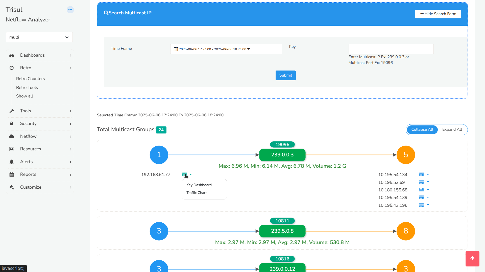

# Multicast GraphX

Multicast GraphX is an interactive visualization tool that helps you explore multicast traffic patterns in your network. It displays a clear and organized layout using D3.js, showing which IPs are sending and receiving multicast data.

Multicast is common in networks that distribute market data and other real-time feeds, such as those of financial services and securities organizations.

## Downloading Multicast GraphX

:::info navigation

Login as admin and,  
:point_right: Go to Web Admin &rarr; Manage &rarr; Apps
:::

From the list of Trisul apps, download Multicast GraphX.

>Note: Make sure the **IGMP Multicast** app is also installed and active.

## Viewing Multicast GraphX

:::info navigation

Login as user and,  
:point_right: Go to Dashboards &rarr; Show all &rarr; Multicast GraphX
:::

## Using Multicast GraphX

  
*Figure: Showing Multicast GraphX*

- Select a time range to view historical multicast activity.

- Choose a Counter Group from the dropdown (e.g., Host, ASN).

The graph displays:

- A **center** node showing the Multicast IP and Port

- A **left** bubble representing the number of sender IPs

- A **right** bubble representing the number of receiver IPs

Click on either bubble to expand the list of senders or receivers.

Each sender or receiver in the list provides a dropdown menu with:

- Traffic Chart – view bitrate over time

- Key Dashboard – jump to a detailed Trisul dashboard for that IP

## Traffic Statistics

For each multicast group, you can also view:

- Maximum, Minimum, and Average bitrate

- Total Volume of data transferred

## Enhanced View for ASN Groups

If the selected Counter Group is ASN, the interface also shows logos of well-known Autonomous Systems, such as Microsoft and Google, so you can identify top ASNs at a glance.
