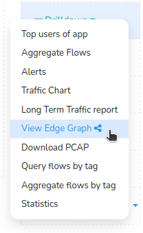
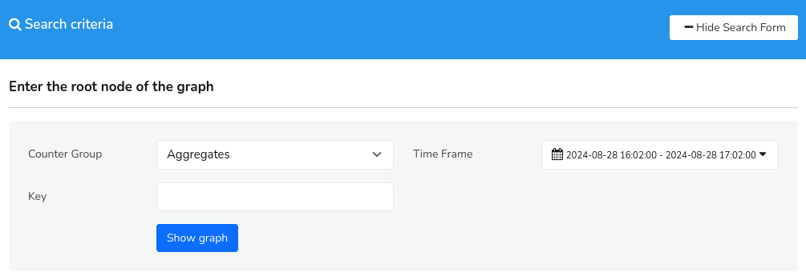
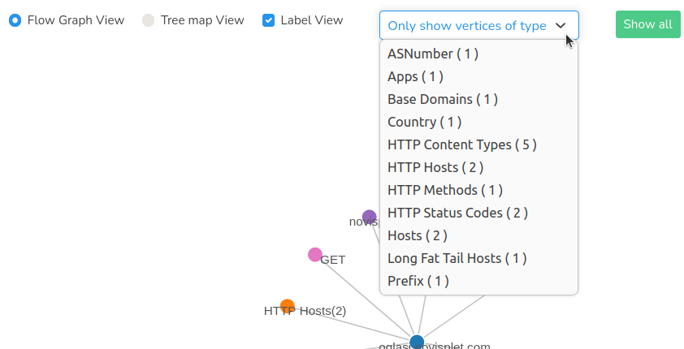
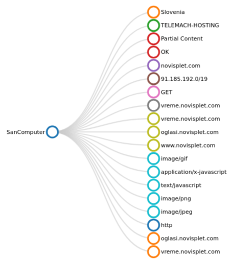
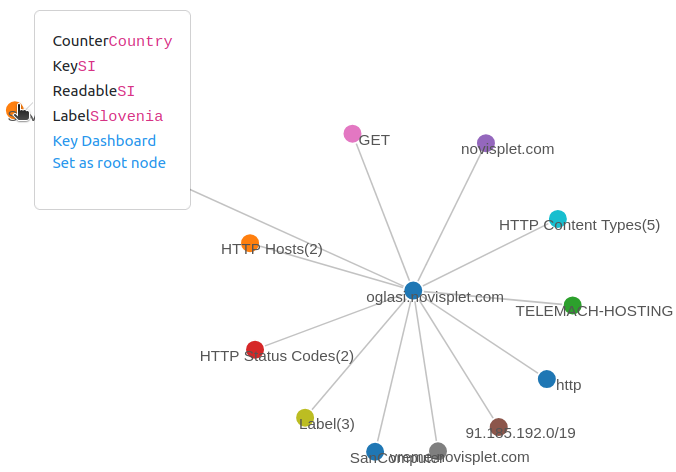

# Working with Edges

The entry point into exploring the streaming graph database of Trisul is to select two items

1. A *root vertex* from where you can enter the graph.
2. A time window

All exploration is done in a tool called the “*Edge Graph Explorer*”.

## Enable Feature

*Edges* is enabled by default in NSM (packet capture) mode. In all other modes it is disabled by default. To enable it in another mode, or if you are upgrading an older install, add the following line in [trisulProbeConfig.xml](/docs/guide/ref/trisulconfig#edges):

```xml
<Edges> <Enable>True</Enable> </Edges>
```

## View Edge Graph

- To generate an Edge Graph, navigate to the [*Key Dashboard*](/docs/guide/ug/ui/key_dashboard) by selecting a key from the dashboard. Within the Key Dashboard, locate the [*Key Details*](/docs/guide/ug/ui/key_dashboard#key-details) section. From there, initiate the Edge Graph display by clicking on the "*Drilldown*" button and selecting "*View Edge Graph*". This is one convenient way to view an edge graph from anywhere like dashboards with *keys*.



*Figure: View Edge Graph Menu Option*

- But you can access *Edge Graph* directly using specific criteria, for that,

:::info navigation
:point_right: Go to Tools&rarr;Edge Graph
:::

This will open up the *search criteria* form for the *edge graph* with [*hide/show search form*](/docs/guide/ug/ui/elements#hide-show-search-form) option.


*Figure: Search Criteria for Edge Graph*

Fill in the *Edge Graph* form with the help of the following fields and descriptions to define a search criteria.

| Field         | Description                                                                       |
| ------------- | --------------------------------------------------------------------------------- |
| Counter Group | Select a counter group from the list                                               |
| Time Frame    | Select a time range from the [Time Selector](/docs/guide/ug/ui/elements#time-selector)  |
| Key           | Enter a key within the counter group to set as the "root vertex"                  |

Click *Show graph* to view the edge graph for the search criteria defined by you.

## Edge Graph Overview 

### Graph Explorer

The Graph Explorer is a point-and-click interface for navigating the graph network.

  
*Figure: Edge Graph Explorer*


The *Edge Graph* explorer options include:

| Options                    | Description                                                                       |
| -------------------------- | --------------------------------------------------------------------------------- |
| Flow Graph View | Default view. Displays the graph network in a flow-based layout, illustrating the relationships between nodes and edges. |
| Tree map View | Draws the graph as a branching tree from the root vertex (a collapsible node-link layout, not nested rectangles). This is a cleaner option in some cases. |
| Label View                 | Toggles the display of labels for nodes and edges, providing additional context and information about the graph entities.                                                                            |
| Only show vertices of type | Filters the graph network to display only nodes of a selected type, allowing for focused analysis on specific entities or groups.                                                                 |
| Show all                   | Resets the graph network to its default view, displaying all nodes and edges without any filters or restrictions.                                                                                     |

:::tip
To declutter a messy force graph, select a highly connected node, drag it to an empty area, and gently "shake" it to settle the graph into a better layout. 
:::

Upon initial generation, the Graph Explorer presents the following features:

### Initial View
- Displays the nodes adjacent to the root vertex
- Vertices are grouped and color-coded for visual distinction

### Tree Map View

The *Tree map View* represents the graph network as a branching tree, illustrating the organization of nodes. 


  
*Figure: Edge Graph- Tree Map View*

This visualization:
- Shows a clear and organized structure, with relative nodes branching out from a central root
- Highlights the relationships between nodes and their connection to the root vertex

Use it for an uncluttered view of the graph network.


### Interactive Features  
- **Hover**: Mouse over a node to reveal additional drilldown options.  
- **Click**: Select a node to expand and display its 1-level adjacent neighbors, enabling further exploration of the graph network. By clicking on a *key* you can further drilldown to two options:
    - Go to the [*key dashboard*](/docs/guide/ug/ui/key_dashboard) of the selected *key*.
    - *Set as root node* option allows you to generate a new edge graph with the selected *key* as root node.

  
*Figure: Initial View and Interactive Features of Edge Graph*


