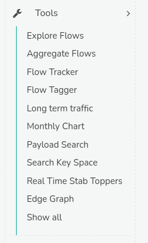

# Analysis Tools Reference

import DocCardList from '@theme/DocCardList';

Trisul offers a suite of tools, which are specialized utilities designed to analyze, process, and act upon network data, including packets, flows, and logs. These tools serve various purposes, such as extracting insights, detecting issues, and taking actions.

These tools are on the **Tools** menu but are documented in other sections:

- [:memo: Flow Tracker](/docs/guide/ug/flow/tracker)
- [:memo: Flow Tagger](/docs/guide/ug/flow/tagger)
- [:memo: Real Time Stab Toppers](/docs/guide/ug/cg/stabber#real-time-stabber-toppers)
- [:memo: Edge Graph](/docs/guide/ug/edges/)  

The rest of this section covers the other tools on the **Tools** menu. 

<DocCardList />

To access the complete toolset, navigate to the main menu in Trisul, where you will find the *Tools* option. Clicking on this option will reveal a dropdown menu listing all available tools as in the figure.  
    
    
*Figure: Tools*

