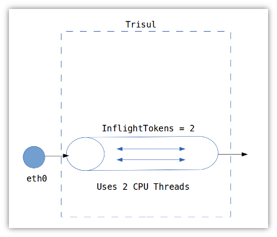
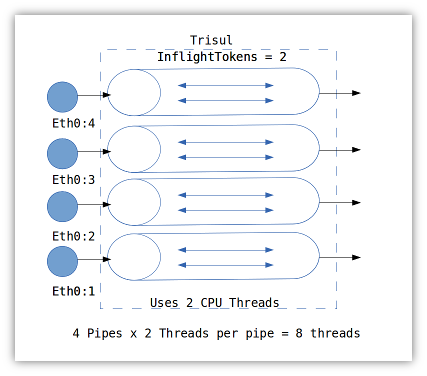

# Setup Trisul for 10Gbps

Describes how you can setup Trisul for capturing and writing to disk at
10Gbps and higher speeds.

## Hardware threads and Trisul

Trisul can use any number of threads but the number of **active pipeline
threads** is determined by the
[`InflightTokens`](/docs/ref/trisulconfig#tuning) parameter in the
[config file](/docs/ref/trisulconfig#tuning) . By default the value
is 2, which means Trisul at full load will use around 200% CPU.



If you increase the `InflightTokens` parameter to 4 you will find that
Trisul’s CPU usage goes up to 400% and you are able to process higher
speeds. However, there is a point of diminishing returns after about 4
hardware threads. Increasing further will actually reduce the
throughput. At this point, you’ve maxed out on what you can do with a
single port.

On an mid range processor, the optimum we’ve measured is about 2-3Gbps
using 2 hardware threads.

Fortunately there are ways to open up multiple input streams or ports.
This is mostly done by flow aware load balancing techniques.

## Ports and streams

As we’ve seen, at very high packet rates there is too much contention at
the single input port. The trick is to split the incoming traffic into
multiple streams and have Trisul use them. Often this requires hardware
support. The architecture looks like this.



Once you have the inputs set up, you can use Trisul’s support for
capturing from multiple adapters to complete the setup. We show how to
do this for some common input methods.

### PF\_RING cluster

How to create 4 pipelines with PF\_RING.

1. Go to Customize \> Capture Adapter
2. Disable all existing adapters
3. Create eth0 then scroll down to the PF\_RING tab set the cluster id
   to 99 (or any number)
4. Create another eth0, again set the cluster id to 99
5. Create another eth0, again set the cluster id to 99
6. Create another eth0, again set the cluster id to 99
7. Now you’ve got 4 eth0 entries all having the same cluster ID

Start trisul with pfring mode.

1. Go to Customize \> App settings
2. Set the Trisul Run Mode to *fullblown\_pf*
3. Restart Trisul. This will startup 4 pipelines.

### Napatech cluster

1. Go to Customize \> Capture Adapter
2. Disable all existing adapters
3. Create eth0, then go to the Napatech tab and set the stream id to 0
4. Only for stream 0; set the hashing mode and config commands, see
   Napatech docs for more details. Typical values are shown below the
   fields.
5. Create eth0, then scroll down and set the stream id to 1 
6. Create eth0, then scroll down and set the stream id to 2 
7. Create eth0, then scroll down and set the stream id to 3
8. Now you’ve got 4 eth0 entries with stream ids 0,1,2,3 

Start trisul with napa mode.

1. Go to Customize \> App settings
2. Set the Trisul Run Mode to *fullblown\_napa*
3. Restart Trisul. This will startup 4 pipelines.

### Myricom, DAG,

We havent tested Myricom as yet, but this should work with their libpcap
compatible driver.

Create 4 streams using the tools provided by the vendor.

1. Go to Customize \> Capture Adapter
2. Disable all existing adapters
3. Create eth0
4. Create eth0
5. Create eth0
6. Create eth0
7. Now you’ve got 4 eth0’s 

Start trisul with libpcap mode.

1. Go to Customize \> App settings
2. Set the Trisul Run Mode to *fullblown*
3. Restart Trisul. This will startup 4 pipelines.

## Writing to disk at 10G

You need a fast disk array to accomplish 10Gbps.

Some tips to acheive 10Gbps.

- Use really large file sizes  
  Change the Ring \> FileSizeMB parameter to 60G
- Put all your files in oper  
  Set number of files in the Oper area to 200, in ref = 0, and archive
  = 0.
- Use iostat to measure iops  
  The key stat is number of blocks written per second

Trisul is already optimized for 10Gbps write to disk, but the free 3-day
License is unlikely to give you the throughput required because you cant
change the above parameters. For an eval license contact us using the
Support page.

## CPU Pinning

This is generally not needed, but if you wish to use certain CPUs only
for Trisul you can use the `CoreAffinityNet` parameter in the Tuning
section of the config file

As an example. Assume we use 4 pipelines x 2 threads for processing and
we want to say with CPUs 0,1,2,3 and 11,12,13,14 use the following.

```html
    ..
<CoreAffinityNet>0,1,2,3,11,12,13,14</CoreAffinityNet>
<CoreAffinityRAID></CoreAffinityRAID>
    ..
```

### IO Thread

Disk writing can be pinned to its own CPU by specifying the
`CoreAffinityRAID` parameter

The same example, now pinning the disk writer (RAID) thread to CPU 5

```html
    ..
<CoreAffinityNet>0,1,2,3,11,12,13,14</CoreAffinityNet>
<CoreAffinityRAID>5</CoreAffinityRAID>
    ..
```

## Additional tuning

1. Disable counter groups you are not interested in
2. Disable the full content store if you dont need it
3. Disable TCP reassembly if you are only interested in basic metering.
   Go to the config file and [set all the
   reassembly](/docs/ref/trisulconfig#reassembly) options to FALSE
4. Make sure the RAID stripe size is equal to the `PcapRAIDStripeSize`
   parameter
