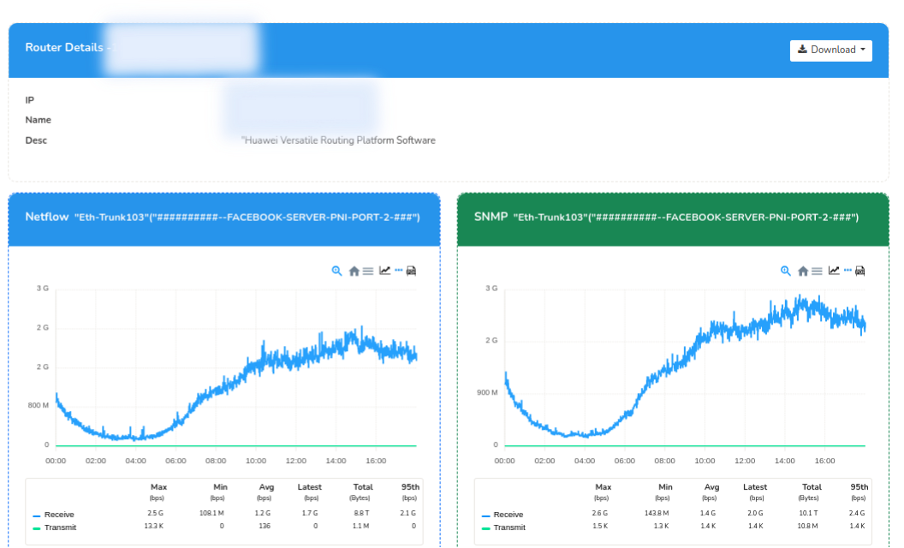

# How to Configure SNMP

## Purpose of SNMP Integration

The primary purpose of integrating SNMP (Simple Network Management Protocol) is to complement NetFlow data by providing additional contextual information, including:

- Interface names
- Interface speeds
- IP addresses
- Other relevant network interface details

This integration enhances the overall network monitoring and analysis capabilities by combining the flow-based insights from NetFlow with the device-level information from SNMP.

### Global SNMP Configuration

You can manually fill in the SNMP details by logging in as admin through Web Trisul Options,

:::info navigation
:point_right: Web Admin Manage &rarr; App Settings &rarr; SNMP Settings
:::

Here you can view the version, community string etc. Click Save.

  
*Figure: Resolve SNMP*

### Resolve SNMP for Multiple Routers

To update SNMP settings for multiple routers follow these steps, Login as admin,

:::info navigation
:point_right: Go to Context default &rarr; profile0 &rarr; NetFlow Wizard &rarr; Routers
:::

Click the **Select All** button above the routers list and click **Resolve**

  
*Figure: Resolve SNMP for multiple routers*

### Resolve SNMP Per Device

To update SNMP settings for single router, Login as user,

:::info navigation
:point_right: Go to NetFlow &rarr; Routers and Interfaces
:::

Click on the option button against the selected routers and click *SNMP Resolve Router and Interface Name* from the dropdown.

  
*Figure: Resolve SNMP for single router*

### Live SNMP

Live SNMP enables immediate retrieval of SNMP data, providing real-time visibility into network device performance. To view Live SNMP of a device.

:::info navigation
:point_right: Go to NetFlow &rarr; Routers and Interfaces
:::

Click on the option button against one of the interfaces and select Live SNMP from the drop down menu. This will display the SNMP data for the selected device. 

  
*Figure: Sample of Live SNMP of an interface*

### Management IP

To set SNMP management IP, follow these steps.

:::info navigation
:point_right: Go to [Key Dashboard](/docs/ug/ui/key_dashboard) &rarr; Set Label/Edit &rarr; Assign User Label/ Edit Attributes &rarr; Attributes
:::

In the attributes fields, add the following `snmp.management_ip= xxx.xx.xx.xx`
Replace `xxx.xx.xx.xx` with the desired management IP address. 

>If the SNMP management IP is not explicitly set, the system will default to using the public IP address.

### SNMP Interface Polling

To install SNMP Poller and SNMP vs NetFlow apps, follow these steps,

:::info navigation
:point_right: Go to [Trisul Apps](/docs/ag/webadmin/apps#types-of-apps) &rarr; Install **Meta App for SNMP**
:::

  
*Figure: Showing SNMP vs NetFlow Chart*  

This will install both the apps SNMP Poller and SNMP vs NetFlow apps to enable SNMP interface polling.

### Special Cases 

- **Huawei**

:::info navigation
:point_right: Web Admin Manage &rarr; App Settings &rarr; SNMP Settings
:::

1) Click Advanced SNMP Settings

2) Check the checkbox **Use Huawei SNMP Port Map** to utilize Huawei's proprietary SNMP mapping to associate Netstream ifIndex with SNMP ifIndex

  
*Figure: Huawei Portmap Settings*