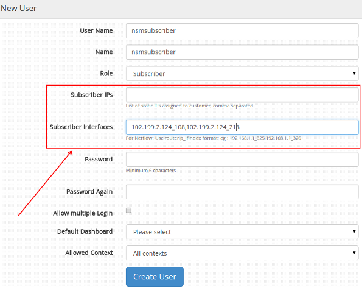
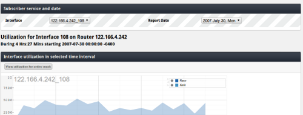
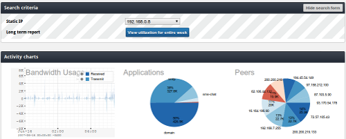

# Offer subscriber reports

## Did you know that you can use Trisul to offer subscriber reports ?  
You can setup Trisul to monitor subscribers from a central location and
then provide each subscriber a web login to view their own reports. You
can use this to build a value added service offering.

Some terms :

  - Subscriber  
    A customer of the ISP/MSP
  - Service  
    Indentifed by static IPs or router sub interfaces

## What is included ?

Trisul allows you to :  
- Create a web user/password and associate that with one or more
services  
- The subscriber can then logon to Trisul and is immediately taken to
their services page  
- A subscriber can only view their own services and are not allowed to
see anything else  
- A subscriber can generate PDF outputs of reports  
- A subscriber can change his/her own password

This page describes how you can accomplish such a setup.

## Network setup

Trisul needs to monitor traffic to all subscriber networks. There are a
few options you can choose from depending on your service topology.

### Customer premises managed switch (dynamic IP)
Have the customer switch export Netflow or Sflow to your datacenter
where Trisul is running  
### Customer premises unmanaged switch / modem (dynamic IP)
Enable Netflow or Sflow at your edge routers  
Enable port spanning at your uplinks where all subscriber traffic
can be visible. You may need to procure a optical tap if link speeds are
upwards of a few Gbps  
### Customer has static IPs
This is the easiest, since you can map IPs to subscribers. Just
enable flow at core routers or use port spanning at the uplink

## Create the subscriber user

To create a user (subscriber) and map him to a set of services:

Select admin -\> Users  
- Click on **Create a new user**

This will bring you to the screen shown below. Specify all the fields as
described in the [Manage Users](/docs/ug/webadmin/userroles.html)
section of the User Guide. Pay specific attention to the following
fields

|            |               |                                                                                                                                                                                                                |
| ---------- | ------------- | -------------------------------------------------------------------------------------------------------------------------------------------------------------------------------------------------------------- |
| Role       |               | Select *Subscriber*. This will open up the next two boxes where you can enter the services                                                                                                                     |
| Static IPs | If applicable | Enter the static IPs assigned to the user, comma separated                                                                                                                                                     |
| Interfaces | If applicable | If using Netflow, enter the netflow interface details. The format is *Router\_IP\_IfIndex* The router IP is the address of the flow exporting router and IfIndex is the SNMP index of the subscriber interface |

div(info). If this subscriber has both static IPs and netflow interfaces
turned on, only specify the interface. The IP will be automatically
considered for reporting.

Then complete the task.  
- Specify an initial password, you will send this to the user can then
change it.  
- If you want to allow multiple logins from the user, check this box.
This depends on your overall service offering.

Press Save and complete the task. Now you can send the username +
password to the subscriber.

## Subscriber login

The subscriber upon visiting the Trisul login page will enter the
username and password you have created for him.

The user is immediately taken to the report page containing :  
- Data for the first service  
- Data for the current day (midnight till now)

The user can select a different service or a different day using the
easy to use drop down lists.

### Showing subscriber interface flow level data

The following screenshot provides an idea of what the user sees. The
report includes the following.

|                                                |
| ---------------------------------------------- |
| In/Out traffic on the subscriber interface     |
| Top Hosts & Top Applications (upto top 1000)   |
| Top Transmitting hosts and Top Receiving hosts |
| Conversations                                  |
| Top 1000 individual flows                      |

A typical screenshot of what a subscriber might see upon logging in.

#### Further steps

- Click on the PDF link to generate a PDF report.  
- Click on the **See utilization for entire week** to view [long term
usage charts](/docs/ug/tools/analyze_item.html)

### Showing subscriber static IP data

A subscriber can select a static IP from a dropdown list and view
detailed flow/conversation level reports.

The screenshot below shows an overview of the kinds of things he can
view.

## FAQ about subscriber report service

#### Can we upload subscriber data in bulk ?

It is possible to create users from a text file or provisioning
database. Please contact Unleash Networks for a quick script to do this
task.

#### What is better Netflow or raw packets ?

Netflow will scale much better than raw packets and will provide
comprehensive reporting. If you plan to offer advanced reports that
include security analysis, then feeding Trisul raw packets is better.

#### Can you provide reports on IPSEC/VPN tunnel service ?

Subscriber can login and view their service details, except that Trisul
will not provide internal host/app data.

#### I dont offer static IP, rather offer DSL/Cable. How can I setup subscribers without an IP ?

Export netflow from the DSLAM router where each service shows up as a
logical interface.

#### Can I offer more advanced reports with drilldowns ?

You can also run a complete instance Trisul as a separate
[context](/docs/ug/domain/index.html#contexts). This will allow the user
to drill down deeply into his traffic. You may offer this as an enhanced
reporting package service.
