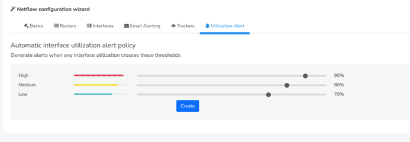

# NetFlow Post Installation Optimization Guide for Large Enterprises

By default, selecting NetFlow Analyzer in the Product Mode Selector enables all required configurations. However, for large enterprises with numerous routers and interfaces, additional optimization is necessary to ensure seamless performance. 

Follow this step-by-step guide to enable and optimize configurations for large deployments:

## Step 1: Initial Configuration

Select NetFlow Analyzer in the Product Mode Selector to enable default configurations.

## Step 2: Update Toppers

- Set the toppers to display the required number of routers as needed.

:::info navigation
:point_right: Go to Context default &rarr; profile0 &rarr; Counter Groups
:::

Drilldown to **Flowgens** and check the checkbox to configure the topper count and update the following,

| Config | Value | Description |
|--------|-------|-------------|
| High watermark | 2500 | The maximum number of flowgens keys tracked |
| Low watermark | 2000 | When keys exceed the high watermark they are pruned down to this level |
| Top-K count | 2500 | Stores top k count in every topper bucket size interval |

And click Update.

  
*Figure: Sample value of the Flowgens Countergroup (Routers)*

- Set the toppers to display the required number of interfaces as needed

:::info navigation
:point_right: Go to Context default &rarr; profile0 &rarr; Counter Groups
:::

Drilldown to **Flowintfs** and check the checkbox to configure the topper count and update the following,

| Config | Value | Description |
|--------|-------|-------------|
| High watermark | 10000 | The maximum number of flowintfs keys tracked |
| Low watermark | 9000 | When keys exceed the high watermark they are pruned down to this level |
| Top-K count | 10000 | Stores top k count in every topper bucket size interval |

And click Update.

  
*Figure: Sample value of the Flowintfs Countergroup (Interfaces)*

- Set the toppers to display the required number of hosts,apps and interfaces (crosskey) as needed.

:::info navigation
:point_right: Go to Context default &rarr; profile0 &rarr; Counter Groups
:::

Search in the drilldown options for **FlowIntf** and check the checkboxes of all the crosskeys as in the figure to configure the topper count and update the following,

| Config | Value | Description |
|--------|-------|-------------|
| High watermark | 50000 | The maximum number of keys tracked |
| Low watermark | 45000 | When keys exceed the high watermark they are pruned down to this level |
| Top-K count | 50000 | Stores top k count in every topper bucket size interval |

And click Update.

  
*Figure: Sample value of the Flowgens Countergroup (Routers)*

## Step 3: Create Trackers

## Step 4: Enable Alerts

Enable the **Utilization Alerts** as the system generates alerts when interface utilization exceeds the specified thresholds.

:::info navigation
:point_right: Go to Context default &rarr; profile0 &rarr; NetFlow Wizard &rarr; Utilization Alert
:::

- Set the threshold values according to utilization for High, Medium, and Low. Click Create.

  
*Figure: Utilization Alerts*

## Step 5: Configure SNMP