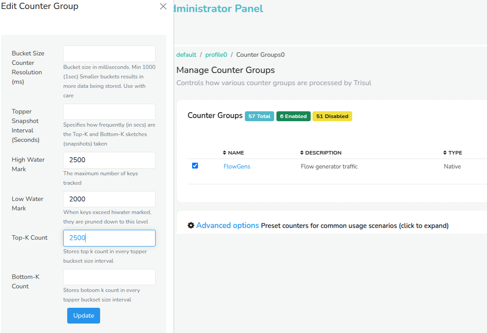
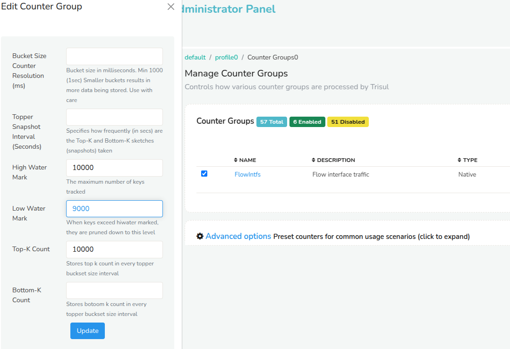
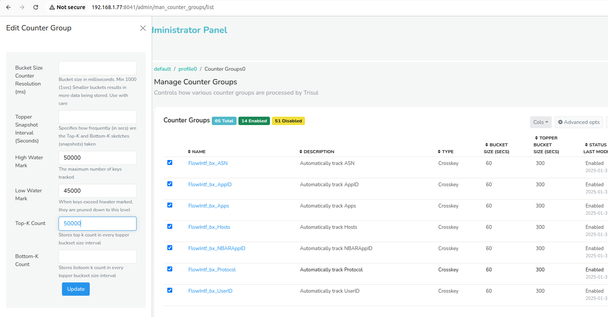
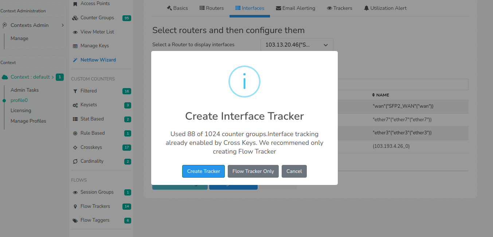

# NetFlow Post Installation Optimization Guide for Large Enterprises

By default, selecting NetFlow Analyzer in the Product Mode Selector enables all required configurations. However, for large enterprises with numerous routers and interfaces, additional optimization is necessary to ensure seamless performance. 

Follow this step-by-step guide to enable and optimize configurations for large deployments:

## Step 1: Initial Configuration

Select NetFlow Analyzer in the Product Mode Selector to enable default configurations.

## Step 2: Update Toppers

- Set the toppers to display the required number of routers as needed.

:::info navigation
:point_right: Go to Context default &rarr; profile0 &rarr; Counter Groups
:::

Drilldown to **Flowgens** and check the checkbox to configure the topper count and update the following,

| Config | Value | Description |
|--------|-------|-------------|
| High watermark | 2500 | The maximum number of flowgens keys tracked |
| Low watermark | 2000 | When keys exceed the high watermark they are pruned down to this level |
| Top-K count | 2500 | Stores top k count in every topper bucket size interval |

And click Update.

  
*Figure: Sample value of the Flowgens Countergroup (Routers)*

- Set the toppers to display the required number of interfaces as needed

:::info navigation
:point_right: Go to Context default &rarr; profile0 &rarr; Counter Groups
:::

Drilldown to **Flowintfs** and check the checkbox to configure the topper count and update the following,

| Config | Value | Description |
|--------|-------|-------------|
| High watermark | 10000 | The maximum number of flowintfs keys tracked |
| Low watermark | 9000 | When keys exceed the high watermark they are pruned down to this level |
| Top-K count | 10000 | Stores top k count in every topper bucket size interval |

And click Update.

  
*Figure: Sample value of the Flowintfs Countergroup (Interfaces)*

- Set the toppers to display the required number of hosts,apps and interfaces (crosskey) as needed.

:::info navigation
:point_right: Go to Context default &rarr; profile0 &rarr; Counter Groups
:::

Search in the drilldown options for **FlowIntf_bx** and check the checkboxes of all the crosskeys as in the figure to configure the topper count and update the following,

| Config | Value | Description |
|--------|-------|-------------|
| High watermark | 50000 | The maximum number of keys tracked |
| Low watermark | 45000 | When keys exceed the high watermark they are pruned down to this level |
| Top-K count | 50000 | Stores top k count in every topper bucket size interval |

And click Update.

  
*Figure: Sample value of the crosskey Countergroups*

## Step 3: Create Trackers

To enable trackers for interfaces, follow these steps,

:::info navigation
:point_right: Go to Context default &rarr; profile0 &rarr; NetFlow Wizard &rarr; Interfaces
:::

1) Select a router from the drop down list to display the interfaces
2) Click on the interface you would like to enable tracking or click on select all button above the list of all interfaces.
3) Click Interface Tracking &rarr; Enable Interface Tracking which will open up the following screen as in the figure. Click *Flow Tracker Only* This will enable the flow trackers for all the selected interfaces.

  
*Figure: Flow Tracker*

> **Note that probe has to be restarted once the trackers are created**

## Step 4: Enable Alerts

Enable the **Utilization Alerts** as the system generates alerts when interface utilization exceeds the specified thresholds.

:::info navigation
:point_right: Go to Context default &rarr; profile0 &rarr; NetFlow Wizard &rarr; Utilization Alert
:::

- Set the threshold values according to utilization for High, Medium, and Low. Click Create.

  
*Figure: Utilization Alerts*

> **Note that probe has to be restarted once the alerts are created**

## Step 5: Configure SNMP

### Option 1: Default SNMP Settings for NetFlow

You can manually fill in the SNMP details by logging in as admin through Web Trisul Options,

:::info navigation
:point_right: Web Admin Manage &rarr; App Settings &rarr; SNMP Settings
:::

Here you can view the version, community string etc. Click Save.

  
*Figure: Resolve SNMP*

### Option 2: Resolve SNMP for Multiple Routers

To update SNMP settings for multiple routers follow these steps, Login as admin,

:::info navigation
:point_right: Go to Context default &rarr; profile0 &rarr; NetFlow Wizard &rarr; Routers
:::

Click the **Select All** button above the routers list and click **Resolve**

  
*Figure: Resolve SNMP for multiple routers*

### Option 3: Resolve SNMP for Single Router

To update SNMP settings for single router, Login as user,

:::info navigation
:point_right: Go to NetFlow &rarr; Routers and Interfaces
:::

Click on the option button against the selected routers and click *SNMP Resolve Router and Interface Name* from the dropdown.

  
*Figure: Resolve SNMP for single router*

