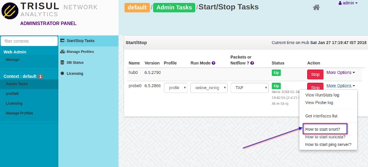
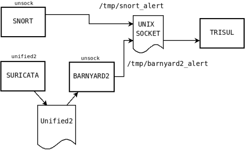

# How to send IDS alerts to Trisul

There are two ways you can send IDS alerts into Trisul

1. Use a Unix Socket and send Unified2 or Snort (Unified) format alerts
   to that socket
2. Use the [LUA Input Filter](/docs/lua/inputfilter) API 

Suricata-EVE APP

:::note[Suricata-EVE APP]

The newly released Trisul APP [Suricata
EVE](https://medium.com/@vivekrj/how-to-get-suricata-eve-alerts-into-trisul-network-analytics-and-why-f3015d7280e0)

:::

Trisul can accept alerts in two formats from a named Unix socket  

- **in Unified format** : for use with `snort -A unsock` option  
- **in Unified2 format** : for use with barnyard2

## Connecting Snort to Trisul using `unsock`

All you have to do is start snort with the correct options. Trisul
automatically picks up the alerts.  

- Start Trisul Probe

```
 Start Trisul via _Admin -> Start/Stop Tasks -> Start Trisul Probe_
```

- Start Snort in `unsock` mode 

Select the “How to start snort” to get the command line options as shown
in the screenshot. You can then copy-paste that into a terminal.



```language-lua
snort -A unsock -l
/usr/local/var/lib/trisul-probe/domain0/probe0/context0/run -c
/usr/local/etc/snort.conf -i eth0 -D
```

## Connecting Barnyard2 to Trisul

Barnyard2 is a software that takes the workload of translating to
various output formats away from Snort. You can have it write to
multiple outputs. Trisul can connect to `barnyard2` using the
`alert_unixsock` output format which is supported by barnyard2.

### Change the socket name to barnyard2\_alert

Barnyard2 uses the socket name *barnyard2\_alert* ; edit the  
[IDSAlerts UnixSocket](/docs/ref/trisulconfig#idsalerts) parameter
to send the alerts to `/tmp/barnyard2_alert`

```xml
<IDSAlerts>
    <Enabled>True</Enabled>
    <UnixSocket>/tmp/barnyard2_alert</UnixSocket>
    <SnortVersion>2.9+</SnortVersion>
    <SnortConfigFile>/etc/snort/snort.conf</SnortConfigFile>
</IDSAlerts>
```

#### Start Trisul

1. Start Trisul via *Admin -\> Start/Stop Tasks -\> Start Trisul*

#### Start barnyard2

All we need to do now is to run barnyard2 to read the unified2 files and
send alerts into the Unix socket.

Edit barnyard2.conf and add the *alert\_unixsock* output option.

```bash
#
# output alert_fast: stdout
output alert_unixsock
```

Run barnyard2 like the following

```bash
barnyard2 -c barnyard2.conf  -l /tmp -o /tmp/byin/unified2.alert.*
```

- ensure the `-l /tmp` which sends the alerts to the unixsocket
  `/tmp/barnyard2_alert` 
- assuming the unified2 files at in */tmp/byin*

### Suricata note

**UPDATE:** We now recommend using the new EVE alert format for
Suricata. Please follow instructions in [How to get Suricata EVE alerts
into Trisul Network
Analytics?](https://medium.com/@vivekrj/how-to-get-suricata-eve-alerts-into-trisul-network-analytics-and-why-f3015d7280e0)

First edit the suricata.yaml file and check if Unified2 logging is
enabled. You can disable all other logging.

```language=yaml
 # alert output for use with Barnyard2
- unified2-alert:
    enabled: yes
    filename: unified2.alert

    # Limit in MB.
    limit: 500
```

Next start suricata and have it log to the */tmp/byin* directory((byin -
just a convention for barnyard input directory, You can use any name you
want)). This will cause suricata to write files of the form
*unified2..log* in the */tmp/byin* directory.

```language-bash
suricata -c suricata.yaml -l /tmp/byin -i eth0
```

## Diagram showing the pieces

A diagram that shows the relationship between the various pieces.



## More things to do

#### How to change the path of the unix socket

The default install of every Trisul Probe listens on a unix socket at
`/usr/local/var/lib/trisul-probe/domain0/probe0/context0/run/snort_alert`
You can change this by editing the
[IDSAlert/UnixSocket](/docs/ref/trisulconfig#idsalerts) parameter
in the config file.

#### How to read a PCAP file and generate alerts

A new tool called [importpcap\_ids](/docs/ug/basicusage/snort) uses
snort to run the normal Analytics as well as IDS over PCAP dumps. The
optional *context=* argument allows you to create multiple separate
datasets in Trisul.

```language-bash
importpcap_ids pcap_dump_name  context=newdataset1
```
