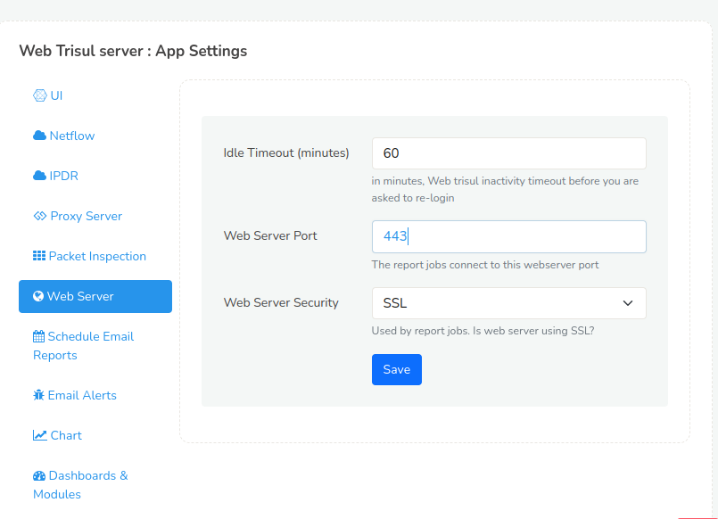

# Using HTTPS

Trisul comes built in with support for secure access via HTTPS.

To start the HTTPS version use the `webtrisulssld` service instead of `webtrisuld` service


You can access the HTTPS web interface at  `https://my.trisulhost.com`


:::info as root
Run these commands as root or sudo
:::


## Step 1: Using your own certificate + private key

The SSL/TLS setup uses a self signed demo certificate and private key that ships with Trisul.  They are found in

| Type | Location|
| ------------------------- | ----------------------------------------- |
| Certificate               | /usr/local/etc/trisul-hub/trisul.ssl.cert |
| Private Key | /usr/local/etc/trisul-hub/trisul.ssl.key |

Replace the certificate/key pair above with your key-pairs.


### Using a different file name for the certificate

Then you need to change the Trisul NGINX file as shown below to point to your new certificate/key files.

Edit this file `/usr/local/share/webtrisul/build/nginxssl.conf`


```bash {4,5}
server {
    listen 443;
    ssl                  on;
    ssl_certificate      /home/user1/mynew-ssl.cert;
    ssl_certificate_key  /home/user1/mynew-ssl.key ;
    }
```


## Step 2: Change Web Server settings


:::note navigation
:point_right:  Login as admin and go to Webadmin: Manage &rarr; App Settings &rarr; Web Server
:::


1. Set the *Web Server Port* to  your new port. 
2. Set the *Web Server Security* to SSL.

As in the following screenshot



*Figure: Showing App Settings required*


## Step 3: Start the SSL service 


If running stop the old HTTP service and start the SSL. 

```bash
# stop the HTTP server 
systemctl stop webtrisuld 

# start the HTTPS (SSL) server 
systemctl start webtrisulssld
```

To set the SSL as default webserver upon start up do 

```bash
# disable the HTTP service 
systemctl disable webtrisuld

# enable the HTTPS  service 
systemctl enable webtrisulssld
```
