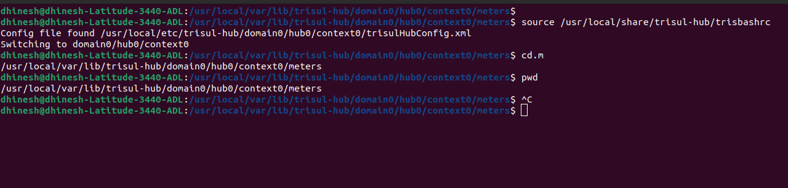

# How to Take Trisul Data and Config Back Up

To ensure business continuity, it is essential to regularly back up Trisul data and configuration. Here's a step-by-step guide:

## Trisul Data Backup

Step 1: Load Trisul Environment Variables
```Bash
source /usr/local/share/trisul-hub/trisbashrc
```
This command loads the Trisul environment variables.

Step 2: Navigate to the Trisul Data Directory
```Bash
cd.m
```
This command changes the directory to the Trisul data path.

Step 3: Verify the Current Working Directory
```Bash
pwd
```
This command prints the current working directory to verify that you are in the correct location.

Step 4: Backup Trisul Data and Configuration

```Bash
cp -r <data path> <backup folder>
```

    
*Figure: Showing Example of Trisul Data Backup*

## Trisul Configuration Backup

To ensure the preservation of your Trisul configuration, it is essential to backup the following files:

**Trisul Hub Config File**: The output of ls /usr/local/etc/trisul-hub/  
**Trisul Probe Config File**: The output of ls /usr/local/etc/trisul-probe/  
**Trisul Probe Shared Files**: The output of ls /usr/local/share/trisul-probe/  
**Trisul Hub Shared Files**: The output of ls /usr/local/share/trisul-hub/  
**Trisul Config File (Verification)**: The output of ls /usr/local/var/lib/trisul-config  

Please backup the outputs of these commands to ensure that your Trisul configuration is safely preserved.

Please run the following commands to list the files in each directory:
```Bash
ls /usr/local/etc/trisul-hub/
ls /usr/local/etc/trisul-probe/
ls /usr/local/share/trisul-probe/
ls /usr/local/share/trisul-hub/
ls /usr/local/var/lib/trisul-config
```
