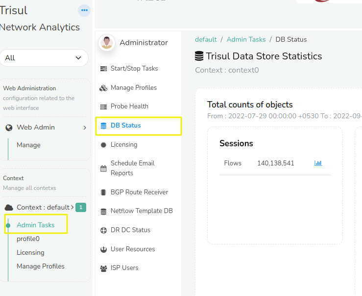
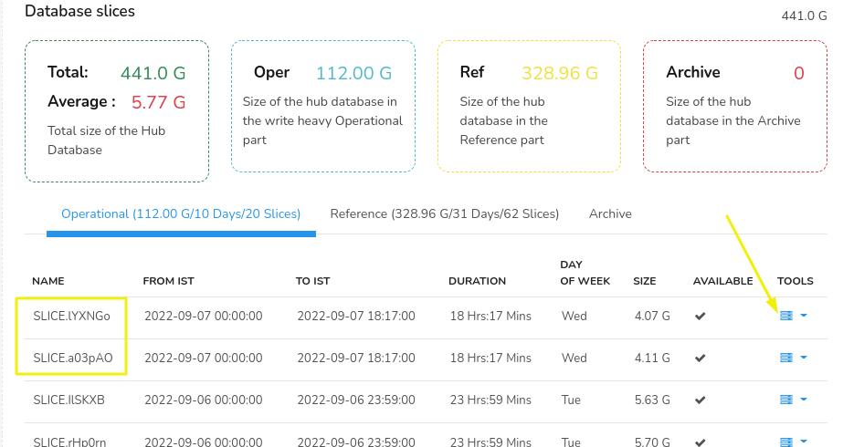
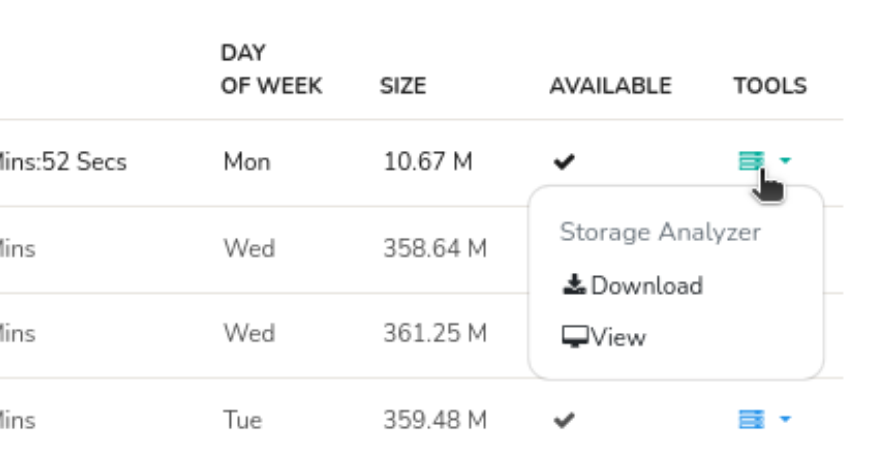
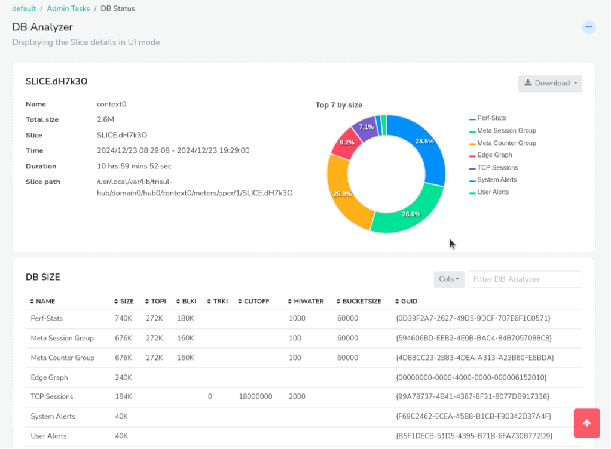
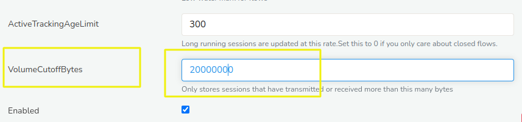

# Tuning database usage

The default deployment of Trisul will store all metrics at its native
resolution. This is by design so the Trisul database can be used as a
source for incident response, post breach audit, and compliance. However
this can result in relatively high storage.

## Finding out disk usage per day

To find out how much disk is being used per day.

:::info
:point_right: Login as Admin &rarr; Select Context \[default\] &rarr;Admin Tasks &rarr; DB
Status
:::

You will be shown the DB status page like this

The following data is shown on this page

1. Count of objects - Sessions (flows), resources, and alerts
2. Total disk usage in oper, ref, and archive points
3. Per slice , per day usage
4. PCAP usage

### Per day storage

The following table shows per *Slice* storage. A *Slice* is a unit of
storage in Trisul, typically each day has two slices. Hence to get the
storage for a day you add the storage of slices with the same date.

In the above picture for the day 09-07-2022 represented by the two
slices highlighted. The total storage for that day would be **4.07 GB +
4.11 GB = 8.18 GB**

### To view detailed analysis

Each database slice further contains many storage subsections of the
Trisul database, you can use the *Analyze Storage* option. This is used
by Trisul Engineers to further fine tune the database.

## Tuning the database

The default install of Trisul Network Analytics stores data for 92 days,
i.e. 3 months.

You can tune the database to extend the storage to cover more number of
days.

### Tuning the Flow / Sessions database

The biggest component of Trisul Network Analytics database storage is
typically the Flow or Session database. A flow represents a single unit
of datatransfer. This is a record that captures
Protocol-SourceIP-SourcePort-DestIP-DestPort bytes packets timestamp
etc. Trisul stores **every single** flow that passes through the network
even if it only transferred 10 bytes or 10 Gigabytes. This is required
because Trisul is used by many customers for audit, incident response,
post breach investigations, and compliance. This application requires
every single flow because malware may only use small flows.

Customers whose primary use cases are *Visiblility* and *Detection*
features of Trisul can dramatically reduce the size of the flow database
by using “Volume Cutoff Bytes”. See [User Guide: Flow
Tuning](/docs/ug/flow/tuning#optimize-flow-handling)

#### Set Volume Cutoff Bytes to 1MB

The flow database has a property that it uses a fixed amount of storage
regardless of the datatransfer. Traffic research indicates that 80% of
flows transfer less than 10% of total traffic. Hence if you set the
‘Volume Cutoff Bytes’ to 1MB it will dramatically reduce the storage
by roughly 80%. You can adjust this value for further optimization
gains.

#### Advantages and disadvantages of Volume Cutoff bytes

By setting the Volume Cutoff Bytes to a value like 1MB - the customer
gains the following

- All flows that transferred greater than 1MB are still stored, hence
  full visibility is still available for large flows
- The total size of the Trisul database is greatly reduced 
- This allows customers to store more number of days with the same
  storage

The following disadvantages for customers whose use case includes
security, incident response, and compliance.

1. During incident response you will not be able to find small flows
   that transferred less than the 1MB flow cutoff.

In general , we recommend customers whose primary use case is visibilty
and network monitoring to set a “Volume Cutoff Bytes” of 1MB for maximum
optimization of disk.

## Optimize Edges

Edge Analytics are an advanced Trisul feature used primary for security
investigations. “Edges” can also use up quite a bit of disk.

- You can disable Edges by opening the Trisul Config file and disable
  the Edge options. See [Edge
  trisulProbeConfig](/docs/ref/trisulconfig#edges)

## Counter groups

Counter groups have the following parameters that can be tuned

- High Water and Low Water — This impacts how many “items” of this
  counter group are stored. 
- Topper Traffic Only — If you set this , then only keys that make it
  to a topper list are stored.
- Top Count — By setting lower values you can control the storage.

See [Counter Group Settings](/docs/ag/context/countergroup_settings)Ensure you replace the demo certificate and key with new ones specific for your organization as described below
