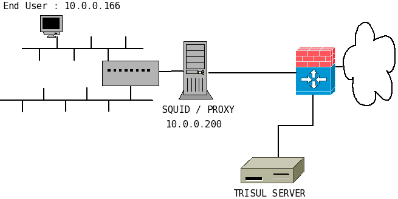

# Using Trisul with web proxies

Trisul is most effective monitoring perimeters of trust boundaries. In
an enterprise scenario, this usually means monitoring on either side of
a corporate firewall. This works beautifully because you can log all
kinds of network & security data exchanged across your boundary by just
monitoring a few external ports.

## The proxy problem

There is a however a big problem in the real world, the humble web
proxy. Proxy servers like Squid, Bluecoat, F5, Cisco, etc make it easy
to apply web controls but they also obscure the real internal IP
address. Traffic upstream of these proxies contain the IP address of the
proxy device and not of the actual endpoint. This means you can no
longer track your endpoints because all traffic will appear to originate
from the proxy.

Here is a diagram that illustrates the problem.

All traffic will appear to come from 10.0.0.200 (the proxy IP) and you
will not be able to tell apart user 10.0.0.166 activity.

The other alternative is to deploy trisul behind the proxy server, but
that is sometimes impractical because that may require mirroring
multiple ports.

The recommended solution is to use the X-Forwarded-For HTTP header.

## X-Forwarded-For (XFF)

Trisul supports the X-Forwarded-For, also known as XFF HTTP header which
contains the end user IPs. Most proxies including Squid have the ability
to add an X-Forwarded-For HTTP header. You need to enable this if not
already enabled by default.

The definition of the X-Forwarded-For header is :

**X-Forwarded-For: client1, proxy1, proxy2**

where the value is a comma+space separated list of IP addresses, the
left-most being the farthest downstream client, and each successive
proxy that passed the request adding the IP address where it received
the request from. In this example, the request passed proxy1, proxy2 and
proxy3 (proxy3 appears as remote address of the request).

[From Wikipedia](http://en.wikipedia.org/wiki/X-Forwarded-For)

## Configure XFF tracking in Trisul

To enable XFF tracking in Trisul you need to edit a parameter in the
trisulConfig.xml file as specified below.

%(hint command)Set the `EnableXFFDeproxy` option to TRUE in the
[Reassembly section of the Trisul Config
file](/docs/ref/trisulconfig.html#reassembly%)

The XFF feature require a few supporting features to be enabled as well.

Make sure these are enabled in the trisulConfig.xml file as well.

\* Enable the `TCPFlowTrack` option  
\* Enable the `TCPReassembly` option  
\* Enable the `IPDefrag` option

The above features are needed because Trisul needs to reassemble the
HTTP headers accurately to reliably process the XFF headers.

Note You need to restart Trisul for this to
take effect.

## Trisul reports

With XFF enabled, Trisul will replace the IP address of the proxy with
that of the endpoint in all monitored objects. All traffic, flows,
packets, alerts, and resources will have the IP address of the endpoint
as if the proxy never existed.

Some key points :

\# A small number of bytes up until the XFF header will continue to be
metered against the proxy.  
\# If the XFF header is not found the entire flow is metered against the
proxy.  
\# The proxy becomes transparent as far as HTTP traffic is concerned.  
\# Raw packets stored by Trisul are re-stamped with the IP of the end
station.
