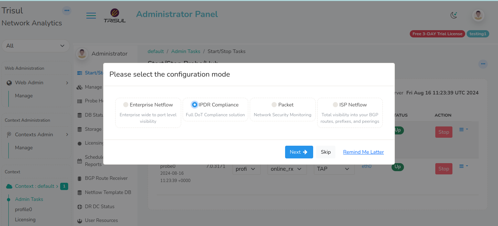

# Installation 

Getting started with Trisul IPDR 

The steps for getting from zero to a working install of Trisul IPDR  are

- Get a VM or a physical server ready for IPDR. See [System Requirements](/docs/ug/install/requirements)
- Sign up and Download the Trisul Network Analytics packages for your platform. [Get Started Page](https://trisul.org/get-started)
- You need to download the three core packages.  **trisul-hub  trisul-probe webtrisul** 

:clap: Congrats ! You are halfway there. Follow the steps outlined in the rest of this document.

## Package install


:::tip[only 3 packages]
For IPDR mode, you only require `trisul-hub  trisul-probe webtrisul`
You do not require the `trisul-geo` and `trisul-badfellas` 
:::

After downloading the packages, logon to the server as root

```bash

# for ubuntu
dpkg -i trisul-hub-xxx.deb trisul-probe-xxx.deb  wetrisul-xxx.deb

# for RHEL/CentOS/Oracle
rpm -Uvh trisul-hub-xxx.rpm trisul-probe-xxx.rpm  webtrisul-xxx.rpm 

```

For more details refer to the [Installation section in the Trisul User Guide](/docs/ug/install/doinstall) 


## Mode wizard at first login

Upon installation of the three packages you can login to the Trisul IPDR webpage using the initial admin login of `admin`/`admin`

### 1. Select the IPDR mode

On the very first admin login you will be prompted to switch into the desired mode of Trisul Netflow Analytics. The selection box will look like this 


*Figure: Select IPDR Compliance Mode*

### 2. Select the interface 

Next you need to select the network interface on which you will be receiving the NetFlow and/or SYSLOG traffic. 


*Figure: Select interface on which data will arrive*

### 3. Start the Trisul IPDR Servers

Next go to Context:default &rarr;  Start/Stop Tasks &rarr; Stop the Probe and then start it again.	 


### 4. Request a Trial License 

The built in license only works for 3-days.  We strongly recommend you contact us for an extended 15-day Trial via https://www.trisul.org/support/get-extended-license/ 

## Configure network for IPDR

Now the IPDR Server is ready. Next you need to get the network to send data to it. 

Configure to send NetFlow/IPFIX to the Trisul IPDR server. You need to do this on the Gateway routers only.


