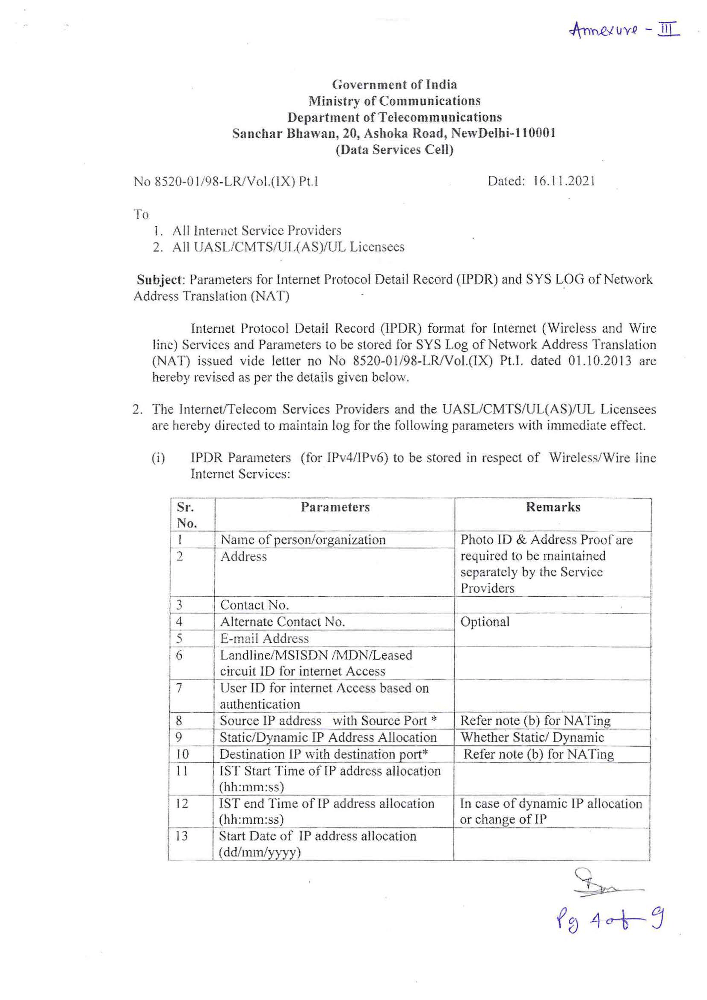
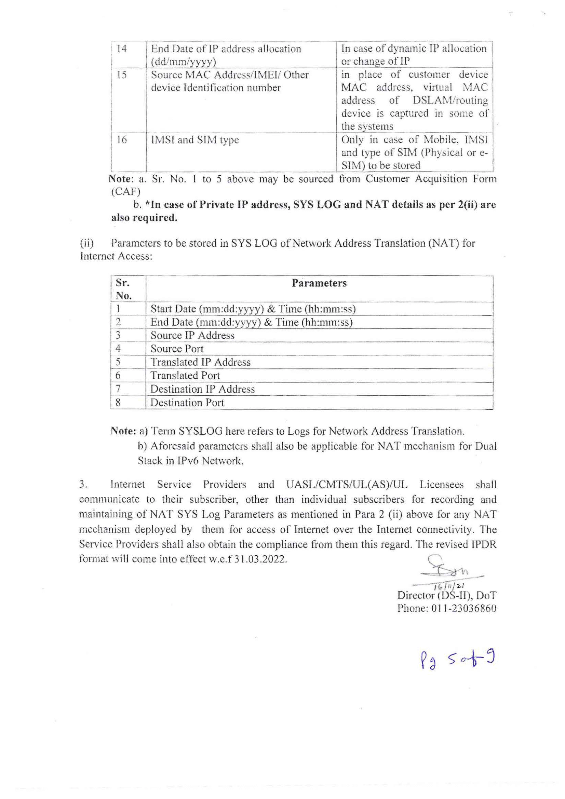
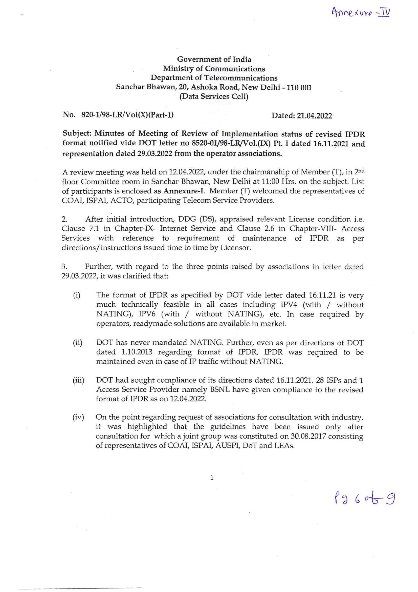
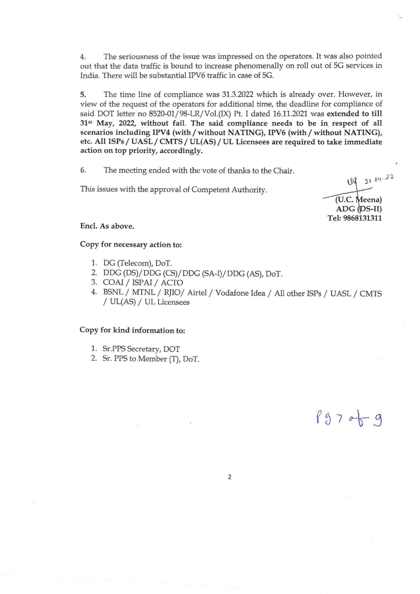
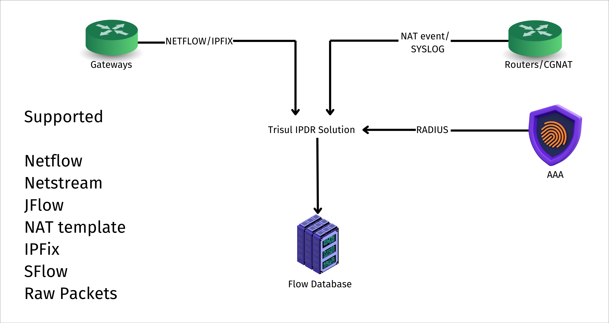

# Introduction to IPDR 

Simply put, Trisul IPDR will be of interest mainly to ISPs who seek to comply with regulatory mandates pertaining to 
- Storing of IP logs
- NAT logging
- AAA logging


This [IPDR mode](ipdrmode) is used to meet Telecom compliance mandates in various jurisdictions. However, it is not exclusive for ISPs, various stakeholders also utilize Trisul IPDR including LEAs, Network Admins, Security teams etc.

The name for this feature is **Trisul IPDR** ( IP Data Record)

:::warning[Compliance note]
Every jurisdiction around the world may have their own logging mandates. This page cites the DoT India mandate as an example, however the product can be used in any jurisdiction where similar mandates are found. 
:::

## DoT (India) Compliance

As per Dept of Telecommunications, India. All Internet Service Providers
and holders of Mobile UMTS/CMTS/UL licensees are required to store the
following information on a per flow basis.

> (i) IPDR Parameters for IPv4/IPv6 to be stored in respect of Wireless/Wireline internet services.  
> (ii) Parameters to be stored in SYSLOG of Network Address Translation

|  |  |
| ---------------------------- | ---------------------------- |
|  |  |

*See DoT Guideline no 8520-01/98-LR/Vol.(IX) Pt 1 dated 16/12/2021 Parameters for Internel Protocol Detail Record (IPDR) and SYSLOG of Network Address Translation (NAT)*

#### Parameters to be collected

- Customer information obtained during customer acquisition.
- user id
- start time of flow
- end time of flow
- source ip address
- NAT source IPv4 or IPv6 address (if NAT is used)
- source port
- NAT source port (if NAT is used)
- Destination IPv4 of IPv6 address
- Destination Port

The compliance requirement calls the above information IPDR and NAT
Syslog. Ideally they should be combined into one simple comprehensive
per-flow log. This is what Trisul IPDR provides.

## Obtaining data telemetry

The Trisul IPDR solution can accept a variety of inputs to create and
maintain the IPDR log for compliance. The following diagram explains the
architecture.



Fig 1. Accepts Netflow, Sflow, IPFIX, NAT and Radius syslog

## Configuring Trisul for IPDR

At ISP scale storing every single flow is a processor and disk intensive
task. Hence this configuration cannot be mixed with the Netflow Traffic
and Security Analytics feature except for very small ISPs. This section
contains configuration tips to optimize this feature.

### Use compressor lz4-ipv4-call-log-with-nat

Use a new flow compressor specifically designed for IPDR flow log. This
high performance compressor can store a flow with NAT in as little as 14
bytes.

Open the [trisulHubConfig.xml](/docs/ref/trsulhubconfig#advanced-db-parameters) file and specify the following in Advanced DB Parameters.

- Use a new compressor `lz4-ipv4-call-log-with-nat`
- Disable microsecond timestamps

```
<DBParameters>
    <FlowStream>
        <MicroSecondTimestamps>false</MicroSecondTimestamps>
        <ZFLOWBLOCK_COMPRESSOR_CODE>lz4-ipv4-call-log-with-nat</ZFLOWBLOCK_COMPRESSOR_CODE>
...
```

## The trisul-ipdr query service

The Trisul IPDR package comes with a powerful async query service called
`trisul-ipdr` The features of this service are

1. Asynchronous - you can submit multiple long running queries for IP
   and then download the results when done
2. Results - the results will be in compliance format including the
   full IP details as well as the NAT (if applicable)
3. Dashboard - dashboard shows running queries, completed queries,
   download results
4. Cancel - allows cancel of long running queries, number of records
   are constantly updated
5. Audit log - all query submits including user name, submit time,
   submit params are stored in audit log
6. Statistics - Dashboard also shows important statistics about Total
   BW, Number of flows/min, DB growth etc.
7. Automatic FTP - for query dumps that are huge, the service
   automatically FTP’s results to a separate secure FTP server

To start this service

```language-bash
systemctl start trisul-ipdr 
```

## Workflow

The system is designed to create a special login to the agent who will
be performing the queries. This login has no other privileges other than
to perform the query required for complaince. The powerful `trisul_ipdr`
service described above ensures the data is provided as a download or
pushed directly to a Secure FTP (SFTP) server. Sometimes we have noticed
agent requests resulting in several GB of output which cannot be downloaded over a browser. See [Configure IPDR Settings](ipdr-settings) on how to setup the SFTP server.

The following diagram shows the workflow


Fig 2. Agent login, submit, download, FTP workflow

#### Agent login with special ID

The agent is given a separate login and password with a dashboard that
shows only one option to retrieve IPDR logs. Once logged in the agent can submit query using [Trisul IPDR Query form](submit-queries) and view the [IPDR dashboard](ipdrdashboard) for the queried IP addresses. The [IPDR reports](ipdrreport) are then downloaded from web browser or FTP server.

## Tuning

We suggest the following configuration parameters for a minimal IPDR
deployment.

| Config file                                                   | Parameter                            | Set this to                      | Notes                                                                                                                                                                |
| ------------------------------------------------------------- | ------------------------------------ | -------------------------------- | -------------------------------------------------------------------------------------------------------------------------------------------------------------------- |
| [Netflow config](/docs/ref/netflow-config)                    | AppMode                              | ipdr                             | Sets the Netflow processing to IPDR                                                                                                                                  |
| [Hub Config](/docs/ref/trsulhubconfig#advanced-db-parameters) | DBParamters \> FlowStream \> AppMode | lz4-ip-call-log-with-nat-pro-max | Sets the database schema and compression code to pro-max                                                                                                             |
| [Probe Config file](/docs/ref/trisulconfig#tuning)            | Tuning \> DisableFlowTupleFeedback   | true                             | Disables monitoring of flow tuples by IP and Application. If this is enabled, there will be connection metrics for every IP and App, could waste disk space for IPDR |
| [Probe Config file](/docs/ref/trisulconfig#edges)             | Edges \> EnableFlowEdges             | false                            | Disable Edge graph generation for space savings                                                                                                                      |
