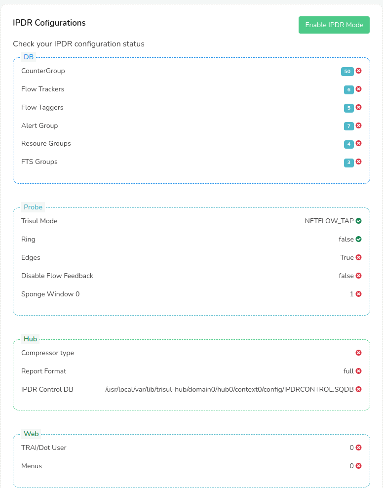

# IPDR Settings

The IPDR Settings page allows you to change two things.

- **FTP Settings** - optionally configure a secure FTP server to dump reports  
- **Set Mode**- one click to configure the IPDR mode

### Access the form 

:::tip[navigation]
Login as admin and select *Context:default > Admin Tasks > IPDR Settings*
:::


*Figure: How to access IPDR Settings* 

## FTP Settings 

To change the FTP settings , press Edit.


*Figure: Press Edit to access the FTP Settings* 

Press **Edit** to access the form as shown below.


*Figure: FTP Settings fields* 

| Field     | Default | Description |
| ------- | ------- | ------ |
| Server |    | The SFTP server IP address or host name  |
| Port Number | 22 | The SFTP server port if not running on the default port 22  |
| Username |   | SFTP user name|
| Private Key  | /usr/local/etc/trisul-hub/ipdrpv.key  | SFTP user private key file path. Use the full file path including the directory name. We recommend you put the private key file in `/usr/local/etc/trisul-hub/ipdrpv.key` Ensure the file is readable by the user `trisul.trisul`  See the section [Configuring FTP](#configuring-the-ftp-server) below for instructions on how the private key is generated|
| Directory  |         | The remote directory where the results file are uploaded|
| Download File Size | 100M    | Results file less than this number will be available for download on the [IPDR Dashboard](ipdrdashboard) page itself|
| NAT Syslog Port   | 514     | Port number where NAT translation syslog as well as AAA logs will be sent|


:::note restart ipdr service
Upon changing these parameters. Restart the trisul_ipdrd service.

```bash
systemctl restart trisul-ipdr
```
:::

## Configuring the FTP Server

This section describes how to configure the FTP server in order to enable automatic dump of IPDR record files to the server.

### Create key pair on Trisul IPDR Hub node

On the Trisul-Hub server create a key pair like so into a file that is
used for Trisul IPDR only. Use a file name `id_trisul_ipdr`

You can do these steps in the `/usr/local/etc/trisul-hub` directory

```bash
cd /usr/local/etc/trisul-hub 
ssh-keygen -t rsa -b 4096
Enter file in which to save the key (/root/.ssh/id_rsa):  id_trisul_ipdr
# do not give passwords 
```

Now  you will have the key pair saved in the current directory

```bash
id_trisul_ipdr.pub      # the public key  (to be send to the target FTP server)
id_trisul_ipdr           # the private key (never to be shared, stored on Trisul-Hub)
```

### Save the public key on the target server

Now put the `id_trisul_ipdr.pub` on to the target server with the
`Username` in the IPDR FTP Settings.

```bash
# on the target server append to authorized_keys

cat id_trisul_ipdr.pub >> .ssh/authorized_keys 
```

### Test it out

On the Trisul-Hub node check if the server works. You can use the ssh
command to test.

```bash
# ensure username@ip matches the FTP settings 

ssh -i /usr/local/etc/trisul-hub/id_trisul_ipdr  dotuser@10.179.210.1 

# if it logs in we are set 
```
-----

## Set Mode : Manually set IPDR mode

If you have skipped the [Mode Chooser Wizard](install) at time of first login, you can switch Trisul to IPDR mode at anytime by following the steps on this page. 

:::info Change the mode
Press the **Enable IPDR Mode** to automatically set all the required parameters the right values.  
:::

In the IPDR Configuration module you can see the status of the IPDR configurations including the database tuning parameters, hub, probe and WebTrisul. 

Clicking on the Enable IPDR Mode sets the parameters and configures the Trisul Network Analytics general platform into Trisul IPDR. 

The image below shows the parameters. 



*Figure: Enable IPDR Mode and view parameters* 

