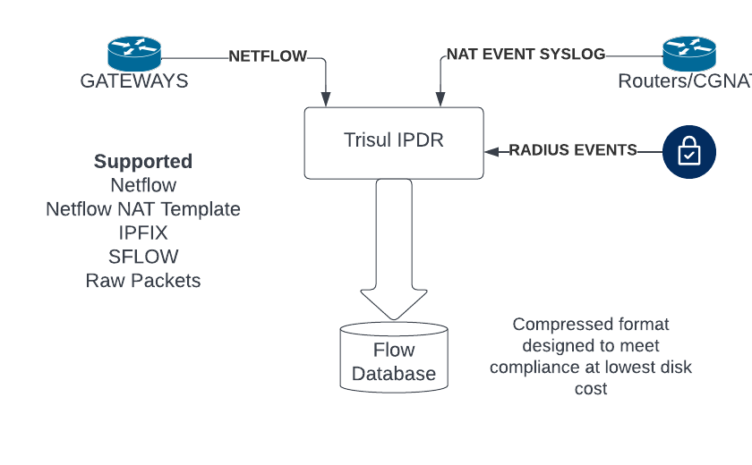
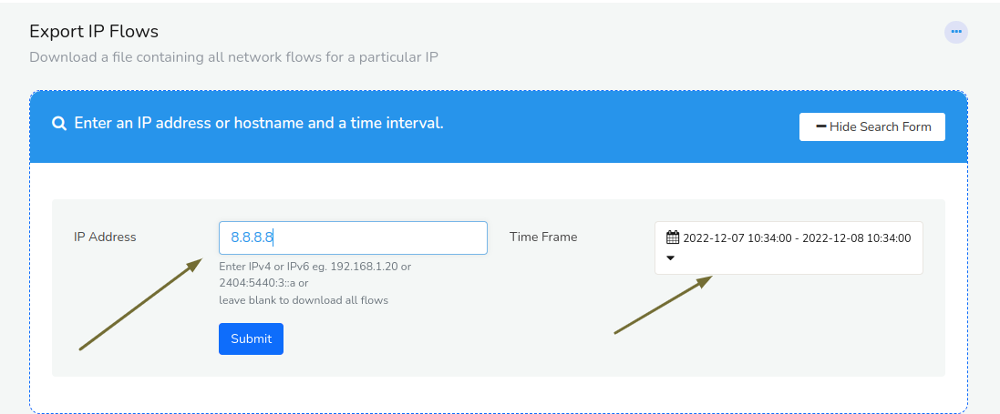
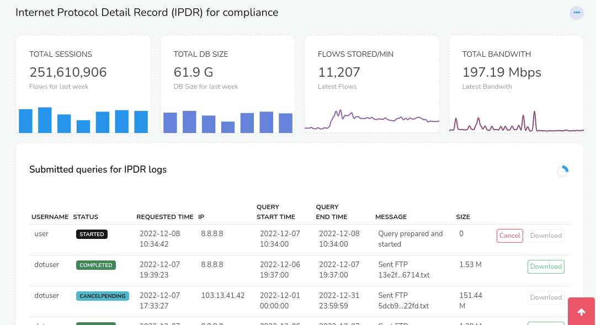

# Complete IP Flow logger

Trisul can be put into a mode where it does full flow logging even at
ISP scale. This mode is typically used to meet Telco compliance
requirements.

The name for this feature is **Trisul IPDR** ( IP Data Record)

## DoT (India) Compliance

As per Dept of Telecommunications, India. All Internet Service Providers
and holders of Mobile UMTS/CMTS/UL licensees are required to store the
following information on a per flow basis.

> (i) IPDR Parameters for IPv4/IPv6 to be stored in respect of Wireless/Wireline internet services.  
> (ii) Parameters to be stored in SYSLOG of Network Address Translation

*See DoT Guideline no 8520-01/98-LR/Vol.(IX) Pt 1 dated 16/12/2021 Parameters for Internel Protocol Detail Record (IPDR) and SYSLOG of Network Address Translation (NAT)*

#### Parameters to be collected

- Customer information obtained during customer acquisition.
- user id
- start time of flow
- end time of flow
- source ip address
- NAT source IPv4 or IPv6 address (if NAT is used)
- source port
- NAT source port (if NAT is used)
- Destination IPv4 of IPv6 address
- Destination Port

The compliance requirement calls the above information IPDR and NAT
Syslog. Ideally they should be combined into one simple comprehensive
per-flow log. This is what Trisul IPDR provides.

## Obtaining data telemetry

The Trisul IPDR solution can accept a variety of inputs to create and
maintain the IPDR log for compliance. The following diagram explains the
architecture.



Fig 1. Accepts Netflow, Sflow, IPFIX, NAT and Radius syslog

## Configuring Trisul for IPDR

At ISP scale storing every single flow is a processor and disk intensive
task. Hence this configuration cannot be mixed with the Netflow Traffic
and Security Analytics feature except for very small ISPs. This section
contains configuration tips to optimize this feature.

### Use compressor lz4-ipv4-call-log-with-nat

Use a new flow compressor specifically designed for IPDR flow log. This
high performance compressor can store a flow with NAT in as little as 14
bytes.

Open the [trisulHubConfig.xml](/docs/ref/trsulhubconfig#advanced-db-parameters) file and specify the following in Advanced DB Parameters.

- Use a new compressor `lz4-ipv4-call-log-with-nat`
- Disable microsecond timestamps

```
<DBParameters>
    <FlowStream>
        <MicroSecondTimestamps>false</MicroSecondTimestamps>
        <ZFLOWBLOCK_COMPRESSOR_CODE>lz4-ipv4-call-log-with-nat</ZFLOWBLOCK_COMPRESSOR_CODE>
...
```

## The trisul-ipdr query service

The Trisul IPDR package comes with a powerful async query service called
`trisul-ipdr` The features of this service are

1. Asynchronous - you can submit multiple long running queries for IP
   and then download the results when done
2. Results - the results will be in compliance format including the
   full IP details as well as the NAT (if applicable)
3. Dashboard - dashboard shows running queries, completed queries,
   download results
4. Cancel - allows cancel of long running queries, number of records
   are constantly updated
5. Audit log - all query submits including user name, submit time,
   submit params are stored in audit log
6. Statistics - Dashboard also shows important statistics about Total
   BW, Number of flows/min, DB growth etc.
7. Automatic FTP - for query dumps that are huge, the service
   automatically FTP’s results to a separate secure FTP server

To start this service

```language-bash
systemctl start trisul-ipdr 
```

## Workflow

The system is designed to create a special login to the agent who will
be performing the queries. This login has no other privileges other than
do perform the query required for complaince. The powerful `trisul_ipdr`
service described above ensures the data is provided as a download or
pushed directly to a Secure FTP (SFTP) server. Sometimes we have noticed
agent requests resulting in several GB of output which cannot be downloaded over a browser. See [Configure IPDR Settings](/docs/ug/webadmin/ipdr-settings) on how to setup the SFTP server.

The following diagram shows the workflow


Fig 2. Agent login, submit, download, FTP workflow

#### Agent login with special ID

The agent is given a separate login and password with a dashboard that
shows only one option. To retrieve IPDR logs.

#### Agent enter query

As per compliance requirements agent queries are based on IPv4 or IPv6
IP address. The agent enters the query here by

- enter the IP address  
  source , destination, or NAT address supported
- select a time window for the query

The fields are marked by the arrows in the figure shown below



Fig 3. Enter IP address and time window

#### Get results from IPDR Dashboard

The IPDR service is asynchoronous, this allows agents to submit multiple
long queries and wait for results without having to submit them one
after another. The results are obtained in the following two methods

##### Secure FTP or Download

Download directly from Web Browser  
For queries that result in a reasonable file size (default 100MB) the
agent can directly download the results by pressing the *Download*
button. See [IPDR Settings \> Download File Size](/docs/ug/webadmin/ipdr-settings) to adjust this limit.

Get it from a secure FTP server  
Regardless of the limit, if a Secure FTP (SFTP) server is configured the
results file is copied to that server automatically. The advantage of
this option is very large file sizes can be sent automatically to the
FTP server rather than the user having to download from the browser.

##### File name

Once completed the IPDR log will have a name like
`765f9124f705735ad54f9c87223eecd4944a0aa7.txt` This is to ensure the
integrity of the file from tampering. The file name is `SHA-1Hash.txt`
where the file contents are hashed to produce the file name.

##### Cancellation

The user can cancel long running tasks by pressing the *Cancel* button.
The results that have been retrieved up until that point is immediately
made available for download and/or FTP.

## IPDR Control Dashboard

The dashboard is divided into two parts as shown below

***Basic metrics***  
This shows key metrics of the flow rate, database size, and bandwidth

***Control table***  
IPDR Queries that have been submitted and current status and download
options.



Fig 4. IPDR Dashboard

### Metrics panels

The following metric modules are shown for a statistical overview.

| Module          | Description                                                                                                      |
| --------------- | ---------------------------------------------------------------------------------------------------------------- |
| Total Sessions  | Total number of flows stored in the database. The bar chart below shows flows stored per day over the past week. |
| Total DB Size   | Storage used. The bar chart below shows the DB size per day over the past week                                   |
| Flows/minute    | Number of flows flushed per minute. The line chart shows flows flushed/minute over the last 24 hours             |
| Total Bandwidth | Total network bandwidth seen. The line chart shows Bps over the last 24 hours                                    |

### Control table

The control table has a row for every query that has been submitted. The
following columns and options are shown

| Column           | Description                                                                                                                                                                                                   |
| ---------------- | ------------------------------------------------------------------------------------------------------------------------------------------------------------------------------------------------------------- |
| Username         | The user who submitted the query                                                                                                                                                                              |
| Status           | The current status of the query. Status codes are                                                                                                                                                             |
| Requested Time   | Time when the user submitted the IPDR query request                                                                                                                                                           |
| IP               | IP address for which IPDR query was issued                                                                                                                                                                    |
| Query Start Time | Time when the query was started by the trisul_ipdr query service                                                                                                                                              |
| Query End Time   | Time when the query completed                                                                                                                                                                                 |
| Message          | Progress message of query. This contains text like `25% complete. 1250 flows exported` For completed requests the partial file name is displayed, you can place your mouse on the file name for the full name |
| Size             | Size of the results file                                                                                                                                                                                      |
| Options Buttons  | The following buttons are available                                                                                                                                                                           |

## Tuning

We suggest the following configuration parameters for a minimal IPDR
deployment.

| Config file                                                   | Parameter                            | Set this to                      | Notes                                                                                                                                                                |
| ------------------------------------------------------------- | ------------------------------------ | -------------------------------- | -------------------------------------------------------------------------------------------------------------------------------------------------------------------- |
| [Netflow config](/docs/ref/netflow-config)                    | AppMode                              | ipdr                             | Sets the Netflow processing to IPDR                                                                                                                                  |
| [Hub Config](/docs/ref/trsulhubconfig#advanced-db-parameters) | DBParamters \> FlowStream \> AppMode | lz4-ip-call-log-with-nat-pro-max | Sets the database schema and compression code to pro-max                                                                                                             |
| [Probe Config file](/docs/ref/trisulconfig#tuning)            | Tuning \> DisableFlowTupleFeedback   | true                             | Disables monitoring of flow tuples by IP and Application. If this is enabled, there will be connection metrics for every IP and App, could waste disk space for IPDR |
| [Probe Config file](/docs/ref/trisulconfig#edges)             | Edges \> EnableFlowEdges             | false                            | Disable Edge graph generation for space savings                                                                                                                      |

### References

Also see [IPDR FTP Settings](/docs/ug/webadmin/ipdr-settings)
