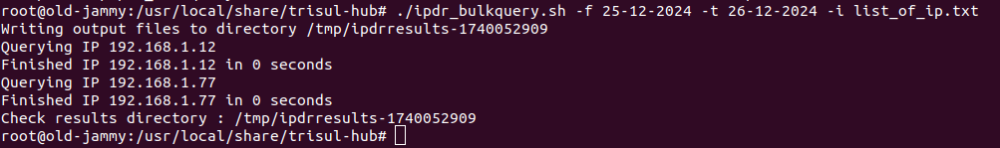
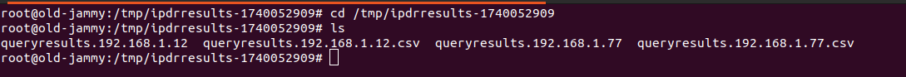

# IPDR Bulk Query Script


The `ipdr_bulkquery.sh` script is designed to query multiple IP addresses in bulk, retrieving flow details for each IP. This script is particularly useful when dealing with a large number of IP addresses.
This script is included with the Trisul Hub IPDR package. The purpose of this script is to allow our IPDR Customers to enter hundreds of IPs at once. Without this it can be tedious to enter each IP separately into the IPDR Web Form.


This script  works on the following input

* Single Timeframe
* A file containing a list of IP one per line

###  IP List

Create a file called iplist1.txt and put all IPs you wish to query in that list

```
#one per line 
203.43.23.1
22.23.44.55
87.23.55.123
78.178.21.139
```

Say you placed the file `iplist1.txt` in the `/root` directory. You can run it like this


```bash
/usr/local/share/trisul-hub/ipdr_bulkquery.sh  \
       -f 1-8-2024-13:00 -t 1-8-2024-13:30 \
              -i /root/iplist1.txt
```


### Output

The output will be placed by default into a subdirectory in `/tmp` (use the `-o` option to specify a different directory)

The subdirectory will have the format `ipdrresults-1722851578` where the number part is a timestamp.

Inside the subdirectory there will be files containing the IPDR query results. You can copy these files over.

```bash
root@ipdradmin:/usr/local/share/trisul-hub# ls -l /tmp/ipdrresults-1722851578
total 40880
-rw-r--r-- 1 root root      230 Aug  5 15:22 queryresults.103.84.86.10
-rw-r--r-- 1 root root        0 Aug  5 15:22 queryresults.103.84.86.10.csv
-rw-r--r-- 1 root root      230 Aug  5 15:23 queryresults.7.7.7.7
-rw-r--r-- 1 root root        0 Aug  5 15:23 queryresults.7.7.7.7.csv
-rw-r--r-- 1 root root 26485607 Aug  5 15:23 queryresults.8.8.4.4
-rw-r--r-- 1 root root 15360273 Aug  5 15:23 queryresults.8.8.4.4.csv
root@ipdradmin:/usr/local/share/trisul-hub#
```

## Usage

`./ipdr_bulkquery.sh [ -c hub-config-xml-file | default=default-hub-xml] [ -f From Date DD-MM-YYYY(-HH:MM)] [ -t To DATE DD-MM-YYYY(-HH:MM) ] [-i list-of-ip-file ]`

To use the script, simply execute it from the command line and pass the required options:
`./ipdr_bulkquery.sh [options]`   


### Options
The following options are available:  
`-c` : Specify the hub configuration XML file (default: default-hub-xml)  
`-f` : Specify the from date (format: DD-MM-YYYY or DD-MM-YYYY-HH:MM)  
`-t` : Specify the to date (format: DD-MM-YYYY or DD-MM-YYYY-HH:MM)  
`-i` : Specify the file containing the list of IP addresses to query  

## Preparing the IP Address List
Before running the script, prepare a text file containing the list of IP addresses you want to query. For example:  
ip_list.txt  
192.168.1.12  
192.168.1.13  
192.168.1.14  
...  

## Running the Script
To execute the script, pass the IP address list file along with the desired date range:
`./ipdr_bulkquery.sh -i ip_list.txt -f 25-12-2024 -t 26-12-2024`  
Note that you can also specify the time range by appending the time in the format HH:MM. For example:
`./ipdr_bulkquery.sh -i ip_list.txt -f 25-12-2024-14:30 -t 26-12-2024-15:30`

## Output
The script will create a directory in `/tmp` (e.g., `/tmp/ipdrresults-1740052909`) containing the query results for each IP address. For each IP, two files will be generated:  
`queryresults.<IP>.txt`  
`queryresults.<IP>.csv`  
These files contain the flow details for the corresponding IP address.

## Example Output
When you run the script, you will see output similar to the following:
```
root@old-jammy:/usr/local/share/trisul-hub# ./ipdr_bulkquery.sh -f 25-12-2024 -t 26-12-2024 -i list_of_ip.txt
Writing output files to directory /tmp/ipdrresults-1740052909
Querying IP 192.168.1.12
Finished IP 192.168.1.12 in 0 seconds
Querying IP 192.168.1.77
Finished IP 192.168.1.77 in 0 seconds
Check results directory : /tmp/ipdrresults-1740052909
```
  
*Figure: Showing IPDR bulk query Output*

  
*Figure: Reading the Output File*

The results will be stored in the specified directory, with separate files for each IP address.