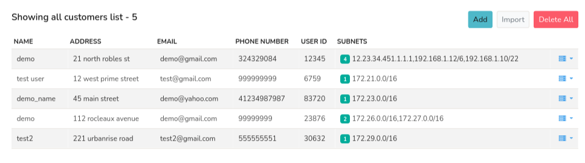

# IPDR Customers

IPDR Customers Management
The IPDR Customers list provides a comprehensive repository of customer details. This feature allows authorized users to:

   Add: Create new customer entries with detailed information
   Edit: Update existing customer records as needed
   Delete: Remove customer entries from the list

This functionality enables efficient management and maintenance of IPDR customer data.

:::info navigation 
:point_right: Go to Context:default &rarr; Admin Tasks &rarr; IPDR Customers
:::

*Figure: Showing IPDR Customers List*