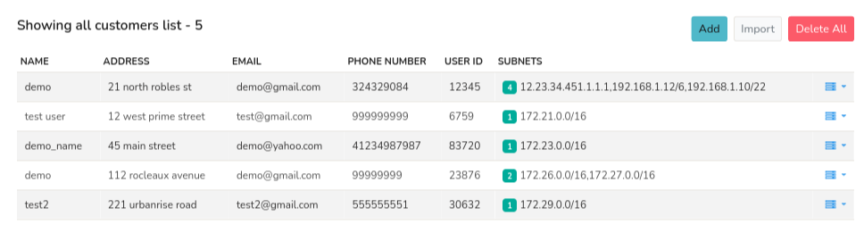
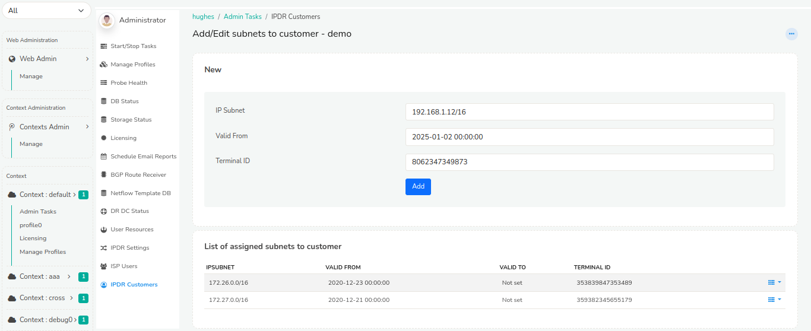

# IPDR Customers

IPDR Customers Management
The IPDR Customers list provides a comprehensive repository of customer details. This feature allows authorized users to:

   Add: Create new customer entries with detailed information
   Edit: Update existing customer records as needed
   Delete: Remove customer entries from the list

This functionality enables efficient management and maintenance of IPDR customer data.

:::info navigation 
:point_right: Go to Context:default &rarr; Admin Tasks &rarr; IPDR Customers
:::

*Figure: Showing IPDR Customers List*

## Adding Details of a New Customer

To add a new customer, click the *Add* button and complete the required fields:

| Field | Descriptions |
|-------|--------------|
| Name | Enter the customer's full name |
| Address | Enter the customer's physical address |
| Email | Enter the customer's primary email address |
| Phone Number | Enter the customer's primary phone number |
| Alternative Phone number | Enter the customer's alternative phone number |
| User ID | Enter the Unique Identifier of the customer. (Example: NB4002) |

And click *Create*.

## Importing Details of a New Customer

To import IP to customer mappings for IPDR click on the *Import* button on the top right corner. Browse and select the CSV file containing IP to customer mapping one per line. Click *Upload CSV File*. 

## Delete All

To delete all the details of the customers, click on the *Delete All* button on the top right corner. You cannot recover the details of the customers once deleted. 

## Action Button

Click on the action button against each customer to *edit*, *delete*, or *add/edit subnets*

### Add/Edit Subnets

To manage subnets and terminal IDs, click on the *Add/Edit Subnets* option from the action button dropdown. This will prompt you to enter the following details:

| Field | Description |
|-------|-------------|
| IP Subnet | Enter the IP subnet address in CIDR notation 
| Valid From | Select the date from which the subnet will be valid from. |
| Terminal ID | Enter the unique identifier for the terminal device associated with the subnet. |

*Figure: Showing IPDR Customers terminal IDs with subnets*

Below that are the list of assigned subnets to customer containg details such as 
Below that are the list of assigned subnets to customer containg details such as 

| Columsn| Descriptions |
|--------|--------------|
| IP Subnet | Displays the IP subnet in CIDR notation. |
| Valid from | Shows the data from which the subnet invalid. |
| Valid to | Displays the date until which the subnet is valid. by default it is set to not set indicating perpetual validity. |
| Terminal ID | Lists the unique identifier for the terminal device associated with the assigned subnet |
