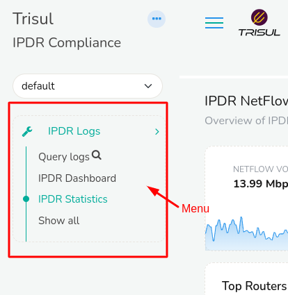

# IPDR Dashboard

Trisul IPDR Dashboard provides a visual representation of network activity data, providing real-time insights and analytics on internet usage patterns. It's a centralized platform that displays key metrics statistics and the output for submitted queries for IPDR logs. 

To view IPDR Dashboard,

:::note Navigation

Login as User name: `dotuser` and 

Password: `ipdr@@123`

:::

Once logged in and the [Trisul IPDR Query form](/docs/ipdr/querying_using_ipdr) is submitted, You can view the Trisul IPDR Dashboard and Menu.

This is the example of the logged in screen that you will be taken to.

   

### IPDR Menu

     

   On the Left side of the screen you can find the IPDR menu where you can navigate to,

1) [Query Logs](querying_using_ipdr)

2) [IPDR Dashboard](ipdrdashboard)

3) [IPDR Statistics](ipdrstatistics)

4) Show all. Click on Show all to view all other tools and dashboards for analysis.

### IPDR Dashboard

IPDR dashboard consists of number of modules that displays IPDR statistics and the record details of submitted queries for IPDR logs. This is an example of Trisul IPDR dashboard.

## Dashboard Components

Trisul IPDR Dashboard consists of two components

1) IPDR Statistics

2) Submitted queries for IPDR logs

### IPDR Statitics

IPDR Statistics consists of modules that provide real-time and historical insights into network activity, including:

#### Total Sessions

This module displays the total number of flows captured by trisul for the last week. The bar chart in this module consists of seven bars each representing flows stored per day for 7 days. 

You can hover over the chart to view the statitics data of flows stored per day for the last seven days.

#### Total DB Size

This module shows you the total Data Base size for the last seven days. Similar to total sessions module, in this each bar in the bar chart displays the disk usage per day for the last seven days by default.

#### Flows Stored Per Minute

In this module you can see the total number of flows (network connections) stored per minute by Trisul. The Sparkline in this module are real-time flows stored per minute for tha last one hour. 

You can hover over on the sparkline to view the value of flows stored per minute at any point of time for the past one hour.

#### Total Devices

This module gives you the total number of unique devices (IP addresses) detected by Trisul since the last one hour. The sparkline in this module represents the number of devices for the past one hour. Similar to the flows store per minute module, here also you can hover over the sparkline to view the real-time total count of devices at any point of time for the past one hour.

### Submitted Queries for IPDR Logs

In this module you can see the result for the custom queries for IPDR logs submitted by the user. Trisul captures the specific IPDR data  based on user defined criteria. The parameters of the logs are exactly as per the regulatory requirements and sufficient for audit/compliance.

This is a sample of Trisul IPDR log.

Let us explore the components of the IPDR log module in the following.

The header of the module contains the total number of status of queries **Started/Completed/Cancelled** by the user.

**User Name**: This is the name of the user who initiated the query.

**Status**: This is the status of the query being processed. When a new query has been requested it will show as NEW. When the query has started processing it will show as STARTED. When the query has processed it will show as COMPLETED. And when the query has been cancelled before completion it will show as CANCELLED.

**Requested Time**: This is the time that the user has submitted the query using the IPDR query form.

**Query**: The specific IP address provided by the user in the IPDR query form.

**Query From Time**: The IPDR data requested from this specific time by the user.

**Query To Time**: The IPDR data requested until this specific time by the user.

**Message**: This is the hash of the report file being generated for the particular query.

**Size**: This is the file size of the generated report for the query.

**Donwload**: You can download the report in .txt, excel, or in CSV formats.

Once you have the query processing completed on the dashboard which will typically take less than 10 seconds. You can click the download button of the desirable format and the report will be downloaded!

##### Cancellation

The user can cancel long running tasks by pressing the *Cancel* button against the query that has just started processing. The results that have been retrieved up until that point is immediately made available for download and/or FTP.
