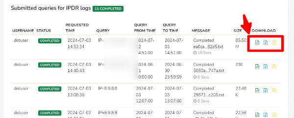
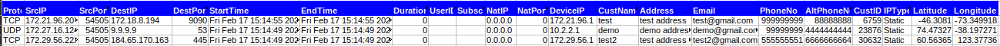
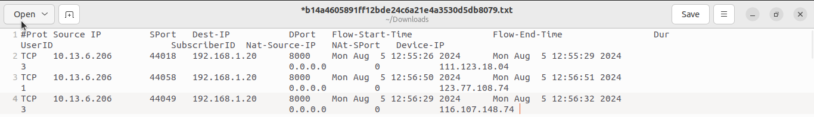
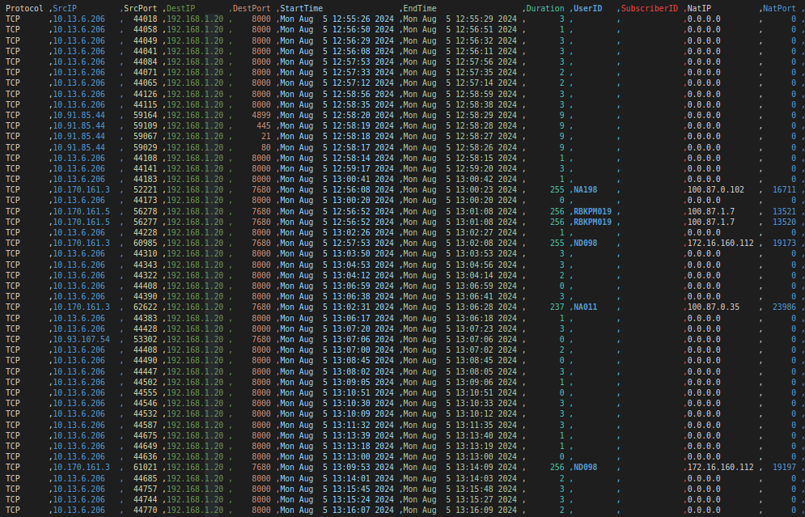

# Format of the output report

This page describes the fields when you export flows using this IPDR *IP Data Record* feature.

## The IPDR Report Fields

As per the compliance requirement the ISPs need to provide the following sets of fields to the agency.

The fields come from three sources

- Network Traffic – Netflow or PCAP
- AAA – Integration with AAA system/ RADIUS etc
- Customer System – The fields collected by the CAF (Customer Acquisition Form) provide the contact info, phone number etc.

### Table

| Name             | Source      | Notes                                                                          |
| ---------------- | ----------- | ------------------------------------------------------------------------------ |
| Protocol         | Flow        | UDP or TCP or ICMP or any other IP protocol of the flow                        |
| Source IP        | Flow        | Source IPv4 or IPv6 address of the flow                                        |
| Source Port      | Flow        | TCP or UDP Port                                                                |
| Destination IP   | Flow        | Dest IPv4 or IPv6 address of the flow                                          |
| Destination Port | Flow        | TCP or UDP Port                                                                |
| Start Time       | Flow        | Start time of the flow in YYYY-MM-DD-HH:MM:SS up to second                     |
| End Time         | Flow        | End time of the flow in YYYY-MM-DD-HH:MM:SS up to second                       |
| Duration         | Flow        | Duration of flow in seconds                                                    |
| NAT IP           | Flow        | NAT IP – usually this is the public IP, if the source IP is a private IP space |
| NAT Port         | Flow        | NAT Port                                                                       |
| Device           | Flow        | The router or other device that exported this flow                             |
| UserID           | AAA         | The user ID obtained from AAA                                                  |
| SubscriberID     | AAA         | Subscriber ID used by some ISP to link with customer databases                 |
| CustName         | Customer DB | Customer name                                                                  |
| Address          | Customer DB | Address                                                                        |
| Email            | Customer DB | E-Mail                                                                         |
| Phone            | Customer DB | Phone number                                                                   |
| Alt-Phone        | Customer DB | Alternate Phone Number                                                         |
| CustID           | Customer DB | A user ID or shortname                                                         |
| IP Type          |             | Shows if the IP type is static or dynamic                                      |
| Latitude         |             | geographical coordinates (The angular distance of a place north or south of the Earth's equator) associated with the IP address.                                                                  |
| Longitude        |             | geographical coordinates (The angular distance of a place east or west of the Greenwich Meridian) associated with the IP address.                                                               |

## Exporting IPDR into a Document

You can view new and previous IPDR queries in the IPDR Dashboard.

:::info navigation

:point_right: Login as `dotuser` &rarr; Goto IPDR Logs&rarr; IPDR Dashboard

:::

Completed queries allow you to download the results in [three document formats](/docs/ipdr/ipdrui#download).

The buttons are shown in the image below

For most cases we prefer the XLSX report. If the number of flows are huge say greater than 250K then use the text report format.

The MS Excel fields looks like this below.

## NAT Details

If the NAT is performed on the device exporting the NetFlow, the information is automatically added and available. If NAT is done in a different device, then please enable NetFlow on that device. CGNAT is similar.

## AAA Details

For ISP, using PPPoE or other technologies to connect users, then we need to add the AAA information to the flows. This is because the IP Address is dynamic and can be re-used by a number of customers. Trisul IPDR supports the following modes of AAA

- AAA Syslog -from systems like Free RADIUS
- AAA databases – periodically send AAA logs into a FTP directory on the Trisul IPDR server, the information is automatically picked up and merged.

## Sample Reports

This page contains details about the Excel and TXT Report format containing the results. These files need to be submitted to the agency. 

There are two places from where you can get the report files.

### Download Directly from Web Browser

For queries that result in a reasonable file size (default 100MB) the
agent can directly download the results by pressing the [Download button](/docs/ipdr/ipdrui#download). See [IPDR Settings > Download File Size](ipdr-settings) to adjust this limit.

### Get it from a Secure FTP Server   

Regardless of the limit, if a Secure FTP (SFTP) server is configured the
results file is copied to that server automatically. The advantage of
this option is very large file sizes can be sent automatically to the
FTP server rather than the user having to download from the browser.

## Report Format

Once the user has requested a query and the query has been processed for the particular IP address the IPDR report will be generated and is available for download in .txt, excel, and CSV formats.

### File name is SHA1 hashed 

Once completed the IPDR log will have a name like `765f9124f705735ad54f9c87223eecd4944a0aa7.txt` This is to ensure the integrity of the file from tampering. The file name is `SHA-1Hash.txt` where the file contents are hashed to produce the file name.

This is a sample IPDR report in excel format generated by Trisul.

And this is a sample of IPDR reported in .txt format

With CSV format you can automate the report and easily exchange data to different applications, systems or organizations.

Trisul IPDR Report format consists of the following details,

The header consists of report summary including Requested by (user name), Requested time (query submitted time) , IPDR records. And query details including parameters submitted by user, Start time and end time requested by the user.

The actual report contains the data of detailed metrics of network activity including,

| Report Data  | Description                                                               |
| ------------ | ------------------------------------------------------------------------- |
| Protocol     | Network Protocol used                                                     |
| SrcIP        | Source IP address                                                         |
| SrcPort      | Source Port                                                               |
| DestIP       | Destination IP address                                                    |
| DestPort     | Destination Port                                                          |
| Start Time   | Timestamp of session start                                                |
| End Time     | Timestamp of session end                                                  |
| Duration     | The length of time the network activity occurred                          |
| UserID       | Unique identifier assigned to the user                                    |
| SubscriberID | Unique identifier assigned to the subscriber (example, customer, account) |
| NatIP        | The private IP address assigned to a device or user by a NAT device       |
| NatPort      | The port number assigned to a device or user by a NAT device.             |
| DeviceIP     | The private IP address of the device                                      |
| CustName     | Name of the customer                                                      |
| CustID       | Customer ID                                                               |
| Address      | Contact address of the customer                                           |
| PhoneNo      | Contact number of the customer                                            |
| IP Type      | Indicates whether the IP address is Static or Dynamic                     |
