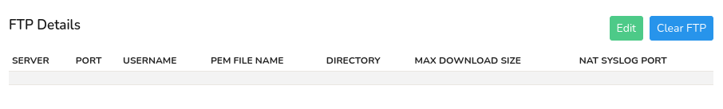
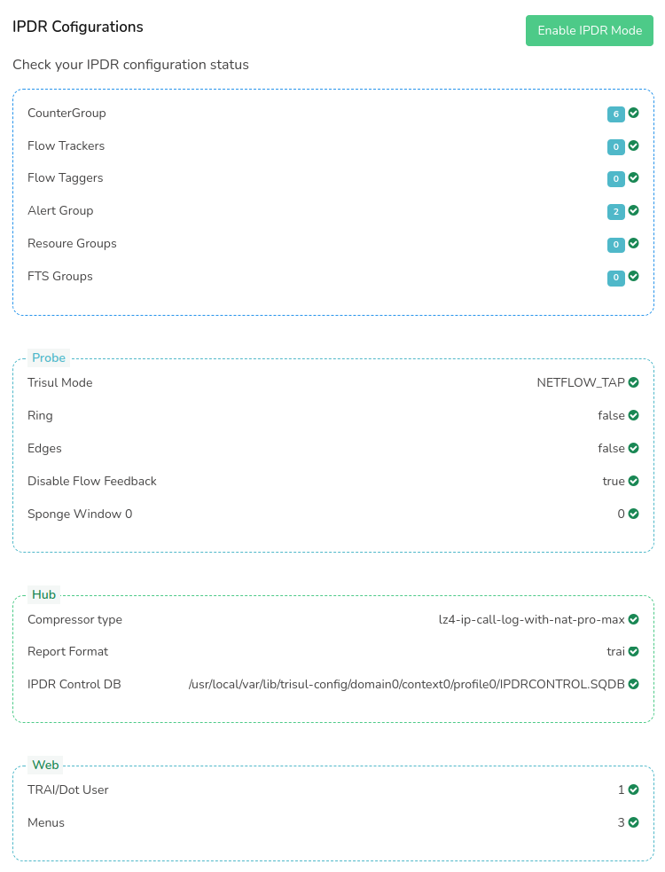

# Manually set IPDR mode

If you have skipped the [Mode Chooser Wizard](install) at time of first login, you can switch Trisul to IPDR mode at anytime by following the steps on this page. 

To enable IPDR Mode, Login as Admin and,

:::note Navigation

Go to Context: default-> Admin Tasks-> IPDR Settings

:::

This will take you to the IPDR settings page as shown in this example.

The IPDR settings consists of two modules

1. FTP Details

2. IPDR Configuration

## FTP Details

In the FTP Details module you can provide detailed records of network traffic, which can be useful for monitoring and analysis, but may also impact performance and storage requirements. Like Username, Port, Server etc.

In the FTP details, Click Edit to configure the details and fill the following fields. Or click Clear FTP to delete all the FTP details.

| Fields             | Description                                                                                                      |
| ------------------ | ---------------------------------------------------------------------------------------------------------------- |
| Server             | FTP Server host name or ip address                                                                               |
| Port               | FTP Server port number                                                                                           |
| Username           | Unique identifier that is used to access your server                                                             |
| Private Key        | Private key used to secure FTP connections. Private key (PPK) file name. Eg /usr/local/etc/trisul-hub/id_rsa.pub |
| Directory          | Remote directory or folder name on the FTP server that you want to access, upload, or download files from.       |
| Download File Size | Maximum allowed file size to download                                                                            |
| NAT Syslog Port    | NAT Syslog port number                                                                                           |

Once providing all the details, Click Update for trisul to start capturing all FTP traffic.

## IPDR Configurations

In the IPDR Configuration module you can see the status of the IPDR configurations including database, hub, probe and web. Click on the Enable IPDR Mode on the top right corner. This will enable the IPDR mode and all the configurations statuses will turn green as shown in this example which ensures the IPDR mode is enabled.

