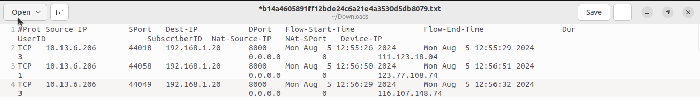
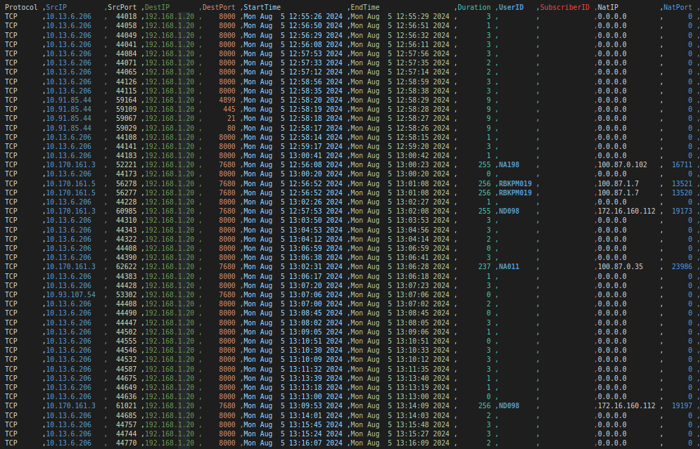

# Sample reports

This page contains details about the Excel and TXT Report format containing the results. These files need to be submitted to the agency. 

There are two places from where you can get the report files.

## Download directly from Web Browser

For queries that result in a reasonable file size (default 100MB) the
agent can directly download the results by pressing the *Download* button. See [IPDR Settings > Download File Size](/docs/ug/webadmin/ipdr-settings) to adjust this limit.

## Get it from a secure FTP server   

Regardless of the limit, if a Secure FTP (SFTP) server is configured the
results file is copied to that server automatically. The advantage of
this option is very large file sizes can be sent automatically to the
FTP server rather than the user having to download from the browser.

## Report Format

Once the user has requested a query and the query has been processed for the particular IP address the IPDR report will be generated and is available for download in .txt, excel, and CSV formats.

### File name is SHA1 hashed 

Once completed the IPDR log will have a name like `765f9124f705735ad54f9c87223eecd4944a0aa7.txt` This is to ensure the
integrity of the file from tampering. The file name is `SHA-1Hash.txt` where the file contents are hashed to produce the file name.

This is a sample IPDR report in excel format generated by Trisul.

And this is a sample of IPDR reported in .txt format

With CSV format you can automate the report and easily exchange data different applications, systems or organizations.

Trisul IPDR Report format consists of the following details,

The header consists of report summary including Requested by (user name), Requested time (query submitted time) , IPDR records. And query details including parameters submitted by user, Start time and end time requested by the user.

The actual report contains the data of detailed metrics of network activity including,

| Report Data  | Description                                                               |
| ------------ | ------------------------------------------------------------------------- |
| Protocol     | Network Protocol used                                                     |
| SrcIP        | Source IP address                                                         |
| SrcPort      | Source Port                                                               |
| DestIP       | Destination IP address                                                    |
| DestPort     | Destination Port                                                          |
| Start Time   | Timestamp of session start                                                |
| End Time     | Timestamp of session end                                                  |
| Duration     | The length of time the network activity occurred                          |
| UserID       | Unique identifier assigned to the user                                    |
| SubscriberID | Unique identifier assigned to the subscriber (example, customer, account) |
| NatIP        | The private IP address assigned to a device or user by a NAT device       |
| NatPort      | The port number assigned to a device or user by a NAT device.             |
| DeviceIP     | The private IP address of the device                                      |
| CustName     | Name of the customer                                                      |
| CustID       | Customer ID                                                               |
| Address      | Contact address of the customer                                           |
| PhoneNo      | Contact number of the customer                                            |
