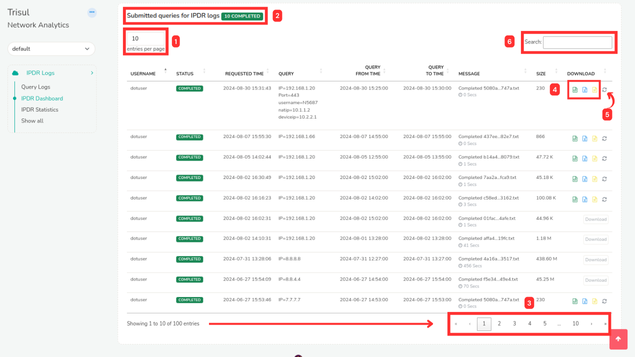

# IPDR UI Elements

This section provides an overview of the essential user interface elements that facilitate efficient query management in Trisul. Learn how to leverage features such as pagination, query summaries, resubmit options, and search functionality to locate specific queries, and easily download the reports.

  
*Figure: IPDR UI Elements*

Features are explained as numbered in the figure.
1) Pagination
2) Query Summary
3) Page Navigation
4) Donwload Options
5) Resubmit Button
6) Search Bar

## Pagination

The pagination feature bar is located at the upper left hand side of the page. Here, you can select the number of submitted queries to be displayed per page from the dropdown.

## Query Summary
Above the table of submitted queries, a summary of the overall query status is displayed, that provide a a quick overview of query status, enabling you to monitor progress.

Cancelled: Number of queries that have been cancelled.  
Completed: Number of queries that have been successfully completed.  
New: Number of newly submitted queries waiting to be processed.  
Started: Number of queries currently being processed.  

This summary is dynamic and updates according to the page data. For each page, the summary will reflect the number of processed queries specific to that page.

## Page Navigation
Below the table of submitted queries, you can navigate to the desired page using the page navigation controls:

Page numbers: If you have selected to display 10 queries per page and there are a total of 500 submitted queries, the page navigation will show 50 pages (1, 2, 3, ..., 50).

Previous page: Click the single left arrow button to navigate to the previous page.
Next page: Click the single right arrow button to navigate to the next page.
First page: Click the double left arrow button to navigate to the first page.
Last page: Click the double right arrow button to navigate to the last page.

This allows you to easily navigate through multiple pages of submitted queries and get an overview of the query status for each page.

## Download 

This is one of the most commonly found UI elements across Trisul. Clicking on the Download button enables you to download the data for sharing, backup and archive.

You can export data, reports, or analytics in various formats like,
PDF: Downloads the data in Portable Document Format (PDF), suitable for printing or sharing.
XLSX: Downloads the data in Microsoft Excel format (XLSX), suitable for editing or analysis.
CSV: Downloads the data in Comma Separated Values format (CSV), suitable for importing into other applications for analysis.

## Resubmit

The Resubmit button is located at the right end of each query in the submitted queries table. This button allows you to quickly resubmit a selected query with minimal effort. When clicked, it directs you to the IPDR Query Form with all fields pre-filled with the original query's information, enabling you to make any necessary adjustments before resubmitting.

## Search Bar

The search bar allows you to quickly find specific submitted queries within the table. You can enter keywords, query IDs, or other relevant criteria to filter the displayed queries, making it easier to locate and manage specific queries.
