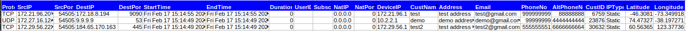

# Latitude Longitude

The latitude and longitude associated with an IP address can be dynamically determined by tracking its corresponding Terminal ID, which updates as the device moves and its location changes. Upon querying the IP address, its latitude and longitude can be extracted by leveraging an API to retrieve the Terminal ID and its associated current latitude and longitude data.

Imagine a satellite serving multiple IP addresses (For example, 10 IPs) can provide real-time geolocation updates for each IP address. As each IP device moves, its corresponding Terminal ID is dynamically updated, enabling the extraction of its current latitude and longitude through an API query.

In the following path `/usr/local/share/webtrisul/config/initializers/latlong_api.rb` set the `LATLON_API_ENABLED=true` and the following details are taken from the API.

 

| Detail | Description |
|--------|-------------|
| Host ID | The IP address of the host server, used to establish a connection to the API |
| Port | The network port number used to access the API, specifying the communication endpoint. |
| URL | The URL path (a part of the URL) of the API endpoint, providing the address for sending requests. |
| API Key | A secure authentication token, used to verify the identity of the requesting application and authorize access to the API. |

:::info navigation
:point_right: Go to Context:default &rarr; Admin tasks &rarr; IPDR Customers
:::

The IPDR Customer list page shows a list of customers with the following details

| Detail | Description |
|--------|-------------|
| Name   | The name of the customer | 
| Address | Physical address of the customer |
| Email | Email address of the customer used for communication and notification|
| Phone number | The customer's phone number |
| User ID | A unique identifier assigned to each customer |
| Subnets | Subnet associated with customer's account used for network configuration |
| Action button | Allows users to perform actions on the customer's account edit, delete, and edit subnets. |

Click on the action button against a particular customer and click *Add/Edit Subnets*.

*Figure showing the Subnet and the Terminal ID associated with the IP*

This page shows the list of assigned subnets to customer with the following details.

| Detail | Description |
|--------|-------------|
| IPSubnet | The IP subnet address assigned to the customer. |
| Valid From | The date and time from which the subnet assignment is effective. |
| Valid To | The date and time until which the subnet assignment is valid. |
| Terminal ID | The identifier of the terminal or device to which the subnet is assigned, used for tracking purposes. |
| Action Button | Allows users to perform actions on the assigned subnet, such as set expiry and delete. |

To extract the geolocation of a particular IP address, the subnet associated with the IP is first identified from the report, and then the terminal ID for that subnet is noted for the specific time period mentioned in the report. The terminal ID for that time is then entered into the API to extract the latitude and longitude of that particular IP address.

**Sample report**:

