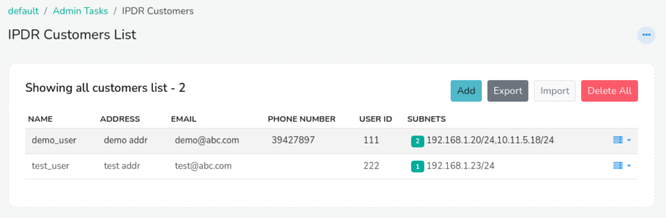

# Customer Inventory Mappings

The IPDR Customers list provides a comprehensive repository of customer details. This document describes how to add customer information, so that they are automatically filled into the output EXCEL report.

This feature allows authorized users to:

There are three ways to maintain customer details

   - Manually maintain static IP to customer mappings one by one
   - Use the EXCEL upload feature to maintain customer mappings in bulk
   - Use the [Trisul IPDR REST API](api) . to maintain the customer mappings
   
## Compliance Requirement

The DoT compliance letter clearly mentions that the following details need to be provided in the output report.  These are called CAF fields. CAF stands for Customer Acquisition Form. 


*Figure: Compliance requirement to add customer info* 


## Manually Add Static IP Mappings 

:::info navigation 
:point_right: Go to Context:default &rarr; Admin Tasks &rarr; IPDR Customers
:::

The column subnets shows the IP Addresses addressed to each customer along with other details.

  
*Figure: Showing IPDR Customers List*

### Adding Details of a New Customer

To add a new customer, click the *Add* button and complete the required fields:

| Field | Descriptions |
|-------|--------------|
| Name | Enter the customer's full name |
| Address | Enter the customer's physical address |
| Email | Enter the customer's primary email address |
| Phone Number | Enter the customer's primary phone number |
| Alternative Phone number | Enter the customer's alternative phone number |
| User ID | Enter the Unique Identifier of the customer. (Example: NB4002) |

And click *Create*.


## Importing using CSV

:::warning CSV overwrites
When importing new customer details into the system by CV, please note that it will override any existing customer information. The CSV file will serve as the master inventory. 
:::


To ensure that all customer details are retained, follow these steps:

- **Export Existing Customer Details**: First, export the current list of customer details from the system. This will prevent any loss of existing data.
- **Combine New and Existing Customer Details**: Add the new customer details to the exported list, ensuring that all information is accurate and up-to-date.
- **Import Combined Customer Details**: Import the combined list of customer details into the system. This will update the system with the complete and accurate customer information.

By following these steps, you can ensure a seamless integration of new customer details without overwriting existing data.

### CSV File Format

A sample CSV format can be found here 

```csv title="customermappings.csv"
#IPSubnet,Name,Address,Email,Phone,Alt Phone,UserID,Valid From Date,Valid To Date,Circuit/TerminalID
192.168.1.0/24,John Doe,"123 Main St, Springfield",john.doe@example.com,9812345678,9876543210,JD123,01-01-2024 09:00:00,01-01-2025 09:00:00,CT-001
10.0.0.0/16,Jane Smith,"456 Elm St, Rivertown",jane.smith@example.com,9898765432,,JS456,,,CT-045
172.16.5.0/28,Ali Khan,"789 Oak St, Lakeside",ali.khan@example.com,9822334455,9899223344,AK789,10-09-2023 10:15:00,10-09-2024 10:15:00,CT-078
```

Notes about the fields 

| Field | Optional | Notes | 
|-------|--------------|-----|
| IPSubnet | Mandatory | You can enter a single IP `192.168.1.12` or a subnet in CIDR format `192.168.1.1/24` or a CSV in quoted format `"192.168.1.1,210.2.1.3"` or a mix of subnet and IP `"192.168.1.1,210.2.1.0/28"` |
| Name | Mandatory | Customer name , if contains comma you must quote |
| Other fields | Optional | | 
| Valid From | Optional |  If no date is specified for "Valid From," the system defaults to January 1, 1970 (Epoch timestamp: 0)|
| Valid To | Optional | If no date is specified for "Valid To," the system assumes the validity period is perpetual, with no end date. |
| Terminal ID | Optional | You can enter a circuit ID or a MAC here for reference |


The default mapping of all the columns to customer and subnet details can be modified in the UI after importing the CSV file.

  
*Figure: CSV Format*

### Importing

:::info navigation 
:point_right: Go to Context:default &rarr; Admin Tasks &rarr; IPDR Customers
:::

To import IP to customer mappings for IPDR, follow these steps:

- Click the Import button located in the top right corner.
- Browse and select the CSV file containing the IP to customer mappings, with one mapping per line.
- Click Upload CSV File to initiate the upload process. 

### Exporting

:::info navigation 
:point_right: Go to Context:default &rarr; Admin Tasks &rarr; IPDR Customers
:::

To export the details of existing IPDR customers, follow these simple steps:

- Navigate to the IPDR customer list page.
- Click the Export button.

The system will automatically export all IPDR customer details in CSV format.

## Delete All

To delete all the details of the customers, click on the *Delete All* button on the top right corner. You cannot recover the details of the customers once deleted. 

## Action Button

Click on the action button against each customer to *edit*, *delete*, or *add/edit subnets*

### Add/Edit Subnets

To manage subnets and terminal IDs, click on the *Add/Edit Subnets* option from the action button dropdown. This will prompt you to enter the following details:

| Field | Description |
|-------|-------------|
| IP Subnet | Enter the IP subnet address in CIDR notation 
| Valid From | Select the date from which the subnet will be valid from. |
| Terminal ID | Enter the unique identifier for the terminal device associated with the subnet. |


*Figure: Showing IPDR Customers terminal IDs with subnets*

Below that are the list of assigned subnets to customer containing details such as 

| Column| Descriptions |
|--------|--------------|
| IP Subnet | Displays the IP subnet in CIDR notation. |
| Valid from | Shows the data from which the subnet invalid. |
| Valid to | Displays the date until which the subnet is valid. By default it is set to "not set" indicating perpetual validity. |
| Terminal ID | Lists the unique identifier for the terminal device associated with the assigned subnet |


:::info Validity timeframe of mappings - `ValidFrom` and `ValidTo` 
The Static IP mapping captures the validity of the assignment via the *Valid From* and *Valid To* fields. While generating the IPDR Report , Trisul IPDR uses the *Valid From* and *Valid To* timestamps to fill out the customer details. Users should do a *Set Expiry* for decommissioned customers rather than *Delete* them. This allows historical mappings to be correctly filled out as per the compliance mandate. 
:::

Click on the action button against a subnet for two options say
1) Set Expiry
2) Delete

Click on *Set Expiry* to set "Valid to" date for the selected subnet that shows the flows until the set expiry date but not the customer details in the report. Click *Delete* to delete that particular subnet.