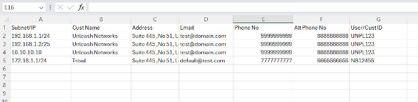

# Static IP Mappings

How to add customer information, so that they are automatically filled into the output EXCEL report.

## Compliance Requirement

The DoT compliance letter clearly mentions that the following details need to be provided in the output report.  These are called CAF fields. CAF stands for Customer Acquisition Form. 

*Figure: Compliance requirement to add customer info* 

:::info  Static vs AAA customers
This feature is most useful for the static IP customers of the ISP. Because the inventory is more stable than large scale ISP providing residiential services. For the latter, talk to us to use a REST API to get the fields
:::

Adding customer details for static IP customers can be done in two methods

- Automatically use a REST API – contact us offline for this
- Enter each mapping or upload a CSV file containing all static IP to customer mappings

## Manually Add Static IP Mappings 

:::info navigation
:point_right: Go to Context: default → Admin Tasks → IPDR Customers
:::

The column subnets shows the IP Addresses addressed to each customer along with other details.

### Add Customer

Press the Add button to add a new Customer.

Fill in the following details - these show up verbatim in the output report that you send to the authorities. 
* **Name** - customer name
* **Address** - address
* **Email** - email ID of the customer
* **Phone Number** - phone number
* **Alt Phone Number** - optional 
* **UserID** - UserID or subscriber ID 

### Add IP Subnet to Customer Mapping

This is how you add static IP mappings to customers added in previous step.

Press the Add/Edit Subnet option

Enter the following 

* **IP** - the IP address or CIDR format eg `19.168.1.23` or `19.168.1.20/28` 
- **Valid From** - the IP Assignment is valid from this date. Set this to 1-1-1970 if you want to use this for old data.

*Figure: Assigning IPs to a customer page* 

Press the **ADD** button to assign this IP. You will see the new IP added as below

Once done simply press the browser **Back** button to go back to the customer list.

:::info Validity timeframe of mappings - `ValidFrom` and `ValidTo` 
The Static IP mapping captures the validity of the assignment via the *Valid From* and *Valid To* fields. While generating the IPDR Report , Trisul IPDR uses the *Valid From* and *Valid To* timestamps to fill out the customer details. Users should do a *Set Expiry* for decommissioned customers rather than *Delete* them. This allows historical mappings to be correctly filled out as per the compliance mandate. 
:::

### Delete and Set Expiry

In the *List of assigned subnets to customers*  each of the assigned subnets is shown
* IP Subnet 
* Valid From - mapping valid From this time
* Valid To - valid Upto this time 

The right side options menu contains the following options 
* Set Expiry - set the Expiry date to the current time
* Delete - delete this mapping entirely

## Bulk Import from CSV Format

You can also import an entire customer database at once via a CSV file. 

The CSV format is shown here, notice the header for fields. 

 

*Figure: CSV file sample* 

A sample working CSV file can be downloaded from here [Sample_IPDR_Customer_Import.CSV](/data/SAMPLE_IPDR_CUSTOMER_SUBNET_MAPPINGS.csv) 

You can edit the information as needed.

- **Step 1** : Select the CSV file
- **Step 2** : Select the column numbers, if you followed the sample file above you can skip this step and directly press IMPORT
- **Step 3** : Confirm

