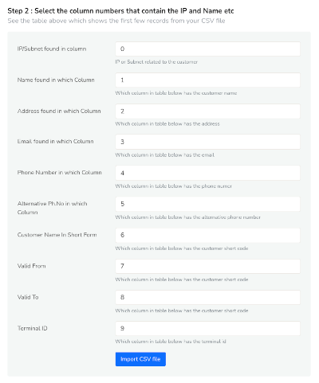

# Customer Inventory Mappings

The IPDR Customers list provides a comprehensive repository of customer details. Basically tells how to add customer information, so that they are automatically filled into the output EXCEL report.This feature allows authorized users to:

   **Add**: Create new customer entries with detailed information  
   **Edit**: Update existing customer records as needed  
   **Delete**: Remove customer entries from the list  

   :::tip
You can also add customer information for static IP and usernames using the [Trisul IPDR API](api) . 
:::

## Compliance Requirement

The DoT compliance letter clearly mentions that the following details need to be provided in the output report.  These are called CAF fields. CAF stands for Customer Acquisition Form. 

*Figure: Compliance requirement to add customer info* 

:::info  Static vs AAA customers
This feature is most useful for the static IP customers of the ISP. Because the inventory is more stable than large scale ISP providing residiential services. For the latter, talk to us to use a REST API to get the fields
:::

Adding customer details for static IP customers can be done in two methods

- Automatically use a REST API – contact us offline for this
- Enter each mapping or upload a CSV file containing all static IP to customer mappings

## Manually Add Static IP Mappings 

:::info navigation 
:point_right: Go to Context:default → Admin Tasks → IPDR Customers
:::

The column subnets shows the IP Addresses addressed to each customer along with other details.

  
*Figure: Showing IPDR Customers List*

### Adding Details of a New Customer

To add a new customer, click the *Add* button and complete the required fields:

| Field | Descriptions |
|-------|--------------|
| Name | Enter the customer's full name |
| Address | Enter the customer's physical address |
| Email | Enter the customer's primary email address |
| Phone Number | Enter the customer's primary phone number |
| Alternative Phone number | Enter the customer's alternative phone number |
| User ID | Enter the Unique Identifier of the customer. (Example: NB4002) |

And click *Create*.

## Importing New Customer Details

When importing new customer details into the system, please note that it will override any existing customer information. To ensure that all customer details are retained, follow these steps:

- **Export Existing Customer Details**: First, export the current list of customer details from the system. This will prevent any loss of existing data.
- **Combine New and Existing Customer Details**: Add the new customer details to the exported list, ensuring that all information is accurate and up-to-date.
- **Import Combined Customer Details**: Import the combined list of customer details into the system. This will update the system with the complete and accurate customer information.

By following these steps, you can ensure a seamless integration of new customer details without overwriting existing data.

### Importing

:::info navigation 
:point_right: Go to Context:default → Admin Tasks → IPDR Customers
:::

To import IP to customer mappings for IPDR, follow these steps:

- Click the Import button located in the top right corner.
- Browse and select the CSV file containing the IP to customer mappings, with one mapping per line.
- Click Upload CSV File to initiate the upload process. 

Once the CSV file is uploaded, you can see a status summary displaying the total customers uploaded, the number successfully imported, the number of records skipped, and the number of IP addresses skipped.

*Figure: Showing Summary of Successful Import*

### Exporting

:::info navigation 
:point_right: Go to Context:default → Admin Tasks → IPDR Customers
:::

To export the details of existing IPDR customers, follow these simple steps:

- Navigate to the IPDR customer list page.
- Click the Export button.

The system will automatically export all IPDR customer details in CSV format.

### Bulk Import from CSV File Format

:::info  Sample Template CSV and EXCEL files 
You can download these sample files and use them as a template to add your own mappings 

 - [Download Sample CSV](/data/SAMPLE_IPDR_CUSTOMER_SUBNET_MAPPINGS.csv)
 - [Download Sample EXCEL](/data/ipdrtemplate.xlsx)          _Right click and Save Link As_

**EXCEL** If using XLSX format ensure you save as _CSV UTF-8 (Comma Separated) *.csv_ file.  The CSV format will be used for import. 
:::

  
*Figure: Sample CSV file 

#### Description of fields in CSV file

|Column Number | Field | Descriptions |
|-------|--------------|--- |
| 1 | IP Address  | The IP Address or Subnet. You can enter multiple IP or subnets in one line separated by a comma. Formats accepted are <ul><li>`192.168.10.23` </li> <li>`192.168.18.24/29`</li><li> `19.82.23.4,19.82.22.0/24` </li></ul> |
| 2 | Name | Customer name |
| 3 | Address | Customer address |
| 4 | Email | Customer Email ID |
| 5 | Phone | Phone number |
| 6 | Alt Phone | Alternative phone number |
| 7 | Customer ID | Circuit ID, Customer ID, Code, Username this uniquely identifies a customer |
| 8 | Valid From | The date from which this IP allocation is valid.  Format is `DD-MM-YYYY HH:MM:SS` the `HH:MM:SS` part is optional. If left blank 01-01-1970 is used |
| 9 | Valid To | The date until which this IP allocation is valid. Format is same as _Valid From_ If field is left blank, the allocation has no end date |
| 10 | Terminal ID | You can put a MAC address or other terminal ID here to be used for internal purposes |

#### Column order customization 

The default mapping of all the columns to customer and subnet details can be modified in the UI after importing the CSV file.

  
*Figure: CSV Column selection*

-----

## Delete All

To delete all the details of the customers, click on the *Delete All* button on the top right corner. You cannot recover the details of the customers once deleted. 

## Action Button

Click on the action button against each customer to *edit*, *delete*, or *add/edit subnets*

### Add/Edit Subnets

To manage subnets and terminal IDs, click on the *Add/Edit Subnets* option from the action button dropdown. This will prompt you to enter the following details:

| Field | Description |
|-------|-------------|
| IP Subnet | Enter the IP subnet address in CIDR notation 
| Valid From | Select the date from which the subnet will be valid from. |
| Terminal ID | Enter the unique identifier for the terminal device associated with the subnet. |

*Figure: Showing IPDR Customers terminal IDs with subnets*

Below that are the list of assigned subnets to customer containing details such as 

| Column| Descriptions |
|--------|--------------|
| IP Subnet | Displays the IP subnet in CIDR notation. |
| Valid from | Shows the data from which the subnet invalid. |
| Valid to | Displays the date until which the subnet is valid. By default it is set to "not set" indicating perpetual validity. |
| Terminal ID | Lists the unique identifier for the terminal device associated with the assigned subnet |

:::info Dont delete customers, use Set Expiry
The Static IP mapping captures the validity of the assignment via the *Valid From* and *Valid To* fields. While generating the IPDR Report , Trisul IPDR uses the *Valid From* and *Valid To* timestamps to fill out the customer details. Users should do a *Set Expiry* for decommissioned customers rather than *Delete* them. This allows historical mappings to be correctly filled out as per the compliance mandate. 
:::

Click on the action button against a subnet for two options say
1) Set Expiry
2) Delete

Click on *Set Expiry* to set "Valid to" date for the selected subnet that shows the flows until the set expiry date but not the customer details in the report. Click *Delete* to delete that particular subnet.