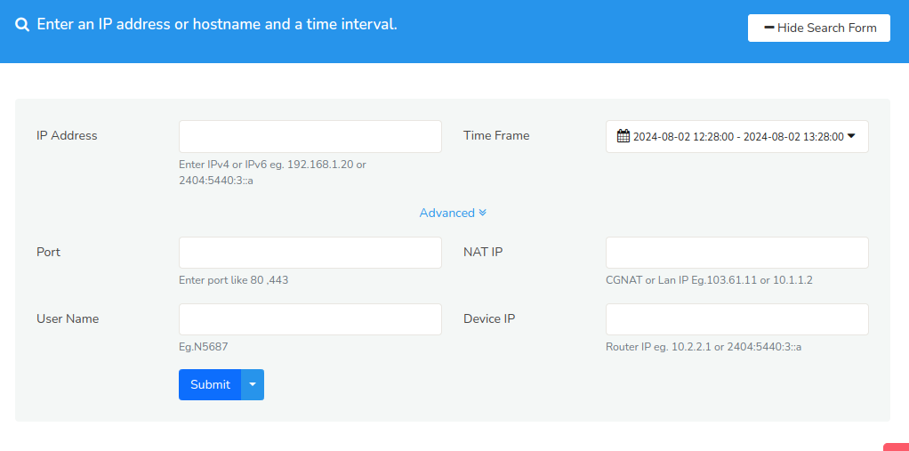

# Submit Queries

This is the place you go to generate IPDR reports when the agencies request information. 

To view Trisul IPDR Query form,

:::info Navigation

:point_right: Login as User name: `dotuser` and

Password: `ipdr@@123`  (:bulb: remember to change the default)

:::

## Form Structure

Trisul IPDR Query Form allows you to query on one or more of the following fields.


Here is the snapshot of Trisul IPDR Query Form.



*Figure: The IPDR Query form*


### Form fields

:::note 
Multiple fields are AND-ed.
:::


| Fields | Input  | Description |
| ------ | --- |---|
| IP Address | Enter the IPv4 or IPv6 address. Example:  209.168.1.20 or 2404:5440:3::a | The IP address of interest for the query. Generally this is the public IP address that you will receive|
| Time Frame | Select from a list of time frames (Last 1 hour, this month etc) or click custom to specify a time period | The time range for which you want to retrieve IPDR data.|
| Port | The TCP or UDP Port number   | The port number|
| NAT IP | The private IP Address    | When NAT or CGNAT is used , enter the private IP you want to query in this field. Typically this would be in the 100.64.0.0/10, 10.0.0.0/8, or other private ranges|
| User Name  | The AAA User name    | The AAA User name, this only works if you are using AAA real time syslog.|
| Device IP  | Router IP Example: 10.2.2.1 or 2404:5440:3::a| The IP Address of the device generating the IPDR Data. Typically the router.|


### Usage Guidelines

- Fill in these fields with desired query parameters

- Click Submit 

This will create a targeted query to retrieve specific IPDR data. The result statistics and IPDR logs can be viewed on the [IPDR Dashboard](ipdrdashboard) right away!


## Full database dump

Some jurisdictions have this requirement where ISPs are asked to provide a full database dump of all records to the agency. Obviously this is going to be gigantic, hence they can be capped at 1 Million records or such. 

To request a full dump leave all the form fields blank and **press the split submit** button as shown below.


*Figure: Request full database dump. A compliance tick mark* 

As a safety mechanism, the Full Database Dump is capped to 250,000 records.  This is controlled by the [IPDR > MaxRecords](/docs/ref/trisulhubconfig#ipdr) option in the Trisul Hub Configuration file. 


### Enhanced Bulk Query Capability

The `ipdr_bulkquery.sh` script is a utility provided with the Trisul Hub IPDR package. It enables users to query thousands of IPs at once, eliminating the need for tedious individual IP entries into the IPDR Web Form.

#### **Prerequisites**

 - The ipdr_bulkquery.sh script is located in the `/usr/local/share/trisul-hub` directory.
 - Create a text file (e.g., iplist1.txt) containing the list of IPs to query, one per line.
 For example (One per line), 
203.43.23.1
22.23.44.55
87.23.55.123
78.178.21.139

#### **Running the Script**

- Place the `ipdr_bulkquery.sh` script and the IP list file (e.g., iplist1.txt) in a desired directory (e.g., /root).
- Execute the script using the following command format:

`/ipdr_bulkquery.sh -f <start_date> -t <end_date> -i <ip_list_file>`


 *   `<start_date>`: Specify the start date and time in the format `1-8-2024-13:00`.
 *   `<end_date>`: Specify the end date and time in the format `1-8-2024-13:30`.
 *   `<ip_list_file>`: Specify the path to the IP list file (e.g., `/root/iplist1.txt`).

**Example Command**

```bash
./ipdr_bulkquery.sh  -f 1-8-2024-13:00 -t 1-8-2024-13:30   -i /root/iplist1.txt
```
### Output

The script generates output files containing the IPDR query results. By default, these files are saved in a subdirectory within the `/tmp` directory. The subdirectory name follows the format `ipdrresults-<timestamp>` (For example, `ipdrresults-1722851578` ).
To specify a different output directory, use the **-o** option followed by the desired directory path.

### Output File Structure

The output subdirectory contains files named queryresults.<IP_address> and queryresults.<IP_address>.csv, where <IP_address> represents the IP address queried.
These files contain the IPDR query results in both plain text and CSV formats.

```
root@ipdradmin:/usr/local/share/trisul-hub# ls -l /tmp/ipdrresults-1722851578
total 40880
-rw-r--r-- 1 root root      230 Aug  5 15:22 queryresults.103.84.86.10
-rw-r--r-- 1 root root        0 Aug  5 15:22 queryresults.103.84.86.10.csv
-rw-r--r-- 1 root root      230 Aug  5 15:23 queryresults.7.7.7.7
-rw-r--r-- 1 root root        0 Aug  5 15:23 queryresults.7.7.7.7.csv
-rw-r--r-- 1 root root 26485607 Aug  5 15:23 queryresults.8.8.4.4
-rw-r--r-- 1 root root 15360273 Aug  5 15:23 queryresults.8.8.4.4.csv
root@ipdradmin:/usr/local/share/trisul-hub#
```