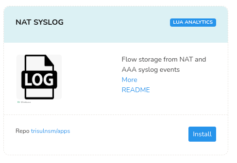

# NAT Syslog 

Many devices allow export of NAT Mappings via SYSLOG.  This can be suitable for lower bandwidth ISPs.

To use the NAT SYSLOG you have to install the  [ NAT Syslog Trisul Apps](/docs/ag/webadmin/apps/)

:::info navigation
:point_right: Login as `admin` and select WebAdmin  &rarr; Manage &rarr; Apps
:::

## Sample configuration 

- [Mikrotik NAT Syslog](https://www.trisul.org/devzone/doku.php/netflow:natsyslog	)

