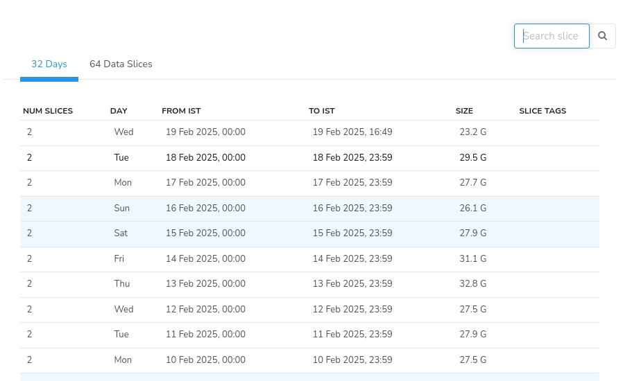
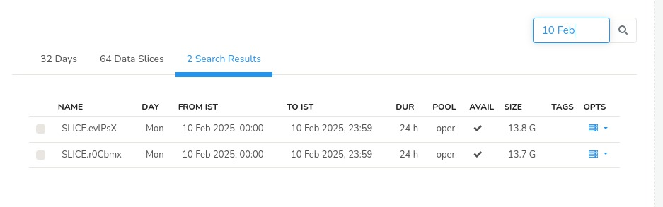

# Using a tape archive 

For very large ISPs, storing logs in tape archives is a very good value proposition.  This document explains how you can setup Trisul IPDR to use tape archives. 


## Architecture

- Trisul IPDR stores data in slices
- Each day maps to 2, 4, or 8 slices depending on the configuration
- The [Storage Status](/docs/ag/admintasks/storage_status)  tool can be used to find out the slices for any day
- When the ISP gets a query for a particular day
	- find the slices that map to the day
	- restore them to a particular directory 
	- run the query
	- afterwards delete the slices which were earlier restored 


# Storage pool architecture

The [Manage Storage](/docs/ag/admintasks/storage_status#tape) section of the Admin Guide explains the Storage Pool concept as used by Trisul. Hot data is stored in the pool called Oper, then it moves to Ref, then to a series of Archives.  

The **tape**  is a special type of storage pool at the end of the chain. 

## Enable the tape storage pool

Edit the [Trisul Hub Configuration file](/docs/ref/trisulhubconfig#advanced-archiving) and set the `OfflineArchiveTag` to `tape` 

```xml
<OfflineArchiveTag>
	tape
</OfflineArchiveTag>

```

When this is enabled, old slices are remembered in the index and tagged with the label `tape`


## Allocate a restore point

Allocate a disk area that can store atleast a week of data. For example if you generate 500GB of logs per day, allocate a 4TB disk.

Mount or softlink the restore point to  a directory called `tape` in the meters directory.

In the following example the 4TB restore disk has been softlinked to the `tape` directory

```bash


noc@ipdr:/usr/local/var/lib/trisul-hub/domain0/hub0/context0/meters$ ls -l
total 52
drwxr-x--- 2 trisul trisul  4096 Feb 10 11:16 archive
-rw-r----- 1 trisul trisul 32768 Feb 17 14:33 METASLICE.SQDB
drwxr-x--- 4 trisul trisul  4096 Feb 10 11:16 oper
drwxr-x--- 2 trisul trisul  4096 Feb 17 14:33 persist
drwxr-x--- 2 trisul trisul  4096 Feb 10 11:16 ref
drwxr-x--- 2 trisul trisul  4096 Feb 10 11:16 tape -> /restore01 
drwxr-x--- 2 trisul trisul  4096 Feb 10 11:16 tmp

```

## Restoring a day

When the customer wants to query for logs from a particular date say Feb 10, 2025.  The workflow is this,


### Locate the slices for day 

:::info navigation 
:point_right: Login as `admin`, Go to Context:default0 &rarr; Admin Tasks &rarr; Storage status
:::

  
*Figure: Showing Slices on the selected storage pool*

Once you have navigated to the Storage Status page and scrolled to the bottom to view the data slices for the selected storage pool. In the top-right corner of the slices section, you'll find the *Search Slice* tool. Enter the desired date in the search bar, and the system will display all data slices for that date, regardless of the storage pool they're stored in.

For instance, to find all slices for February 10th, simply enter "10 Feb" in the search bar. 

  
*Figure: Showing sample of slices searched for a particular date*

>**Note: The search starts only if you enter a minimum of three characters. For example: "Feb". Search date can be with or without spaces say 10 Feb 2025 or 10feb2025**


### Restore the 2 slices 

Restore the two slices SLICE.evlPsX and SLICE.r0Cbmx to the mentioned `tape ` restore point 

It should look like this 

```bash


noc@ipdr:/usr/local/var/lib/trisul-hub/domain0/hub0/context0/meters$ ls -l tape 
total 4
drwx------ 11 trisul trisul 4096 Feb 10 23:59 SLICE.evlPsX
drwx------ 11 trisul trisul 4096 Feb 10 23:59 SLICE.r0Cbmx

```


### Run the query 

Now you can run the IPDR Query with the date Feb 10, 2025 as described in [Submit Queries](/docs/ipdr/submit-queries)


## Check Storage Status

After restoration  you can check the Storage Status 

  
*Figure: Showing Storage*

This shows the storage status with a check mark showing the slice is now available for query. Now you can run the query.


