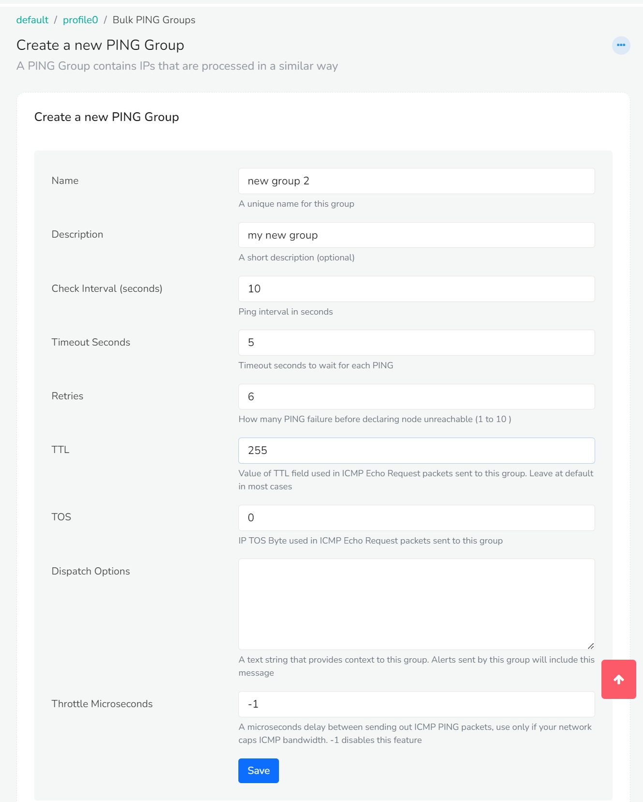
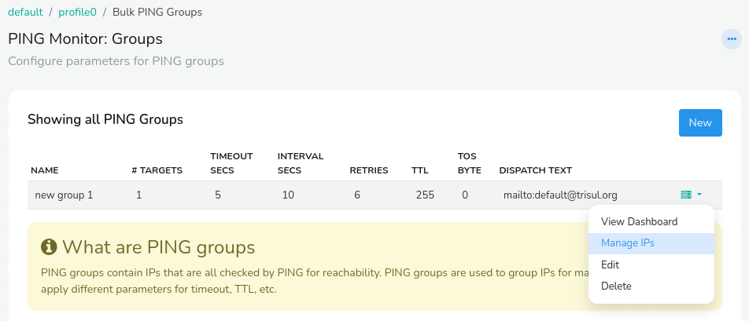
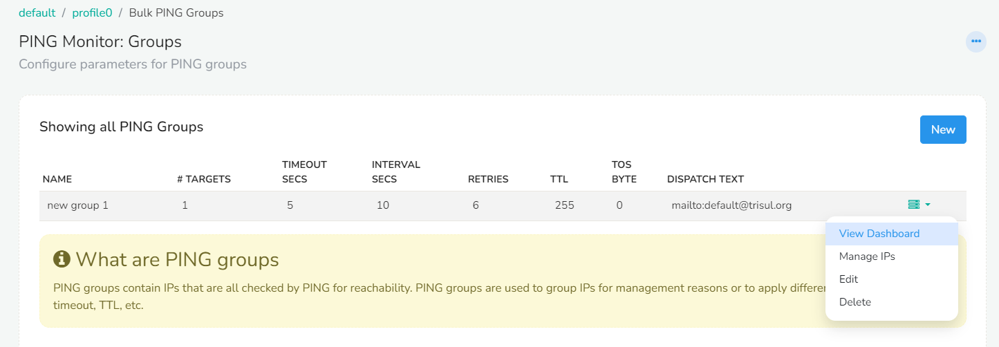

# PING Monitor

## Create PING Groups:

 Ping groups are collections of IP addresses that are grouped together for monitoring purposes. These groups are organized and managed to monitor multiple devices or hosts based on various criteria, such as their function, location, or importance.

To create PING groups, Login as admin.

:::note navigation
Go to Context:default>profile0>Bulk PING Groups

:::

You have now landed on the *PING Monitor: Groups* window where you can add, edit and manage PING groups. 


To add a new PING Group,
Click on the *New* button on the right side of the module.
*Create a new PING Group* module will appear with the following fields,



| Fields                   | Description                                                                                                                          |
| ------------------------ | ------------------------------------------------------------------------------------------------------------------------------------ |
| Name                     | Provide a name for your PING group                                                                                                   |
| Description              | Enter a short description                                                                                                            |
| Check interval (seconds) | By default ping interval in seconds is set to 10. Change if necessary.                                                               |
| Timeout seconds          | By default timeout seconds to wait for each PING is set to 5. Change if necessary.                                                   |
| Retries                  | The number of Ping failure before declaring a node unreachable is set to 6 by default. Change if necessary.                          |
| TTL                      | By default the value of TTL field used in ICMP Echo Request packets sent to this group is set to 255. Leave at default in most cases |
| TOS                      | Enter the IP TOS Byte used in ICMP Echo Request packets sent to this group                                                           |
| Dispatch Options         | Enter the mail id to which alert has to be sent. For example: mailto:default@unleashnetworks.com                                     |
| Throttle Microseconds    | A microseconds delay between sending out ICMP PING packets, use only if your network caps ICMP bandwidth. -1 disables this feature.  |

Once providing all the fields, Click *Save*.

You have now successfully created a PING group!

The newly added PING groups are now available for edit on the Ping monitor window.

## Manage IPs:

Once you have added the Ping groups to the Ping Monitor module you can add the IPs to be monitored on that Ping group.



To manage IPs on the PING groups,
Click on the dropdown option button on the right side against the PING group you would like to manage. From the list of dropdown options click *Manage IPs*.


Click on the *Add* button to add or remove IPs to be monitored with PING in this group. The *Add Ping Target to group* module will appear with the following fields.

| Fields     | Description                                                                                      |
| ---------- | ------------------------------------------------------------------------------------------------ |
| IP Address | Enter the IP address or host name you want to ping                                               |
| Label      | Provide a label name for the IP address                                                          |
| User Data  | You can provide user data like contact info/ phone number responsible for this target IP address |

Once you have provided the required fields, click Save.

You have now succesfully added the IPs to be monitored!

The newly added IP can be edited or removed using the dropdown option button on the right side against the IP address listed.


You can export the list of IPs by clicking on the *Export to CSV* button on the top right corner. You can also import the data by clicking on the *Import from CSV* button right next to the Export button.

## View Dashboard

Once the IP addresses are added to the Ping groups you can check for the state of the IPs in the dashboard.

On the *Ping Monitor:Groups* module, Click on the drop down option button on the right side against Ping group you would like to monitor. From the list of drop down options click *View Dashboard*. 



This will take you to the *Ping Monitor Group default* window where you can see the real time status of node reachability.


On the Dashboard module you can see the Total number of IPs, Number of IPs in Up state, Number of IPs in Down state, and Number of Packetlosses occured on the top left of the module. You can change the view to Normal, Compact, Dynamic and Fixed using the dropdown buttons on the top right of the module.
The Dashboard module contains the following details.

| Fields          | Information                                                                                |
| --------------- | ------------------------------------------------------------------------------------------ |
| IP              | The added IP address                                                                       |
| Name            | The label name of the IP address                                                           |
| State           | The state of the IP address indicating Up/Down/Packetloss                                  |
| Last change IST | The last changed time of the IP address state                                              |
| Since           | The time since when the IP address has been in that state                                  |
| Pktloss         | The percentage of packetloss occured if any                                                |
| Info            | Click on the info button against the IP address you would like to view the ping history of |

## PING

When you are all set with adding the Ping groups and IPs to the Ping groups. Its go-time for the PING!

Enter `ping xxx.xxx.x.xx \\IP address` This will start sending a series of ICMP echo request messages to the specified IP address at certain intervals. This will look something like this, 

```
PING 8.8.8.8 (8.8.8.8): 56 data bytes
64 bytes from 8.8.8.8: icmp_seq=0 ttl=56 time=14.6 ms
64 bytes from 8.8.8.8: icmp_seq=1 ttl=56 time=14.3 ms
64 bytes from 8.8.8.8: icmp_seq=2 ttl=56 time=14.4 ms
64 bytes from 8.8.8.8: icmp_seq=3 ttl=56 time=14.5 ms
--- 8.8.8.8 ping statistics ---
4 packets transmitted, 4 packets received, 0.0% packet loss
round-trip min/avg/max = 14.3/14.5/14.6 ms
```

Similarly, to send ping requests to a large number of IP addresses simultaneously and check their availability, enter the command,

`trisul_bulkping -demon /usr/local/etc/trisul-probe/domain0/probe0/context0/trisulProbeConfig.xml`

This will start sending a series of ICMP echo request messages to multiple IP addresses as a bulk at certain intervals.

### To stop the process:

Once you have checked the reachability of the host you can stop the process by using the command,

`ps -ef | grep bulkping` 

 This gives you the detailed information of the running process. Something that will look like this,

`user       1234   5678  0 12:34 ?        00:00:01 /path/to/bulkping` 

where 1234 is the PID. Once you have the PID, enter

`sudo kill -9 xxxx //xxxx is PID` to force stop the process.

As you have now stopped the process, you can verify the state of the IP address which will be reflected on the *dashboard* as packetloss/down.
