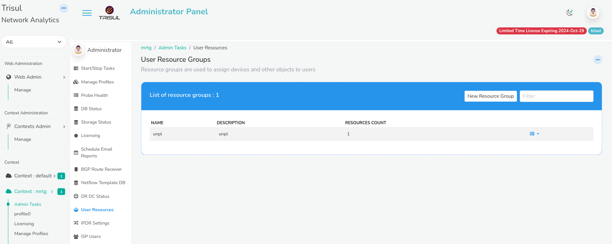

# How to create Resource groups?

Resource Groups are used to assign devices and other objects to users. To create a resource group,

*Login as admin*

You have now landed on the admin window.

:::info navigation
Go to Context:MRTG &rarr; Admin Tasks &rarr; User resources
:::

On the *User Resource Group* module Click *New Resource Group*

On the *Add a new resource group* enter the name of the user and a short description. Then click Create.
You have now successfully created a new resource group and the newly added resource group will be reflected in the List of resource group window. 

## How to create a subscriber user?

To create a subscriber user,

:::note navigatiion
Go to Web Admin>Manage>Users
:::

Click *Create a new user* on the *Web interface users* module

You will see the *New User* window with the following fields.

| Fields                | Description                                                                      |
| --------------------- | -------------------------------------------------------------------------------- |
| User Name             | Enter the username for the subscriber                                            |
| Authentication        | Select Local authentication                                                      |
| Password              | Enter the password for the subscriber                                            |
| Full Name             | Enter the full name of the subscriber                                            |
| Role                  | Select user role as Subscriber                                                   |
| Allow Multiple Login  | Check this if you want to allow multiple concurrent login sessions for this user |
| Default Dashboard     |                                                                                  |
| Default Home Page URL | Enter the URL: /mrtg/index                                                       |
| Allowed Contexts      | Select the contexts from the list of contexts for the subscriber                 |

Click *Create User*. The user has been successfully added and the same will be reflected under the list of all users.

## How to assign resource groups to user?

 To assign resource groups to the users,

*Login as admin*

:::note navigation
Go to Context:MRTG>Admin Tasks>User resources
:::

You can see the newly added resource groups under the list of resource groups window.
Click on the dropdown option button on the right against the resource group you would like to assign to. Click *Add/Edit Resources*.
The Resource group keys window appears with the following fields.

| Fields                              | Description                    |
| ----------------------------------- | ------------------------------ |
| Description of these group of items | Enter a short description on what this collection represents                                                              |
| Counter Group                       | Select SNMP-Interface from the list of counter groups                                                                     |
| Keys                                | Click on the Plus icon to add the keys and click Select after adding the desirable keys to that particular resource group |

:::note
If you cannot find SNMP-Interface from the list of counter groups. Install *SNMP-Poller* from [Trisul Apps](/docs/ag/webadmin/apps) before this step and try again.
:::

Once you have filled all the fields, Click Add. You have now successfully assigned the keys to the resource group. You can see the keys assigned to the resource groups on the bottom of the same window.
