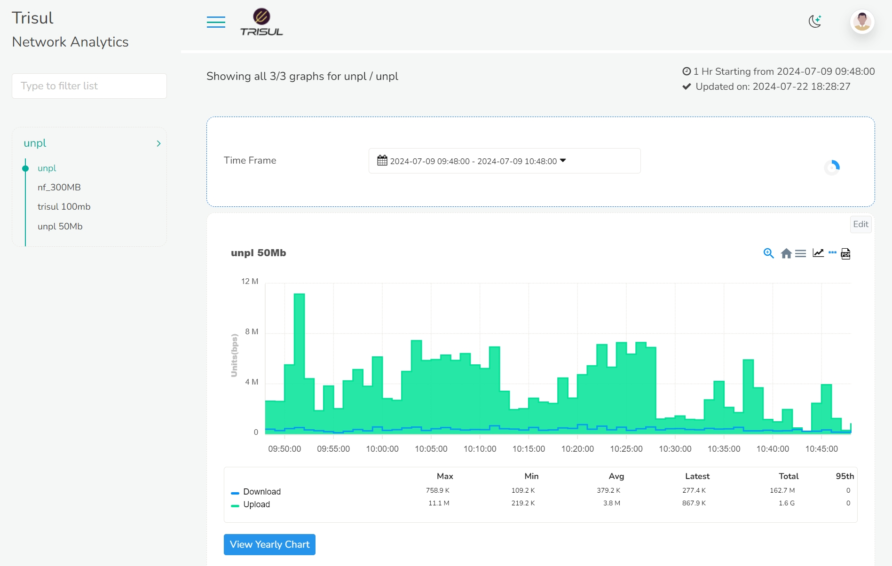
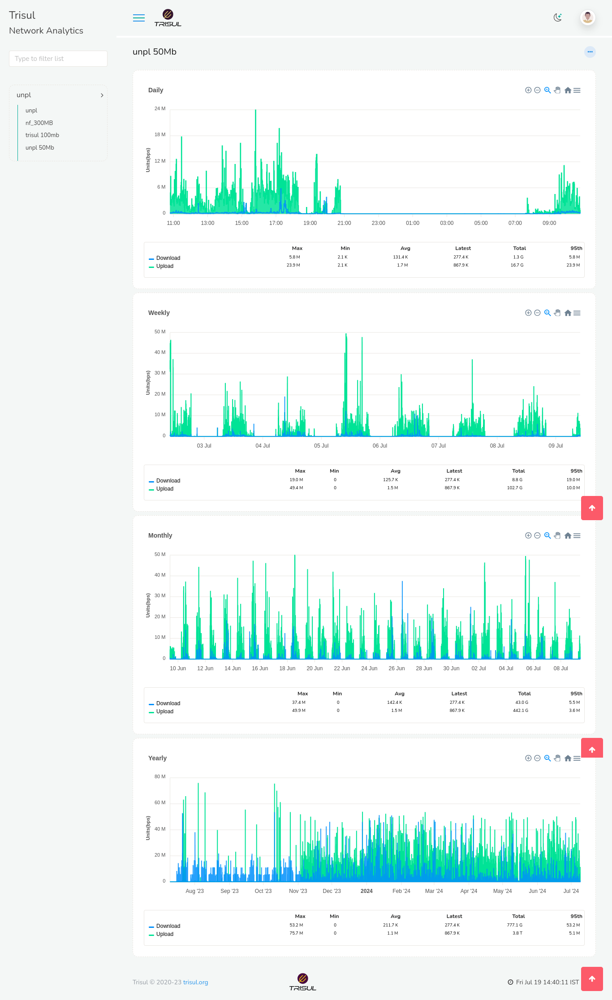

# Traffic Grapher

This is similar to the MRTG software that all ISPs are familiar with.

## Monitoring Bandwidth

You can see the bandwidth consumption in visual graphics as chart and download them as report from logging in as user.
*Login as user*

You have now landed on the subscriber user window.

Once you have logged in, on the left you can see the resource groups and the keys assigned to that particular user. On the right side of the window, you can see the *time frame* module and bandwidth consumption chart module. The blue lines on the graph represents download data and green represents upload data. By default the time frame is set to last 15 mins so the chart on the screen is the bandwidth consumption for the last 15 mins. 

You can select the desired time range from the *time frame* module to view the bandwidth consumption for that particular time window.

For a longer time window, Click and drag on the spikes to zoom in and find more detailed time of the zoomed in section.

On the top right corner of the chart you can find a number of valuable icons. From the right, PDF, Live SNMP, Menu, and Home icons.

#### PDF

Click on the PDF icon to download the selected data in PDF format.

#### Live SNMP

Click on the Live SNMP icon to view the Live bandwidth consumption which is updated every 10 seconds.

#### Menu

Click on the Menu icon to download the data in other desirable formats including SVG, PNG, and CSV.

#### Home

Click on the Home icon to reset from the zoom selection if you have panned in for detailed view.

#### View Yearly Chart

Click on the *View Yearly Chart* button on the left bottom of the bandwidth cosnsumption chart module and the following window will open up for the selected key.

This will give you a granular view of daily,weekly,monthly and yearly charts which can be monitored in a more detailed time frame .

You can fetch the data for any key on the resource groups following the above steps!
