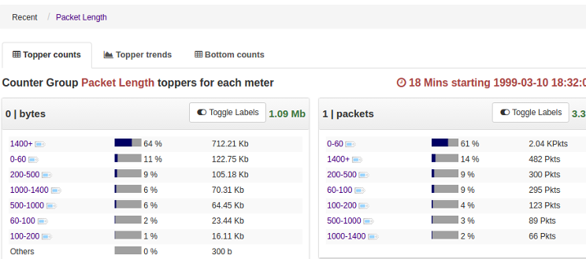
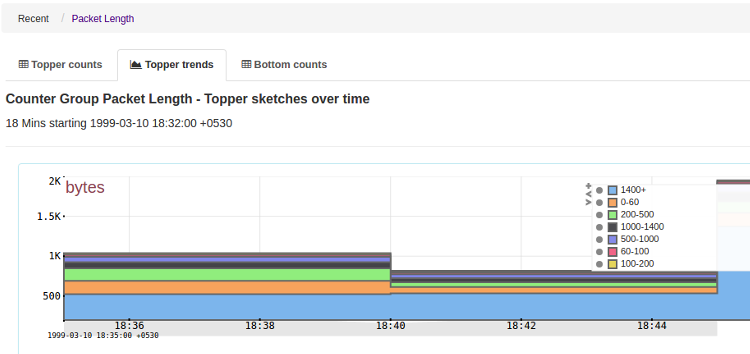
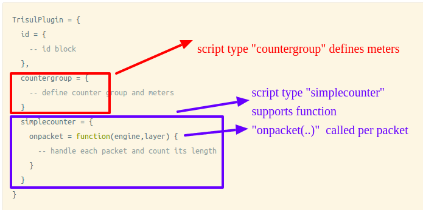

# Quickstart tutorial 2 – A simple counter

Congrats, you’ve made it to the second tutorial in the series. In the [first instalment](/docs/lua/Quick-tutorial1) , we got our feet wet by writing a very simple hello world script. It didnt no much beyond printing a few log messages, but it taught us how to setup scripting. In this tutorial 2, we will write a simple script that meters packet lengths.

## Packet Length Histogram counter

Once again as in Tutorial-1, lets run the script first and then explore details.

:::info[GOALS]

 Develop useful Packet Length Histogram counter. How many packets > 1400,1000-1400,500-1000,etc. How to run in production mode, how to write a [simplecounter](/docs/lua/FRONT-END-SCRIPTS/simple-counter) script to plug into each packet, how to view results.

:::

1. ## Get pktlen.lua
   
   1. Download [pktlen.lua](https://raw.githubusercontent.com/trisulnsm/trisul-scripts/master/lua/tutorial/tutorial2/pktlen.lua) into the [lua scripts directory](/docs/lua/scripting-basics) `/usr/local/lib/trisul-probe/plugins/lua` *A sample run is shown below*
      
      ```lua
      cd /usr/local/lib/trisul-probe/plugins/lua
      wget https://raw.githubusercontent.com/trisulnsm/trisul-scripts/master/lua/tutorial/tutorial2/pktlen.lua
      ```

2. Run Trisul over a PCAP file
   
   1. Login as root or as the user specified in the trisulProbeConfig.xml file (default : trisul)
   
   2. Run Trisul over a PCAP file, you can use your own or download [tutorial2.pcap](https://github.com/trisulnsm/trisul-scripts/blob/master/lua/tutorial/tutorial2/16minutes.pcap "1.6MB") . This time will not be using the development tool *testbench* because we want to save the results into the database. Import the PCAP into a new context called “tut2”. The *context=tut2* flag allows you to import the PCAP into its own context without erasing the previous data.
      
      ```lua
      trisulctl_probe importpcap /tmp/tutorial2.pcap context=tut2
      ```
      
      You need to enter YES 2 times to confirm that you want to create a new context and import the PCAP.
   
   There will be no output. You need to login to Web Trisul to find out what just happened.

3. Login to Webtrisul context “tut2”
   
   1. Login to Webtrisul, you will see a new context called “tut2” at the login screen. Select that and login. Then Go to Retro > Counters
   
   2. Select “Packet Length” and voila ! You have detailed stats about distribution of packet lengths
      
      

            

## Exploring pktlen.lua

The pktlen.lua script plugs into Trisul to get a look at each packet. then counts the packet length againt a bucket. We will also demonstrate a way to count the bandwidth while we are at it.

Lets meter

1. Traffic bandwidth – bytes/ bps per length bucket
2. Packets – per length bucket

### Meters and Keys

The two meters we maintain are

| Bandwidth | “Bytes”   | RATE_COUNTER | Bandwidth per length-bucket. Out of 10Mbps bandwidth , 8Mbps is due to packets between 1000-1514 bytes in length, 100Kbps is due to small packets < 60 bytes etc |
| --------- | --------- | ------------ | ---------------------------------------------------------------------------------------------------------------------------------------------------------------- |
| Packets   | “Packets” | COUNTER      | Absolute count of number of packets in each length-bucket                                                                                                        |

Each bucket is identified by a unique string called a ‘key’. This script will use a string like “500-1000” to present packet lengths in range of 500 to 1000 bytes.

**Structure of pktlen.lua**

Lets look a bit deeper into th script `countergroup` and `simplecounter` sections and these are where the action happens.



The Trisul LUA API consists of about 16 different “script types”. In this tutorial , pktlen.lua uses the countergroup and simplecounter script types. You can even place the countergroup and simplecounter tables in separate files if you want.

1. The [id block](/docs/lua/scripting-basics#id-block) just identifies the plugin to Trisul, we’ve already see this in Tutorial 1
2. The [`countergroup` block](/docs/lua/FRONT-END-SCRIPTS/counter-groups) defines a new counter group
3. The [`simplecounter` block](/docs/lua/FRONT-END-SCRIPTS/simple-counter) is where you count packets

## **The countergroup block**

[Reference : countergroup](/docs/lua/FRONT-END-SCRIPTS/simple-counter)

Since we are creating a new counter group that meters Packet Lengths, we use a `countergroup` block to create a new group called “Packet Length”.

```lua
countergroup = {
  -- control section
  --   Id of the counter group 
  control = {
    guid = "{6ecb4ebb-d53b-470c-aca6-2f326b4c6c91}",
    name = "Packet Length",
    description = "Packet length distribution",
    bucketsize = 30,
  },

  -- meter section
  --  What we're trying to count 
  --  meter 0 -  bytes by packet len
  --  meter 1 -  number of packets of each length 
  meters = {
      0, T.K.vartype.RATE_COUNTER, 10, "Bytes",   "bytes" ,   "B" },
      1, T.K.vartype.COUNTER,      10, "Packets", "packets",  "Pkts" },
  },

},
```

You will notice the counter group has two sub blocks called control and meters.

### The `control` section

**guid for the counter group**

                There are tools to generate online, like http://www.guidgen.com/ – note the curly braces

**name**

                   Packet length

**bucket_size**

                    we select 30 seconds as the resolution for this group

### The `meters` section

We define two meters

| Meter 0 | RATE_COUNTER | This will track Mbps, Kbps for each packet length key    | 10 topper in sketch  |
| ------- | ------------ | -------------------------------------------------------- | -------------------- |
| Meter 1 | COUNTER      | This will track total packets in each interval by length | 10 toppers in sketch |

## **The simplecounter block**

[Reference : simplecounter](/docs/lua/FRONT-END-SCRIPTS/simple-counter)

Finally, we’ve landed at the most critical part of the plugin. This is where your LUA code actually goes.

:::note

The `onpacket` function is called for each packet at the appropriate protocol layer.

:::

We want to tap packets at the IP layer, so we define the protocol_guid as

protocol_guid

            at which layer do we want to listen to packets. The guid `{0A2C724B-5B9F-4ba6-9C97-B05080558574}` in the example stands for IP. See [Well Known GUIDs](/docs/ref/guid#protocols)

```lua
simplecounter = {

  protocol_guid = "{0A2C724B-5B9F-4ba6-9C97-B05080558574}",

  onpacket = function(engine,layer)
    local packet= layer:packet()
    local len  = packet:wire_length()
    local key = ""

    if len > 1400 then key = "1400+"
    elseif len > 1000 then key = "1000-1400"
    elseif len > 500 then key = "500-1000"
    elseif len > 200 then key = "200-500"
    elseif len > 100 then key = "100-200"
    elseif len > 60 then key = "60-100"
    else key = "0-60" 
    end

    --
    -- update_counter methods is the "magic"  glue
    -- between C and LUA in trisul
    --

    engine:update_counter_bytes( 
        TrisulPlugin.countergroup.control.guid, key , 0)

    engine:update_counter( 
        TrisulPlugin.countergroup.control.guid, key, 1, 1)

  end,```
```

Key things to remember

1. Your onpacket function is called for every packet. Try not to do any I/O.
2. The two parameters *engine* and *layer* are objects passed with every packet
3. Layer – represents the layer you mentioned in the *protocol_guid* section of the countergroup block
4. Packet – from the layer you can get access to the entire packet using layer:packet()
5. The engine parameter is the critical object that provides the methods you need to call to end your script.

What we’re doing

1. We get the “wire length” from layer:packet(), then group it into 7 keys based on length
2. Call the update_counter methods in the [Engine object](/docs/lua/TOP-LEVEL-LUA-OBJECT/object-engine)

Thats it ! The rest is taken care of by Trisul. We have a brand new counter group called Packet Length.

**Congrats !** You are now well on your way to writing your own scripts. Just browse the code samples on [GitHub](https://github.com/trisulnsm/trisul-scripts/tree/master/lua) and check out the documentaton on the left navigation.
