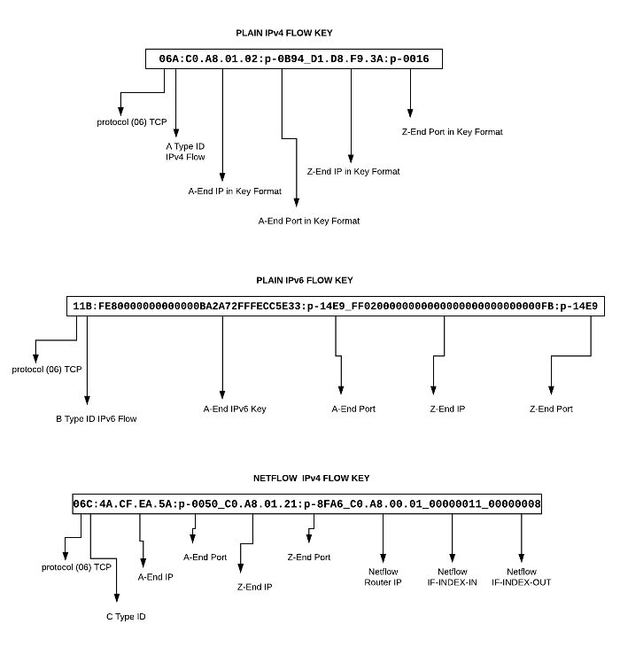

# Object FlowID

In Trisul, flows are identified by a strings that look like this `06A:C0.A8.01.02:p-0B94_D1.D8.F9.3A:p-0016`

The string encodes the tuples that make up the flow. The FlowID object described in this page makes working with these types of strings easier.

## [Structure of flow key in Trisul](https://trisul.org/docs/lua/obj_flowid.html#structure_of_flow_key_in_trisul)

Trisul support 3 types of flows 1) plain IPv4 2) IPv4 with Netflow and 3) Plain IPv6. The following image shows the structure of these 3 flow IDs. Luckily you never have to construct these keys yourselfs. LUA calls into your functions that involve a network flow will use an object called *FlowID* that wraps this for you. See [How to get or create a flowID](https://trisul.org/docs/lua/obj_flowid.html#how_to_get_or_create_a_flow_id)



## Methods

:::note[**_Readable methods**]

The readable versions return friendly strings whereas the plain methods return TrisulKey format strings.  
For example : `ipa` might return `FF020000000000000000000000000002` where `ipa_readable` returns `ff02::2`. The raw method is faster than the “readable” method, but the readable method is easier to work with. That is why we have provided both using the API.

:::

| Name                         | In  | Out    | Description                                                                                                                                                                                                                                                                                                                                                                                                                                                                                   |
| ---------------------------- | --- | ------ | --------------------------------------------------------------------------------------------------------------------------------------------------------------------------------------------------------------------------------------------------------------------------------------------------------------------------------------------------------------------------------------------------------------------------------------------------------------------------------------------- |
| id                           |     | string | A unique string identifying the flow, see the section above                                                                                                                                                                                                                                                                                                                                                                                                                                   |
| key                          |     | string | Synonym for `id()` method above                                                                                                                                                                                                                                                                                                                                                                                                                                                               |
| protocol                     |     | string | IP protocol in hex, TCP/GRE/UDP/etc – so UDP which is protocol `17` as per IANA will be represented as `11`                                                                                                                                                                                                                                                                                                                                                                                   |
| ipa                          |     | string | *Trisul Key Format* : IP Address of A-End can be IPv4 or IPv6                                                                                                                                                                                                                                                                                                                                                                                                                                 |
| ipa_readable                 |     | string | *Human readable format* : IP Address of A-End can be IPv4 or IPv6                                                                                                                                                                                                                                                                                                                                                                                                                             |
| porta                        |     | string | *Trisul Key Format* : port                                                                                                                                                                                                                                                                                                                                                                                                                                                                    |
| porta_readable               |     | string | *Human readable format* : port number for TCP/UDP flows. For IP flows this can contain a *protocol string* like “ipsec0”, so make sure you check for this.                                                                                                                                                                                                                                                                                                                                    |
| ipz                          |     | string | *Trisul Key Format* : IP Address of A-End can be IPv4 or IPv6                                                                                                                                                                                                                                                                                                                                                                                                                                 |
| ipz_readable                 |     | string | *Human readable format* : IP Address of A-End can be IPv4 or IPv6                                                                                                                                                                                                                                                                                                                                                                                                                             |
| portz                        |     | string | *Trisul Key Format* : port                                                                                                                                                                                                                                                                                                                                                                                                                                                                    |
| portz_readable               |     | string | *Human readable format* : port number. See porta_readable remarks                                                                                                                                                                                                                                                                                                                                                                                                                             |
| netflow_router               |     | string | Netflow router ID. This is in key format. such as `0A.81.4A.92`. For a printable format use netflow_router_readable                                                                                                                                                                                                                                                                                                                                                                           |
| netflow_ifindex_in           |     | string | Netflow input ifIndex. This is an 8 digit HEX interface index such as `0000000A`. Use the _readable method to intepret it as ifIndex `10`                                                                                                                                                                                                                                                                                                                                                     |
| netflow_ifindex_out          |     | string | Netflow output ifIndex                                                                                                                                                                                                                                                                                                                                                                                                                                                                        |
| to_s                         |     | string | convenience method returns a string. The fields are correctly padded to aid in table format printing. The order of the fields are Protocol, A-End IP, A-End Port, Z-End IP, Z-End Port, then if Netflow details are available Netflow Router IP, IfIndex_In, IfIndex_Out<br/><br/> LUACopy`p flow:to_s() flow:to_s() “TCP 10.4.13.111  49231  192.168.2.8   80” p flow:flow():to_s() flow:flow():to_s() => "TCP  10.131.17.9     61868 116.90.243.38   52311 10.129.74.146   10      11      "` |
| flow_type                    |     | string | Type of flow. A single character<br/><br/><br/><br/>- ‘A’ : IPv4 Flow<br/><br/>- ‘B’ : IPv6 Flow<br/><br/>- ‘C’ : IPv4 Flow with Netflow details<br/><br/>- ‘D’ : IPv6 Flow with Netflow details<br/><br/>                                                                                                                                                                                                                                                                                                |
| netflow_router_readable      |     | string | Netflow Exporting Router IP Address                                                                                                                                                                                                                                                                                                                                                                                                                                                           |
| netflow_ifindex_in_readable  |     | string | Netflow Interface Index IN.                                                                                                                                                                                                                                                                                                                                                                                                                                                                   |
| netflow_ifindex_out_readable |     | string | Netflow Interface Index OUT.                                                                                                                                                                                                                                                                                                                                                                                                                                                                  |

## How to get or create a flow ID

You can create the flowID string manually using the above formula. In Trisul LUA Scripting you rarely would need to create the flow ID because it is passed to you in many cases by the framework. For example : The [onnewresource](https://trisul.org/docs/lua/resource_monitor.html#function_onnewresource "e,resource") method in the Resource Monitor scripts pass you a flow object.

So you simply use that as shown here

```lua
onflush=function(engine,resource)

     engine:add_resource('{EE1C9F46-0542-4A7E-4C6A-55E2C4689419}',
               resource:flow():id(),    ----> the flow ID is passed to you
               "INDICATOR:DNSIP6",
               ip);
```

Alternately in some script types like [simplecounter](https://trisul.org/docs/lua/simple_counter.html) you do not have access to a flowID, you can construct one using the [Packet:flowid](https://trisul.org/docs/lua/obj_packet.html#methods) method.

```lua
onpacket=function(engine,layerdata)

     engine:add_resource('{EE1C9F46-0542-4A7E-4C6A-55E2C4689419}',
               layerdata:packet():flowid(),    ----> create the flowID from the packet object 
               "INDICATOR:DNSIP6",
               ip);
```
