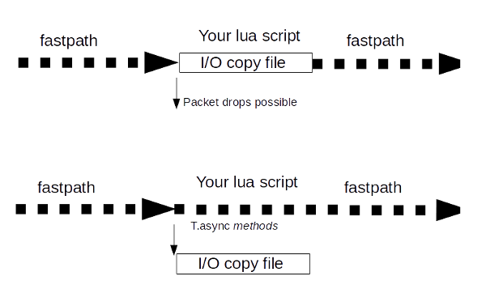

# Asynchronous execution intro

This section describes the concepts behind async execution within Trisul LUA scripting framework. Please refer to [`T.async`](/docs/lua/obj_tasync) documentation for function reference. This section explains the motivation and design of this execution model.

## Table `T.async`

The [T.async](/docs/lua/TOP-LEVEL-LUA-OBJECT/object-tasync ) interface provides methods to help you do long running I/O tasks that do not block the streaming pipeline. The tasks are executed by a separate worker thread pool and when the results are ready, they re-enter the pipeline path. The number of worker threads is by default 1 but can be increased by the [`request_async_workers` parameter](/docs/lua/scripting-basics#structure-of-a-lua-script ) at the plug-in level.

## Purpose of T.async

Recall that the Trisul LUA api supports ‘frontend’ (fast path) and ‘backend’ (slow path) scripts.

The T.async methods are designed for use in scripts that are involve some I/O that can block the streaming pipeline.

1. when frontend scripts block : can result in packet drops
2. when backend scripts block : backend script have more time budget than front end scripts, but if they block it can result in some metrics being lost because Trisul being a real time streaming engine requires all backend work complete in under 60 seconds.

Using the methods in T.async you can perform these tasks out of the main pipeline in a separate thread pool.



### Number of async worker threads

Use the global parameter [TrisulPlugin.request_async_workers](/docs/lua/scripting-basics#structure-of-a-lua-script ) to change the default number of worker threads (1).

## Usage

This small snippet shows the use case

:::note[Use case]
Copy the file pointed to by `path` into `/tmp/xyz.txt` file

:::

There are two ways to approach this

1. method 1: copy the file directly in lua. synchronous method.
2. method 2: use the async interface to copy the file

### Method 1 : Copying a file inline (blocks fast path)

```lua
-- save  path to /tmp/xyz
-- os.execute returns only when copying is complete
-- this blocks the packet pipeline can cause packet loss in fast networks 
os.execute( "cp "..path.." /tmp/xyz.txt")")`
```

This would work, but the problem is while the `os.execute(..)` is copying the file, the packet pipeline is blocked. This may result in packet loss. We therefore recommend that whenever you do I/O you use any of the T.async methods.

### Method 2 : Copying a file async (does not block fast path)

This method uses the `T.async:copy` function to do this async

```lua
-- save path to /tmp/xyz
-- T.async run outside fast path, so returns immediately 
T.async:copy( path, "/tmp/xyz.txt")
```

### Method 3 : Copying a file using T.schedule

T.async:schedule described in the next section allows you to run any lua function out of the fast path and then call back in when results are available. Here is how you would do it using that method.

```lua
T.async:schedule(
    {
      -- set data as the file path
      data = path,

      --
      -- [ on slow path, another thread with indata = data  ]
      onexecute = function( indata)
        os.execute( "cp "..indata.." /tmp/xyz.txt")
      end,

    }
  )
```

## T.async:schedule

### Purpose

Run arbirary LUA code in async manner

[T.async methods](/docs/lua/TOP-LEVEL-LUA-OBJECT/object-tasync ) `cp` `cat` accomplish very specific tasks. Using the `T.async:schedule` method you can run any arbitrary LUA code off the main packet pipeline.

### Methods

T.async:schedule expects a table with the following fields

| Name      | In                                                                                   | Description                                                                                                                                                                                                                                                                                                           |
| --------- | ------------------------------------------------------------------------------------ | --------------------------------------------------------------------------------------------------------------------------------------------------------------------------------------------------------------------------------------------------------------------------------------------------------------------- |
| data      | string                                                                               | a string that is passed on to the onexecute function below                                                                                                                                                                                                                                                            |
| onexecute | function( in_data)                                                                   | **called on separate worker thread** A function that accepts the `data` string specified. This function executes in a separate thread/task from the packet pipeline. You do your processing and optionally return a ‘response’ string. See rules below                                                                |
| onresult  | function([engine](/docs/lua/TOP-LEVEL-LUA-OBJECT/object-engine ), in_data, out_data) | **called on main Trisul thread** if your script in `onexecute` on the separate thread returns string, Trisul will re-enter the fast path and call the `onresult` function with the result string. You can then update the `engine` parameter by adding metrics, generating alerts, or interact with Trisul in any way |

#### Skeleton async execution

Use this skeleton.

```lua
T.async:schedule(
          {
              -- the data  
              data = path,

              -- [ on slow path, another thread ]
              -- and return the string
              onexecute = function( indata)
                return "result string"
              end,

              -- [ back on fast path]
              -- 
              onresult = function(engine, req, response)

              end
          }
      )

  end,
```

#### Usage

This small snippet shows the usage

Task: calculate sha1sum of extracted file

```lua
onfile_http  = function ( engine, timestamp, flowkey,
               path, req_header, resp_header, length )


      T.async:schedule(
          {
              -- send the file path
              -- 
              data = path,

              --
              -- [ on slow path, another thread ]
              -- calc sha1sum on the file
              -- and return the string
              -- 
              onexecute = function( indata)
                local h = io.popen("sha1sum "..path)
                local sha1  = h:read("*a")
                h:close()
                return sha1
              end,

              --
              -- [ back on fast path]
              -- 
              onresult = function(engine, req, response)
                  print("The SHA1 sum of  "..path.." IS " .. response)
              end
          }
      )

  end,
```
