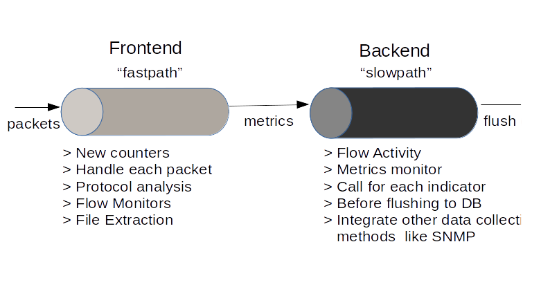

# Trisul LUA Scripting Basics

This section introduces the Trisul LUA API. First we start off with an overview of the Trisul streaming architecture and then learn where the LUA scripts plugin. Then move on to topics such as installation, debugging, threading rules, and messaging.

## Introduction

The Trisul LUA API allows you to extend the functionality of Trisul by plugging yourself into the various points in the packet processing pipeline. Some of the things you can do :

1. process every packet , create protocol dissectors
2. measure your own metrics
3. plug in to TCP reassembly, flow events, and file extraction
4. integrate with custom threat intel
5. plugin to the traffic metrics stream and generate further advanced metering
6. log artifacts like HTTP headers, SSL certificates, DNS records, etc
7. dozens of other applications. see [samples](https://github.com/trisulnsm/trisul-scripts/tree/master/lua) and [Trisul Apps](https://github.com/trisulnsm/apps)

:::info

Trisul embeds LuaJIT 2.1.0-beta3 compatiable with LUA version 5.1. Ensure your scripts are compatible with Lua 5.1 and not 5.2.

:::

## Stream Processing

The basic architecture of Trisul Network Analytics is of a stream processor with two pipelines – the fast and the slow.

1. The first pipeline is called the **frontend** pipeline. The *frontend* pipeline is also called the *fast path*. The *frontend* pipeline works on packets and converts them into a metrics stream.
2. The second pipeline is called the **backend** pipeline or the *slow path*. The *backend* pipeline does not work on network packets or flows but on the metrics and resources stream generated by the *frontend* pipeline.

Since Trisul is a stream processor your scripts need to complete within a particular time budget. The scripts attached to the fast path need to complete much faster than those at the slow path. For scripts that involve I/O or someother time consuming task, an [asynchronous execution API](/docs/lua/async-exec) is available.

The two streaming pipelines are shown below



## Frontend and Backend scripts

A script is attached either to the [frontend or the backend pipeline](/docs/lua/basics#stream-processing) It cannot be attached to both. You do not have to do anything special to mark your script as attaching to frontend or backend. The “type of script” you write is automatically detected and attached to the correct place. We will shortly see what types of scripts are available.

| Frontend script types                                                                                               | Backend script types                                                                                                         |
| ------------------------------------------------------------------------------------------------------------------- | ---------------------------------------------------------------------------------------------------------------------------- |
| Marked in docs as F or FRONTEND                                                                                     | Marked in docs as B or BACKEND                                                                                               |
| Fast path                                                                                                           | Slow path                                                                                                                    |
| Works on packets and flows                                                                                          | Works on metrics stream                                                                                                      |
| Time budget in milliseconds, slow scripts will result in packet drops as the buffers fill up                        | Time budget in 10-15 seconds, slow scripts will result in some metrics getting dropped                                       |
| Loaded on probe start                                                                                               | Loadad and unloaded dynamically on running system                                                                            |
| Script types : Input Filter , Simple Counter, Reassembly Handler, File Extraction , PCAP storage , Protocol Handler | Script types : Engine Monitor, Alert Monitor, Counter Monitor, Session Monitor, Resource Monitor, FTS Monitor , Flow Tracker |

## Skeleton Script

You can get started easily by simply copying a well documented skeleton script from [Github Trisul-Scripts](https://github.com/trisulnsm/trisul-scripts/tree/master/lua/skeletons)

## Installing  and Uninstalling

LUA scripts are contained a single file, say `myplugin.lua`. A large LUA app can contains several `*.lua` files.

## Search directories for LUA scripts

LUA scripts are loaded by the Trisul probes, not by the Hub nodes. This section describes the directories where Trisul Probe searches for LUA scripts.

### On each trisul-probe

The following two directories are searched for LUA plugins by the probes. Put your *.lua script in either of these two directories

| **Probe local** loaded by all contexts on the probe | `/usr/local/lib/trisul-probe/plugins/lua`                                  |
| --------------------------------------------------- | -------------------------------------------------------------------------- |
| **Context local** loaded by specific context only   | `/usr/local/var/lib/trisul-probe/domain0/probe0/context0/config/local-lua` |

For [development and test purposes](/docs/lua/debugger) you can set the `TRISUL_LUA_PATHS` environment variable to add your own search paths to the probe nodes.

### On trisul-hub automatically deploys to all probes

put your *.lua script in this directory, it will be automatically deployed to all probes.

| **Global** loaded on all probes | `/usr/local/var/lib/trisul-hub/domain0/config0/context0/profile0/lua` |
| ------------------------------- | --------------------------------------------------------------------- |

### Subdirectories

If your application has a lot of `*.lua` files you can group them into a subdirectory. We recommend you name the subdirectory by the name of your app.

If you had an app called **myBGP**, you can consider putting all of its *.lua files in a directory called “myBGPApp” that describes the app. See below

```lua
/usr/local/var/lib/trisul-probe/domain0/probe0/context0/
    +/config
      +/local-lua
        +/myBGPApp
          - bgp.lua
          - pdurecord.lua
          - sweepbuf.lua 
          - debugger.lua
```

:::tip

Just put all your *.lua files in `/usr/local/var/lib/trisul-probe/domain0/probe0/context0/config/local-lua`

:::

### Uninstall

To uninstall, just remove the the lua files from the directory.

### Injecting scripts into running Probe

- **Backend scripts** ~~-~~ Supports live injection. Modified scripts are picked up automatically within 1 minute. If you remove the backing LUA file, scripts are automatically unloaded within 1 minute.
- **Frontend scripts** ~~-~~ Does not support live injection. To load and unload scripts you need to restart Trisul Probe

Using the `trisulctl_probe list lua` tool [see [trisulctl_probe](/docs/ref/trisul_probe)] you can check if your LUA script has been discovered. If your script is not listed ensure that it is present in the specified directory and has the right permissions.

```lua
trisulctl_probe
list lua probe0 default 
-- prints include path
-- prints search paths

LUA scripts found in directory /usr/local/var/lib/trisul-probe/domain0/probe0/context0/config/local-lua
---------------------------------------------------------------------------------------------------
ftp.lua                       FTP filex                               FRONTEND             reassembly_handler   HOOK INTO TCP REASSEMBLY
ocsp_check_async.lua          OCSP checker                            BACKEND              fts_monitor          HANDLE FULL TEXT SEARCH (FTS) EVENTS 

LUA scripts found in directory /usr/local/var/lib/trisul-probe/domain0/probe0/context0/config/lua
---------------------------------------------------------------------------------------------------
No lua scripts found

LUA scripts found in directory /usr/local/lib/trisul-probe/plugins/lua
---------------------------------------------------------------------------------------------------
perf-stats.lua                Perf Stats                              FRONTEND             countergroup         CUSTOM COUNTER GROUP 
base-domain.lua               Base Domains                            FRONTEND             countergroup         CUSTOM COUNTER GROUP 
trisul_probe:static-20.61.99.14-tataidc.co.in(domain0)>
```

## Threading

In Trisul, both the frontend and backend pipelines are multi-threaded. This means that multiple instances of your LUA script may be loaded at the same time. During development you may wish to convert the frontend and the backend to single threaded as follows

### Using testbench

The best way is to use the `trisulctl_probe testbench` command to develop your scripts. See [Development Environment](/docs/lua/debugger)

Alternately, you can manually convert the probe pipelines into single threaded by editing [trisulProbeConfig.xml](/docs/ref/trisulconfig)

To convert Front End to single threaded

Change the `InflightTokens` parameter in trisulProbeConfig.xml to 1

To convert Back End to single threaded

Remove the second `<Flusher>` in trisulProbeConfig.xml

## Loading and error handling

All `.lua` files in the above mentioned directories will be inspected for capabilities by the Trisul runtime. If there are any syntax errors, the scripts will simply fail to load with no output on the command line. The errors can be found in the main Trisul log file. The log files are located in `/usr/local/var/log/trisul-probe/domain0/probe0/context0/ns*.log`

Some techniques

1. All messages will contain the filename of your Lua script, so you can grep `myfile.lua`
2. You can also try loading it outside of Trisul via a Lua command line to rule out syntax errors

A typical error message looks like this

```lua
# grep re2http.lua /usr/local/var/log/trisul-probe/domain0/probe0/context0/ns*.log
Sat Apr  5 16:27:49 2014.048575 ERROR [re2http.lua]Unable to load lua file, see next message 
Sat Apr  5 16:27:49 2014.048588 ERROR [re2http.lua]LUA file error : plugins/lua/re2http.lua:51: ')' expected (to close '(' at line 50) near 'for'
```

or test your lua script for syntax errors

```lua
# lua
dofile('myscript.lua')
```

Also see: [Print and Logging](/docs/lua/basics#print-and-logging)

## Structure of a LUA  script

A LUA script follows the following structure.

1. the entire script is housed inside a table called `TrisulPlugin`
2. the fields `id` , `onload`, `onunload`, and `onmessage` can appear with any script type
3. the actual script appears within a sub table with the name of the script type, eg `simple_counter`
4. you can put multiple script types in a single LUA file, they will be loaded on to different LuaJIT VM
5. See [hello.lua sample](https://github.com/trisulnsm/trisul-scripts/blob/master/lua/hello/hello2.lua)

The following snippet shows the structure of a typical LUA script (all methods except the id block are options )

```lua
TrisulPlugin = {

  id = {
    ...
  },

  request_async_workers = ..,  

  onload = function()
    ...
  end,

  onunload = function()
    ...
  end,

  message_subscriptions = {..},

  onmessage = function()
    ...
  end,

  -- plugin type 
  -- here we select simplecounter in this example
  simplecounter = {
    ...
  }
}
```

## Explanation of structure

A quick explanation of the various items in the Lua script

**TrisulPlugin**

Table housing the entire plugin

**id**

The [ID Block](/docs/lua/basics#id-block) a must for all plugins

**onload/onunload**

called when framework [loads or unloads](/docs/lua/basics#onload-and-onload) the script

**message_subscriptions**

which message IDs do you want to listen to (see [Inter script communications](/docs/lua/basics#inter-script-communications) )

**onmessage**

when some other plugin sends a message for you or broadcast (see [Inter script communications](/docs/lua/basics#inter-script-communications) )

**request_async_workers**

optional number of workers you want to handle the async execution in this plugin. (see [T.async](/docs/lua/async-exec) )

**plugin type (simplecounter)**

a Table which contains your script of a particular type, simplecounter, reassembly handler etc (see [Script types](/docs/lua/selector) and [Script selector cheatsheet](/docs/lua/selector))

## On GUIDs

Trisul uses globally unique identifiers called GUIDs to identify each counter group, protocol, resource type, and many other things. Here is a list of [Common GUIDs](/docs/ref/guid). When you want to create a new *type* of entity you need to assign a new GUID to refer to that. You can login as *admin* into Trisul to see list of all counter guids, resource guids, Full Text (FTS) guids, etc.

**Type** : A LUA string in this format `{889900CC-0063-11A5-8380-FEBDBABBDBEA}`

##### Creating new GUIDs

You can use the `trisulctl_probe` tool to create GUIDS.

```lua
$ trisulctl_probe testbench guid 
{889900CC-0063-11A5-8380-FEBDBABBDBEA}
```

:::info[**GUID string has braces**]

Dont forget the `{..}` braces. They are part of the GUID string

:::

## onload and onload

These methods, if present, are called for every plugin.

| method   | optional/required | in  | return value                     | description                                                                                                                                                                                                                                                                    |
| -------- | ----------------- | --- | -------------------------------- | ------------------------------------------------------------------------------------------------------------------------------------------------------------------------------------------------------------------------------------------------------------------------------ |
| onload   | optional          |     | return `false` to disable script | Called when the script is loaded into Trisul. You may do any initialization such as reading datafiles here. If you want to stop the script, for instance due to a missing datafile.You need to return `false` from here. Otherwise dont return anything at all or return true. |
| onunload | optional          |     |                                  | Called when the script is unloaded. Free up resources                                                                                                                                                                                                                          |

One important point is your script may be loaded and unloaded several times by Trisul. Also more than one instance of your script may be loaded and active. Do not make any assumptions about the singleton nature of your scripts.

## print and logging

Your script can use [`T.log(..)`](/docs/lua/obj_globalt#functiontlog) to log into the Trisul probe log files and take advantage of all of its features. You can also use the standard LUA `print(..)` statements in your code to debug your script.

### Where are the Trisul-Probe log files

When you use the `T.log()` function the log messages are merged into the main Trisul Probe file. They are located in the `/usr/local/var/log/trisul-probe/domain0/probe0/context??/ns-???.log` files. The LUA script name from which the log message came is automatically added to the log message.

### Using `print(..)`

The way Trisul deals with the print(..) statements :

If running in a daemon mode

`stdout` of LUA is redirected to trisul-probe log directory the log files are named `lua-<yourscriptfilename>-luajitVMInstance.log`

If running with an attached terminal

or when using the [Development Testbench](/docs/lua/debugger) – the print(..) messages send output to the terminal as they normally do

## Inter script communications

Each script is loaded in a separate LUAJIT virtual machine and is isolated from the other scripts. Even multiple instances of a single script are loaded in a separate VM. This means :

1. there is no “global” state that is accessible to all scripts
2. any global variables you declare are only visible in your script instance.

The only way scripts can talk to each other is by messaging. Trisul provides a robust infrastructure for this using onmessage() and postmessage()

### onmessage

   Called when there is a message. Every message type is idenfitied by a GUID that is assigned by the sender. The function onmessage() parameters are

| message_id | guid   | Identifies the message type                                                                                                        |
| ---------- | ------ | ---------------------------------------------------------------------------------------------------------------------------------- |
| message    | string | The actual message is always in the form of a LUA string, it is up to the sender and receiver to encode and decode the information |

## postmessage

Any LUA script can call the `postmessage_frontend` and `postmessage_backend` functions on the [Engine Object](/docs/lua/obj_engine) Any script, whether a backend or a frontend script can post to both types.

1. postmessage_backend – send this message to the backend script instances (slow path, metrics pipe)
2. postmessage_frontend – send this message to the frontend script instances (fast path, packet pipe)

Both these variant accept two parameters that match the ones in *onmessage*

For details : See documentation of [postmessage_frontend](/docs/lua/obj_engine#functionpost_message_frontend) and [postmessage_backend](/docs/lua/obj_engine#functionpost_message_backend)

### Broadcasts and message_subscriptions

When you call `postmessage(..)` you can optionally include a message_id. If you do not include a message_id the post(..) is treated as a broadcast and sent to all scripts with an onmessage(..) function.

On the receiver side; if your script has a *onmessage* function

- it will get all broadcast messages (sent without a message_id)
- all messages with a message_id that appears in a table called `message_subscriptions`

`message_subscriptions` is just an array of message-ids you are interested in. The framework will not send you other IDs.

An example *onmessage()* with subscriptions is shown below

```lua
message_subscriptions = {
 '{F8D5570E-00A7-41FD-C30E-298C55D8EC4D}',
},

-- this method is only called when some other script does a postmessage_ 
-- with a msg id  '{F8D5570E-00A7-41FD-C30E-298C55D8EC4D},
  onmessage = function(msgid, message)

end,
```

## ID block

Every plugin must have an ID block with the following fields. These fields can appear in log messages or be used to search and identify plugins.

| name          | string | Required                     | A short name for the script |
| ------------- | ------ | ---------------------------- | --------------------------- |
| description   | string | Required                     | More info about the plugin  |
| author        | string | Optional (default = Unleash) | Who wrote the script        |
| version_major | number | Optional (default = 1)       | A major version number      |
| version_minor | number | Optional (default = 0)       | A minor version number      |

A sample ID block might look like

```lua
..
  id = {
    name = "Packet Length Counter",
    description = "Adds a metric stream that counts packet length histograms ",
    author = "Unleash",
    version_major = 1,
    version_minor = 0,
  },
```

or without the optional fields

```lua
..
  id = {
    name = "Packet Length Counter",
  },
```
