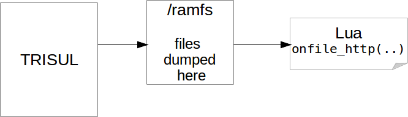

# File Extraction Overview

From Release 6.0, Trisul features a very flexible file extraction platform. Most of the functionality is controlled by LUA scripts that you will write.

:::tip

Extract and dump content like PDFs, Binaries, Javascripts, Video for further analysis.

:::

## How it works

| What the platform provides                                                                                                                                                                                                                                                                                                                        | What you provide via LUA                                                                                                                                                                                                                                                                                                                                                                                                |
| ------------------------------------------------------------------------------------------------------------------------------------------------------------------------------------------------------------------------------------------------------------------------------------------------------------------------------------------------- | ----------------------------------------------------------------------------------------------------------------------------------------------------------------------------------------------------------------------------------------------------------------------------------------------------------------------------------------------------------------------------------------------------------------------- |
| 1 . The Trisul platform provides the following services Dumps content in ramfs filesystem<br/>2 . TCP reassembly<br/>3 . HTTP reassembly chunking and decompression<br/>4 . Async file system operations<br/>5 . Ability to turn on and off feature on per flow basis<br/>6 . Streaming or full file mode<br/>7 . Integration with Trisul metrics | 1 . Determine by looking at headers or flows if you want the content or not<br/>2 . Determine if you are no longer interested in content by looking at first few chunks<br/>3 . Copy any files for further analysis off the ramfs filesystem to a disk based one<br/>4 . Streaming processing if you want to deal with buffers instead of full files<br/>5 . Any custom logging or sending to other systems. Your code. |

## The `ramfs` filesystem

Linux offers a memory backed filesystem called *ramfs* aka *tmpfs* Trisul’s file extraction feature uses this filesytem to dump extracted files. Your LUA script an operate on that file or copy it out to a real disk backed file system for further analysis.

The flow looks like this



### Creating the ramfs filesytem

#### Location

The default location of the ramfs filesystem is at `/usr/local/var/lib/trisul-probe/domain0/probe0/context0/run/ramfs` (see *[FileExtraction RamfsDir](/docs/ref/trisulconfig#file-extraction )* setting)

#### Creating

We will actually be using a memory system called *tmpfs* rather than the older *ramfs*. To create the file system in the default location with a size of 40MB use the following commands.

##### Using trisulctl_probe

trisulctl_probe features a convenient method to create the ramfs

```lua
sudo trisulctl_probe
createramfs probe0 context0

# then answer the questions, select a size of 10MB for the ramfs
```

#### Manually

or you can do it manually using the following commands (as root)

```lua
$ cd /usr/local/var/lib/trisul-probe/domain0/probe0/context0/run
$ mkdir ramfs
$ sudo mount -t tmpfs -o size=40m tmpfs ramfs/
```

#### Add entry of new filesystem to fstab

To ensure that the ramfs partition is persisted on reboot. Add it to fstab as shown in this example

```lua
tmpfs   /usr/local/var/lib/trisul-probe/domain0/probe0/context0/run/ramfs     tmpfs   nodev,nosuid,size=20M          0  0
```

#### Size of the file system

The ramfs filesystem will keep all the partially extracted content and those that are currently being processed by your LUA scripts. Therefore make sure there is sufficient space for them. You can try by setting aside 100MB to 256MB. If that turns out to be too limited you will get system alerts. You can then increase the size.

## Streaming vs File mode

You have the choice of handling the extracted file contents in file mode or streaming mode. What does this mean ?

#### File Mode LUA handling

Your contents are available in the `/ramfs` Your LUA script can operate on it right there on ramfs or copy it over to a disk backed file system.

For very large files, your LUA script will receive the file in large chunks (default 5MB). You can process these chunks on the `/ramfs` or you can append these chunks and create the full file.

#### Streaming Mode LUA

Your LUA script will be directly given buffers. There will be nothing on the ramfs. It is your duty to scan these chunks. Or you can append these chunks to a file to recreate the content.

The streaming mode LUA was created by Trisul to support a number of applications that work on these streaming chunks. A key application is the ability to scan the first 10K bytes or so and determine if the content will be of use when extracted.

#### How to select the mode

There is no need to explicitly select a mode.

1. if there is atleast one LUA script that define `onfile_http (..)` – then the mode is **File Mode**
2. if all LUA scripts only use `onpayload_http(..)` or `onpayload_raw(..)` then the mode is **Streaming Mode**

## Filtering

The main challenge in file extraction is the sheer volume of files that will be pulled out even in moderate enterprise environments. Using LUA you can look at various events and decide if you want that file or not.

| `filter_flow` | called when each flow is started                      | Decide if you want to extract files by looking at IPs and Ports of the endpoints                                                                                                                                                          |
| ------------- | ----------------------------------------------------- | ----------------------------------------------------------------------------------------------------------------------------------------------------------------------------------------------------------------------------------------- |
| `filter`      | called twice. once for request and again for response | Look at request HTTP header fields and decide if you want the response or look at response HTTP header fields and decide if you want the contents. A common usage of this is to look at the `Content_Type` HTTP header and only save PDFs |
| at any time   | –                                                     | At any point for example by looking at payload you can decide to skip extraction for a flow by calling `Engine:DisableReassembly(flowid)`                                                                                                 |

Once you have the full file in /ramfs ; you can of course run the standard linux tools like `file abc.bin` to test the magic numbers of the file. If the file interests you, then your LUA script can copy it over to a disk based filesystem.

## Performance considerations

Some rules for your LUA scripts

1. They are called in fast path
2. If your methods do any I/O or take too long to process you may see packet drops
3. Suggest you use the `T.async` methods to asynchronously copy content from /ramfs to a disk. Then run separate processing over those files

#### Getting a “missing tmpfs filesystem” error

No you will get the following error

```lua
terminate called after throwing an instance of 'std::domain_error'
  what():  Missing tmpfs file system (needed for file extraction) <path>
```

To fix this you need to set aside a `/tmpfs` memory backed filesystem as follows

Use the

```lua
$ cd /usr/local/var/lib/trisul-probe/domain0/probe0/context0/run
$ mkdir ramfs
$ sudo mount -t tmpfs -o size=40m tmpfs ramfs/
```
