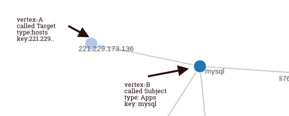

# Object Engine

The Trisul metrics engine.

You call methods on this object to add metrics, objects, flows, or other types of information. This is the most important object you will be working with.

## Functions

A summary of the functions available in this object.

- F – functions that can be called from [Frontend](/docs/lua/basics#frontend-and-backend-scripts) scripts
- B – functions that can be called from [Backend](/docs/lua/basics#frontend-and-backend-scripts) scripts

If you call functions that are not available you will get the following error

```lua
ERR_NOTAVAIL: add_flow_counter() is not available for backend scripts
```

| Name                                                                                                 | Availability | Description                                                                         |
| ---------------------------------------------------------------------------------------------------- | ------------ | ----------------------------------------------------------------------------------- |
| [update_counter](/docs/lua/obj_engine#function-update_counter)                                 | F B          | Updates a meter for a key with a particular value                                   |
| [update_counter_bytes](/docs/lua/obj_engine#function-update_counter_bytes)                           | F            | Updates a meter for a key but with a value of wire_length in the packet             |
| [update_counter_raw](/docs/lua/obj_engine#function-update_counter_raw)       | F B          | Update counter raw is a variant of update_counter.                                  |
| [update_key_info](/docs/lua/obj_engine#function-update_key_info)             | F B          | Set a user friendly label or a description for a key                                |
| [ add_alert](/docs/lua/obj_engine#function-add_alert)                        | F B          | Add an alert                                                                        |
| [add_alert_full](/docs/lua/obj_engine#function-add_alert_full)                    | F B          | Same as add alert with with a priority and classification. Used for IDS alert types |
| [add_alert_tca](/docs/lua/obj_engine#function-add_alert_tca)                 | F B          | For alerts based on metric values and threshold crossing events`                    |
| [add_resource](/docs/lua/obj_engine#function-add_resource)                   | F B          | Add a new resource with metadata and contents to Trisul                             |
| [timestamp](/docs/lua/obj_engine#function-timestamp)                         | F B          | The latest timestamp seen by the engine                                             |
| [add_flow_counter](/docs/lua/obj_engine#function-add_flow_counter)           | F            | Add a flow counter                                                                  |
| [reset_flow_counter](/docs/lua/obj_engine#function-reset_flow_counter)        | F            | Removes all flow counters, then does an add_flow_counter                            |
| [tag_flow](/docs/lua/obj_engine#function-tag_flow)                           | F B          | Tag a flow with a label. Y                                                          |
| [instanceid](/docs/lua/obj_engine#function-instanceid)                       | F B          | Engine Instance identifier                                                          |
| [probeid](/docs/lua/obj_engine#function-probeid)                             | F B          | Trisul probe id of the engine                                                       |
| [update_flow](/docs/lua/obj_engine#function-update_flow)                     | F            | Update a flow based metric                                                          |
| [new_flow_record](/docs/lua/obj_engine#function-new_flow_record)             | F            | Inform framework about a new flow record                                            |
| [set_flow_duration](/docs/lua/obj_engine#function-set_flow_duration)         | F            | Set the duration of the flow in seconds                                             |
| [disable_reassembly](/docs/lua/obj_engine#function-disable_reassembly)       | F            | Stop TCP reassembly of this flow                                                    |
| [post_message_frontend](/docs/lua/obj_engine#function-post_message_frontend) | F B          | Post a message to other LUA plugins attached to the packet (frontend) pipeline      |
| [post_message_backend](/docs/lua/obj_engine#function-post_message_backend)   | F B          | Post a message to other LUA plugins in the metrics (backend) pipeline               |
| [add_edge](/docs/lua/obj_engine#function-add_edge)                           | F B          | Add a single edge to the Trisul Streaming Graph Analytics pipeline                  |
| [add_flow_edges](/docs/lua/obj_engine#function-add_flow_edges)               | F B          | Automatically add edges from a network flow to a given vertex.                      |
| [set_key_attribute](/docs/lua/obj_engine#function-set_key_attribute)         | F B          | Set an arbitrary \{attribute-name,value}\ pair for any key                          |
| [add_flow_attribute](/docs/lua/obj_engine#function-add_flow_attribute)       | F B          | Add an \{attribute-name,value\} pair for any flow for other Lua script to pick up.  |

## Function `update_counter`

Adds a single metric to the Trisul platform.

### Purpose

Update a counter with a value. Recall that the heirarchy in Trisul is

- Counter Group *example* `Applications`
  - Key *example* `pop3`
    - Meter *example* meter `id = 5 Active Connections`

#### Also see

Use [update_counter_raw](/docs/lua/obj_engine#function-update_counter_raw) if

1. you are updating `GAUGE` or `AVERAGE` meter [data types](/docs/lua/obj_globalt#constants-tkvartype)
2. you are updating more than 8 metrics for the same key

### Parameters

| counter guid | `guid` string | the counter group you want to update    |
| ------------ | ------------- | --------------------------------------- |
| key          | string        | the unique key within the counter group |
| meter        | number        | the metric id within the counter group  |
| value        | number        | the metric value                        |

### Return value

None

### Usage

```lua
..

-- update the Hosts counter group identified by the GUID {4CD..}
--        the Host identified by 182.28.22.123
--        the Meter 1 (received bytes)
--           with the value 288278
--
engine:update_counter( "{4CD742B1-C1CA-4708-BE78-0FCA2EB01A87}", "182.28.22.123", 1, 288378)
```

---

## Function `update_counter_bytes`

FRONTEND ONLY

Adds a single metric to the Trisul framework. Same as [update_counter](/docs/lua/obj_engine#function-update_counter) but where the metric value is the packet wire length.

### Purpose

When used with [simplecounter](/docs/lua/simple_counter) and other front end scripts – this method adds a metric with the wire length of the packet context in which it is called.

### Parameters

| counter guid | `guid` string | the counter group you want to update    |
| ------------ | ------------- | --------------------------------------- |
| key          | string        | the unique key within the counter group |
| meter        | number        | the metric id within the counter group  |

### Return value

None

### Usage

This method is only available on frontend scripts.

---

## Function `update_counter_raw`

A variation of [update_counter](/docs/lua/obj_engine#function-update_counter)

### Purpose

This does exactly the same thing as [update_counter](/docs/lua/obj_engine#function-update_counter) with the following difference.

1. this version has a slightly lower performance
2. use this method if you want to update a large number of keys for a single counter group . **More than 8 keys**
3. you are updating `GAUGE` or `AVERAGE` meter [data types](/docs/lua/obj_globalt#constants-tkvartype)

### Parameters

| counter guid | `guid` string | the counter group you want to update    |
| ------------ | ------------- | --------------------------------------- |
| key          | string        | the unique key within the counter group |
| meter        | number        | the metric id within the counter group  |
| value        | number        | the value of the meter                  |

### Return value

None

### Usage

```lua
--
-- we are updating 6 keys for a single counter group
-- for this kind of updating use the 'raw' version
--
engine:update_counter_raw("{D2AAD7C6-...}", "user_1",  1, 100)
engine:update_counter_raw("{D2AAD7C6-...}", "user_11", 1, 10)
engine:update_counter_raw("{D2AAD7C6-...}", "user_2",  1, 200)
engine:update_counter_raw("{D2AAD7C6-...}", "user_33", 1, 3200)
engine:update_counter_raw("{D2AAD7C6-...}", "user_34", 1, 300)
engine:update_counter_raw("{D2AAD7C6-...}", "user_44", 1, 23200)
```

## Function `update_key_info`

Set a user friendly label for a key.

### Purpose

Set a user friendly label or a description for a particular key. For example : to assign a hostname to an IP address

### Parameters

| counter group id       | `guid` string | the counter group id of the counter          |
| ---------------------- | ------------- | -------------------------------------------- |
| key                    | string        | the key                                      |
| label                  | string        | the human friendly label attached to the key |
| description (optional) | string        | more information                             |

### Return value

None

### Usage

```lua
..
--
-- to assign a label "Router1_10G_1" to the MAC address "0A:11:21.BA:00:02" 
-- the GUID "{4B0.."  represents the MAC Counter Group
-- 
engine:update_key_info( "{4B09BD22-3B99-40FC-8215-94A430EA0A35}", "0A:11:21:BA:00:02", "Router1_10G_1")
..
```

## Function `add_alert`

Add an alert to the Trisul framework.

### Purpose

Lets you add a simple alert to the Trisul pipeline. This simple version only contains a priority, alert-type, and description. Also see [add_alert_full](/docs/lua/obj_engine#function-add_alert_full) and [add_alert_tca](/docs/lua/obj_engine#function-add_alert_tca) for more specific variants.

### Parameters

| alert guid | `guid` string | Identifies the type of alert. See [GUIDs](/docs/lua/basics#on-guids)                                                                        |
| ---------- | ------------- | ----------------------------------------------------------------------------------------------------------------------------------------------------- |
| flowkey    | string or nil | the [flowid string](/docs/lua/obj_flowid) of the flow which caused the alert. `nil` if alert not related to a particular flow |
| alertkey   | string        | the type of alert within the group. Think of this as a *Signature ID*                                                                                 |
| priority   | number        | the alert priority. typically 1 = high, 2 = medium, 3 = low. But you can use your priorities if you are using your own alert groups                   |
| message    | string        | a dispatch message                                                                                                                                    |

### Return value

None

### Usage

The following example adds a Priority 1 alert to the general purpose [User Alerts](/docs/ref/guid#alert-groups) group.

```lua
engine:add_alert("{B5F1DECB-51D5-4395-B71B-6FA730B772D9}", -- GUID for 'User Alerts' group
                 resource:flow():id(),                     -- flow ID
                 "RAMNIT-DETECTED",                        -- alert key , think of this as a SigID   
                 1,                                        -- priority
                 "A potential EK was detected message ="   -- free form text alert 
                 )
```

---

## Function `add_alert_full`

Add an alert to the Trisul framework with all bells and whistles.

### Purpose

Same as `add_alert` but with classification and priority fields. To make it compatible with alerts from IDS systems like Snort and Suricata

### Parameters

| alert guid     | `guid` string     | Identifies the type of alert. See [GUIDs](/docs/lua/basics#on-guids)                                                                        |
| -------------- | ----------------- | ----------------------------------------------------------------------------------------------------------------------------------------------------- |
| flowkey        | string or nil     | the [flowid string](/docs/lua/obj_flowid) of the flow which caused the alert. `nil` if alert not related to a particular flow |
| alertkey       | string            | the type of alert within the group. Think of this as a *Signature ID*                                                                                 |
| classification | string            | Optional: a type of alert. This is for compatibility with popular IDS systems like Snort and Suricata                                                 |
| priority       | number            | the alert priority. typically 1 = high, 2 = medium, 3 = low. But you can use your priorities if you are using your own                                |
| message        | string            | a dispatch message                                                                                                                                    |
| status         | string (optional) | a status or impact field. Example : CLEAR, ALARM, FIRE, BLOCK etc                                                                                     |

### Return value

None

### Usage

---

## Function `add_alert_tca`

A special type of alert called Threshold Crossing Alert (TCA) based on metrics.

### Purpose

Same as `add_alert` family but designed for metrics based alerting.

### Parameters

| alert guid | `guid` string | Identifies the type of alert. See [GUIDs](/docs/lua/basics#on-guids)                                                                     |
| ---------- | ------------- | -------------------------------------------------------------------------------------------------------------------------------------------------- |
| tca_id     | number        | a number that uniquely identifies a type of threshold you’ve defined elsewhere. Example : a TCA , Threshold Band, or Flow Tracker alert in Trisul. |
| status     | string        | a string `FIRED` crossed threshold event or `CLEAR` when condition is clear and metric back in limits                                              |
| message    | string        | a dispatch message                                                                                                                                 |

### Return value

None

### Usage

---

## Function `add_resource`

Add a new resource.

### Purpose

Resources are meta data which you can log and search on. You can create your own resource group or add to existing resource groups like “DNS Records”, “HTTP URLs”, etc. Think of *resources* as *logs* and resource groups as *log types*

### Parameters

| resource_id         | a GUID                                                                    | Resource group ID. See [GUIDs](/docs/lua/basics#on-guids)                               |
| ------------------- | ------------------------------------------------------------------------- | ------------------------------------------------------------------------------------------------- |
| flowkey             | a string in [FlowID](/docs/lua/obj_flowid) format | The flow containing this resource. You can get the flow ID from a packet.                         |
| uri                 | a string                                                                  | The metadata that identifies the resource. This can be thought of a summary of the full log entry |
| contents (optional) | a string                                                                  | The actual resource (less than 32K). This of this as the complete log line                        |

### Return value

None

### Usage

```lua
-- add a custom SHA256 hash resource
--
engine:add_resource('{9781db2c-f78a-4f7f-a7e8-2b1a9a7be71a}',  -- represents FileHash resource in Trisul 
                    flowkey:id(),                              -- flow ID
                    "SHA256:"..hex_sha256,                     -- resource key (log summary)
                    full_filename)                             -- full resource  (full log)
```

---

## Function `timestamp`

The latest timestamp in seconds since Epoch format (timeval.tv_sec) seen by the engine.

### Purpose

If you want to find out the latest timestamps seen by the engine. Remember that you may not be able to simply use `os.date)` because Trisul also works on PCAP files that may have other timestamps.

### Parameters

None.

### Return value

| Number | Representing number of seconds since 1-1-1970, a unix timestamp value (tv_sec) |
| ------ | ------------------------------------------------------------------------------ |

1. For frontend scripts that work with packets, this represents the timestamp of the last packet seen.
2. For backend scripts, this returns the last stream interval that was processed to completion.

### Usage

---

## Function `add_flow_counter`

FRONTEND ONLY

Add an automatic flow based counter.

### Purpose

A Flow Counter works in the following way :

1. you attach a counter to a flow
2. all packets in that flow from that point onwards automatically get that counter with the metric equal to the packet length

### Parameters

| flowkey          | string        | identifies the flow that you want to attach a counter to                            |
| ---------------- | ------------- | ----------------------------------------------------------------------------------- |
| counter group id | `guid` string | the counter group id of the counter you want to attach to this flow                 |
| key              | string        | the key within the counter group                                                    |
| metric           | number        | the metric for the counter group                                                    |
| direction        | number        | the direction you want to count.<br/>0 = Both 1 = OUT (in Direction of SYN), 2 = IN |

### Return value

None

### Usage

The method is only available for Frontend scripts. If you call this method from a backend script you will get an error.

If you detect a particular flow to be carrying YouTube video you can attach a counter “you-tube-traffic” metric. From that point onwards each packet on that flow will automatically update the ‘youtube-traffic’ counter with the packet length.

#### Note on the `Direction` parameter

Use Direction=0 to update a Total traffic counter and Directions 1,2 to update IN/OUT separately. In the snippet below you’ve [created your own counter group](/docs/lua/counter_group) with GUID `{55F..}` with three meters 0=Total,1=Xmit,2=Recv. You can see how to update the *Totals* counter Direction=0 and In/Out counters

```lua
-- Direction 0 : update both OUT and IN direction packets to the same counter

-- to update a TOTAL BYTES counter 
engine:add_flow_counter( flowkey:id(),
                         "{55F98CC1-646E-4DE6-AD79-6B896211F177}",  -- a counter guid
                         'my-video-traffic', 
                         0,  -- Total bytes
                         0)  -- Both directions update the Total bytes counter 


-- for XMIT 
engine:add_flow_counter( flowkey:id(),
                         "{55F98CC1-646E-4DE6-AD79-6B896211F177}",  -- a counter guid
                         external_host, 
                         1,   -- Transmit meter
                         1)   -- Only OUT direction update the Trasmit meter 
-- for RECV
engine:add_flow_counter( flowkey:id(),
                         "{55F98CC1-646E-4DE6-AD79-6B896211F177}",  -- a counter guid
                         external_host, 
                         2,   -- Recv meter 
                         2)   -- Only IN direction update the receive meter 
```

## Function `reset_flow_counter`

FRONTEND ONLY

Removes a flow based counter.

### Purpose

Remove a previous flow based counter added by [add_flow_counter](/docs/lua/obj_engine#function-add_flow_counter)

### Parameters

| flowkey          | string        | identifies the flow that you want to attach a counter to            |
| ---------------- | ------------- | ------------------------------------------------------------------- |
| counter group id | `guid` string | the counter group id of the counter you want to attach to this flow |

### Return value

None

### Usage

The method is only available for Frontend scripts. If you call this method from a backend script you will get an error.

---

## Function `tag_flow`

Tag a flow with a string.

### Purpose

Add a text label to a IP flow. You can then search for flows using this string.

### Parameters

| flowkey | string | identifies the flow that you want to attach a counter to. Usually you get this from [flow:id](/docs/lua/obj_flowid)                                                                   |
| ------- | ------ | -------------------------------------------------------------------------------------------------------------------------------------------------------------------------------------------------------------- |
| tag     | string | a short text label that is attached to the flow. You can attach multiple tags to a flow but the total length of all tags must be less than 64 bytes. If you add tags >= 64 bytes the extra tags are discarded. |

### Return value

None

### Usage

---

## Function `instanceid`

A **string** representing the instance of the engine

### Purpose

There may be multiple `engine` contexts in Trisul. This string identifies each one. You can use this to construct unique filenames etc.

### Parameters

None.

### Return value
| Type | Info |
------------------------------------------------------------------------------------------------------------------------------------------------------------- |---|
| String | Representing the instance of the engine object you are working with. This string is random string like “77BAB82” for Frontend scripts. For backend scripts, this string is the instance number such as “0”, “1”, “2” etc. |


### Usage

A common use of `instanceid` is to construct filenames for log files. Another use is when you have scheduled scripts and you only want to run them once. In that case, you only run your code when `engine:instanceid()=="0"` See [engine_monitor](/docs/lua/engine_monitor) for more.

---

## Function `probeid`

The probe id.

### Purpose

Use this to retrieve the probeid – eg `probe0` that the engine object belongs to.

### Parameters

None.

### Return value

| Type  | Info |
| ------ | ------------------------------------------------------------------------------- |
| String | The probe id such as `probe0` that identifies the domain probe id of the engine |


### Usage

---

## Function `update_flow`

FRONTEND ONLY

Add a flow metric.

### Purpose

Update a flow based metric. The key used in a SessKey format.

### Parameters

| key   | string | a string representing a flow in SessKey format |
| ----- | ------ | ---------------------------------------------- |
| meter | number | the metric id                                  |
| value | number | update with this value                         |

### Return value

None

### Usage

---

## Function `new_flow_record`

Use this method only when you are writing an [Input Filter](/docs/lua/inputfilter) plugin importing feeds with “Netflow like” flow records.

### Purpose

Tell the Trisul framework we have new flow record with X bytes and Y packets. The reason you need to do this is because some plugins ; such as Badfellas work with flow records for efficiency reasons. This method does not impact metrics in any way, but exists only to inform some plugins of a new flow.

### Parameters

| key        | string | a string representing a flow in SessKey format |
| ---------- | ------ | ---------------------------------------------- |
| bytes_az   | number | bytes in A > Z direction                       |
| bytes_za   | number | bytes in Z > A direction                       |
| packets_az | number | packets in A > Z direction                     |
| packets_za | number | packets in Z > A direction                     |

### Return value

None

### Usage

---

## Function `set_flow_duration`

FRONTEND ONLY

Set length in seconds of a flow.

### Purpose

Use this along with `update_flow` to handle Netflow like input data. This method sets the length of each flow. Use this if the duration of the flow is available in your input records.

### Parameters

| key   | string | a string representing a flow in SessKey format |
| ----- | ------ | ---------------------------------------------- |
| value | number | duration of the flow in seconds                |

### Return value

None

### Usage

---

## Function `disable_reassembly`

FRONTEND ONLY

Stop reassembly and reconstruction of this flow.

### Purpose

This method is useful in various contexts like [file extraction](/docs/lua/fileextract) and [reassembly](/docs/lua/reassembly)

The main use of this method is when you need to see the beginning bytes of a TCP flow to determine whether you are interested in further reassembly. Turning off reassembly of TCP streams you are not interested in can save significant CPU and memory.

### Parameters

| Name | Type  | Info                                           |
| --- | ------ | ---------------------------------------------- |
| key | string | a string representing a flow in SessKey format |

### Return value

None

### Usage

disable_reassembly is only available for frontend scripts that work with packets and flows.

---

## Function `post_message_frontend`

Post a message to the frontend (packet) pipeline

### Purpose

Use this method to communicate with other LUA plugins that are plugged into the packet pipeline stages.

You can use `trisulctl_probe testbench guid` to generate a msg id.

### Parameters

| message_id (optional) | a GUID   | a message ID – message sent only to those LUA plugins subscribed to this message id. |
| --------------------- | -------- | ------------------------------------------------------------------------------------ |
| message               | a string | a message. the targets would know how to handle                                      |

### Return value

None

### Usage

```lua
-- sent to all plugins which have an onmessage(..) handler 
--
engine:post_message_frontend("192.168.2.1 port 299 needs fileextraction")


-- sent to only those plugins who have subscribed to 
-- message if {F8D5570E-00A7-41FD-C30E-298C55D8EC4D}
--
engine:post_message_frontend("{F8D5570E-00A7-41FD-C30E-298C55D8EC4D}",
                              "192.168.2.1 port 299 needs fileextraction")
```

## Function `post_message_backend`

Post a message to the backend (streaming metrics) pipeline

### Purpose

Use this method to communicate with other LUA plugins that are plugged into the backend pipeline

You can use `trisulctl_probe testbench guid` to generate a msg id.

### Parameters

| message_id (optional) | a GUID   | a message ID – message sent only to those LUA plugins subscribed to this message id. |
| --------------------- | -------- | ------------------------------------------------------------------------------------ |
| message               | a string | a message. the targets would know how to handle                                      |

### Return value

None

### Usage

```lua
-- sent to all backend plugins which have an onmessage(..) handler 
--
engine:post_message_backend("192.168.2.1 port 299 label all flows as suspicious")


-- sent to only those plugins who have subscribed to 
-- message id {F8D5570E-00A7-41FD-C30E-298C55D8EC4D}
--
engine:post_message_backend("{F8D5570E-00A7-41FD-C30E-298C55D8EC4D}",
                              "192.168.2.1 port 299 label all flows as suspicious")
```

## Function `add_edge`

Add a new uni-directional edge to the *edge stream*. This is part of the new Trisul Streaming Graph Analytics feature set.

### Purpose

In Graph Analytics lingo, an *edge* is two vertices joined with a connection. The `add_edge` method allows to you push a simple Edge to the Trisul streaming pipeline.



The above picture explains the following terms

Subject Vertex Type

The type or color of Vertex-A. This is a GUID , typically a counter group or alert type.

Subject Vertex Key

A key identifying the vertex within the group. Example an *IP Address* within *Hosts*

Target Vertex Type

The type or color of Vertex-B.

Target Vertex Key

A key identifying the target vertex

### Parameters

| subject_guid | a GUID | type of Vertex-A |
| ------------ | ------ | ---------------- |
| subject_key  | string | key of Vertex-A  |
| target_guid  | a GUID | type of Vertex-B |
| target_key   | string | key of Vertex-B  |

#### Note on edge direction.

Trisul edges are directional, so if you want to add a bi-directional edge. Call `add_edge` twice with A and B reversed the second time. See *Usage* section.

### Return value

None

### Usage

Here is how you add a bi-directional edge. Say between a PING-ALERT and an Internal IP address

```lua
--
engine:add_edge("{F8D5570E-00A7-41FD-C30E-298C55D8EC4D}", "ICMP-PING-ALERT"
                "{98348488-45A7-45FD-450E-45838053800D}", "10.2.28.18" );

-- the other direction
engine:add_edge("{98348488-45A7-45FD-450E-45838053800D}", "10.2.28.18",
                "{F8D5570E-00A7-41FD-C30E-298C55D8EC4D}", "ICMP-PING-ALERT");
```

## Function `add_flow_edges`

Add edges from a given vertex to all vertices of a flow.

### Purpose

This function adds the following uni-directional edges from a given *vertex*

- Vertex → Source IP
- Source IP → Vertex
- Vertex → Dest IP
- Dest IP → Vertex
- Port → Vertex
- Vertex → Port
- Protocol → Vertex
- Vertex → Protocol

### Parameters

| flow_key    | a string | A string representing a flow. This is in [FlowID format](/docs/lua/obj_flowid) You typically get this string as inputs to your lua function |
| ----------- | -------- | -------------------------------------------------------------------------------------------------------------------------------------------------------------------- |
| target_guid | a GUID   | type of Vertex-B. This can be a counter group id, alert group id, or any other group id                                                                              |
| target_key  | string   | key of Vertex-B                                                                                                                                                      |

### Return value

None

### Usage

Add an ALERT vertex to all the endpoints of the flow that generated it.

```lua
--
-- adds edges from the new ICMP-PING-ALERT vertex
--
engine:add_flow_edges("06A:C0.A8.01.02:p-0B94_D1.D8.F9.3A:p-0016", 
                      "{F8D5570E-00A7-41FD-C30E-298C55D8EC4D}", "ICMP-PING-ALERT");
```

---

## Function `set_key_attribute`

Add an arbitrary attribute-name, attribute-value pair to any key.  
If the key already has an attribute with the *attribute-name* then overwrite the old value with the new *attribute_value*

### Purpose

Allows you to attach a name,value to any key. For example

1. A common use is to assign an Interface Speed (ifSpeed) to a netflow interface.
2. other uses can be thought of such as “operating-system” to a Host IP, etc

### Parameters

| counter guid    | `guid` string | the counter group                       |
| --------------- | ------------- | --------------------------------------- |
| key             | string        | the unique key within the counter group |
| attribute_name  | a string      | A name for the attribute                |
| attribute_value | a string      | a value                                 |

### Return value

None

### Usage

```lua
--
-- to assign a value of 100000 to interface_speed for interface 1ge/0/0
--

set_key_attribute(  "{7CA09636-02D4-45e7-AA00-BE0D49B94E26}", -- netflow interfaces group
                    "1ge/0/0",             -- interface key 
                    "interface_speed",     -- attr_name
                    "1000000" )            -- value
```

---

## Function `add_flow_attribute`

Adds an attribute-name=attribute-value to a flow.

### Purpose

Flow attributes can be attached to any flow. You can then write other scripts that can listen to these attributes using [reassembly/onattribute](/docs/lua/reassembly#function-onattribute) and work on them.

### Parameters

| flow_key        | string | A string representing a [FlowID](/docs/lua/obj_flowid) |
| --------------- | ------ | ------------------------------------------------------------------------------- |
| attribute_name  | string | type of attribute. Example HTTP-User-Agent                                      |
| attribute_value | string | attribute value, Example “Mozilla …”                                            |

### Return value

None

### Usage
