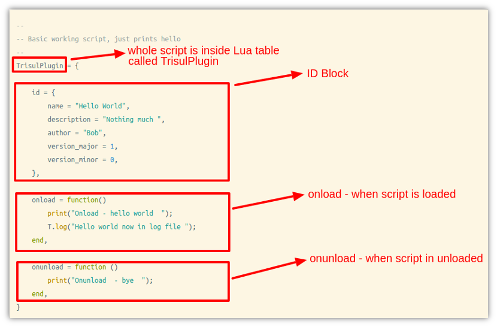

# Quickstart tutorial 1 – Getting started

This tutorial will get you started from scratch to a working script. We will assume you have installed Trisul and Web Trisul. You do not need to install LUA because it is embedded into the Trisul Probe.

## Hello World

Lets get started with a simple “hello world” example. We will run the script first, see its output, and then start exploring it.

:::note[GOALS]

Get started by learning where to place LUA scripts, how to run in development mode, how to view logs.

:::

1. ### Get hello.lua and put it in the plugins directory
   
   1. Download the sample [hello.lua](https://raw.githubusercontent.com/trisulnsm/trisul-scripts/master/lua/tutorial/tutorial1/hello.lua) script and save it in the lua scripts directory `/usr/local/lib/trisul-probe/plugins/lua` *Sample run shown below
      
      ```lua
      cd /usr/local/lib/trisul-probe/plugins/lua
      wget https://raw.githubusercontent.com/trisulnsm/trisul-scripts/master/lua/tutorial/tutorial1/hello.lua
      ```

2. ### Run Trisul over a PCAP file
   
   1. Now lets run Trisul over a sample PCAP file. Use your own or download a sample PCAP from tutorial.pcap
   
   2. Run the trisulctl_probe CLI tool command ‘testbench’ which will run your scripts in a single threaded mode attached to your terminal. See [Development Environment](/docs/lua/debugger) *Sample run shown below*
      
      ```lua
      cd /tmp
      wget https://github.com/trisulnsm/trisul-scripts/raw/master/lua/tutorial/tutorial1/tutorial.pcap?raw=true -O tutorial.pcap
      trisulctl_probe testbench run tutorial.pcap
      ```

3. ### Output
   
   1. Here is the output you will see as Trisul discovers and loads all the lua scripts including your *hello.lua*
      
      ```lua
      # trisulctl_probe testbench run Test.pcap 
      Trisul Test Bench :  run your LUA scripts in a test environement
        ✓ domain0 up and running
        ✓ domain node hub0 ready
      Replacing image with 
      /usr/local/bin/trisul  -nodemon /usr/local/etc/trisul-probe/domain0/probe0/context_debug0/trisulProbeConfig.xml -mode offline -in Test.pcap
      ```
     ```lua 
      Onload – hello world  
      Onunload  – bye  
      Onload – hello world  
      Onunload  – bye
      ```
      ```
      
      ```
> Congratulations! You have just run your first LUA script on Trisul

   ** Exploring hello.lua **

   The script [hello.lua](https://github.com/trisulnsm/trisul-scripts/blob/master/lua/tutorial/tutorial1/hello.lua) looks like this

   

   Note the following six points.

1. The main elements are the LUA table `TrisulPlugin` the `id` block and the `onload` and `onunload` functions

2. The entire plugin is inside a LUA table called “TrisulPlugin” `TrisulPlugin = { ..}`

3. The LUA table [*id*](/docs/lua/basics#id-block) contains info about the script

4. The `onload` and `onunload` [functions](/docs/lua/basics#onload-and-onload) are called by the engine when the script is load/unloaded

5. Within the *onload* and *onunload* function you can access a global called **T**

6. The [global **T** exposes several methods](/docs/lua/obj_globalt) like `T.log` to interact with Trisul
   
   That is the model of the Trisul LUA API, your script will be called at various times depending on the type of script.
   
   ## Why is the script loading so many times ?
   
   You may have noticed that the print messages appear multiple times.
   
   ```lua
   Onload - hello world  
   Onunload  - bye  
   Onload - hello world  
   Onload - hello world  
   Onunload  - bye  
   Onunload  - bye
   ```
   
   The Trisul engine can spin up multiple instances of your LUA script depending on the threading setup. It can also load and unload during the probing/discovery process. This brings us to one of the big rules of LUA scripting with Trisul. Your script can be loaded and unloaded many times and multiple instances of your script might be running at the same time.
   
   ## Running in normal mode
   
   The tutorial used the ‘development’ mode to run the script. You can also run it normally using the following methods
   
   ```lua
   # option 1: to start listening to live traffic 
   trisulctl_probe start context default 
   
   # option 2: to import pcap
   trisulctl_probe importpcap /home/npl/BigPcap.pcap 
   
   # option 3: to run from command line with a terminal attached 
   trisulctl_probe start context default@hub0
   trisul -nodemon /usr/local/etc/trisul-probe/domain0/probe0/context0/trisulProbeConfig.xml -mode offline -in Test.pcap
   ```
   
   **Using print and logs**
   
   You can use the `print(..)` function in LUA in order to debug your script. The following rules apply

7. If running with the `-nodemon` option, Trisul runs in the foreground and all the print(..) messages appear on stdout

8. If running with the `-demon` option, Trisul overwrites the LUA `print(..)` function with its own. So you print messages show up in the log files with a DEBUG level.
   
   The log files are generally found in `/usr/local/var/log/trisul-probe` ; the output from your LUA script show up in these files just like the messages from the Trisul core engine. Log messages from each script are automatically prefixed with the script name. So the following
   
   ```lua
   Mon Mar 31 12:52:33 2014.882121 INFO  [hello.lua] Hello world now in log file
   Mon Mar 31 12:52:33 2014.882121 INFO  [m.lua] From simplecounter demo
   ```
   
   This allows you to grep for `hello.lua` to only see messages from your script.

## Development tips

Some useful tips for development.

1. Switch to [single threaded mode](/docs/ref/trisulconfig#tuning)
2. Use a PCAP file to develop your script instead of live traffic
3. Run over the PCAPs with `-nodemon` mode to output LUA `print(..)` statements on the console

## Next steps

Congrats! You have written your first LUA script, although it doesnt do much. Lets move on to the next Tutorial : [How to write a simplecounter](/docs/lua/tutorial2)
