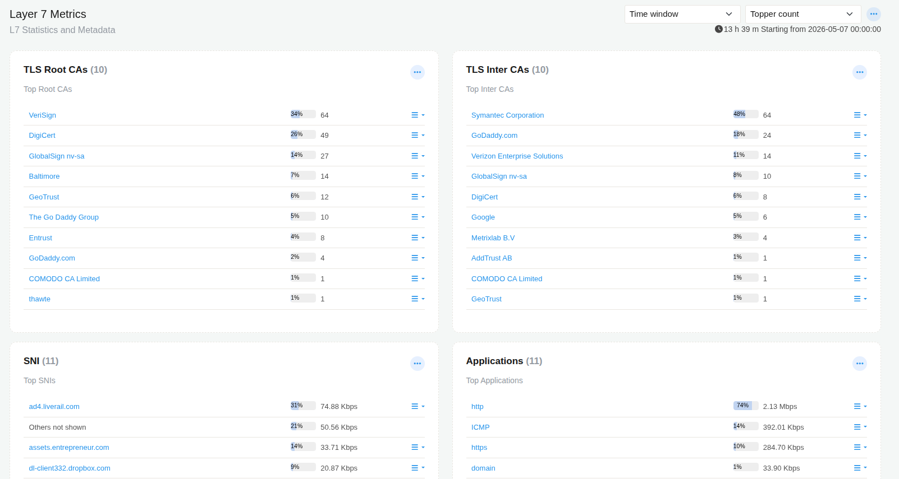
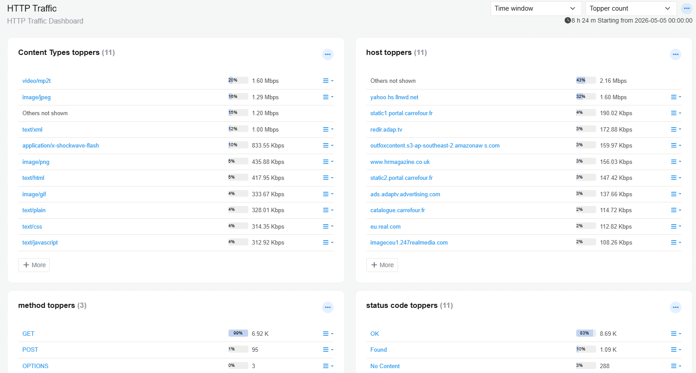
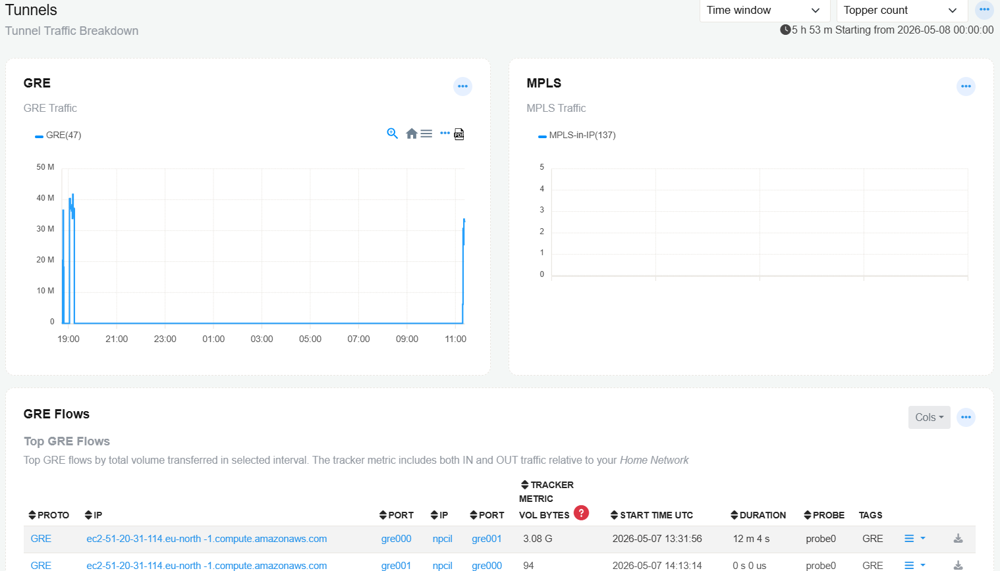
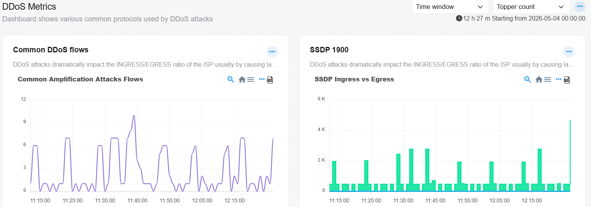
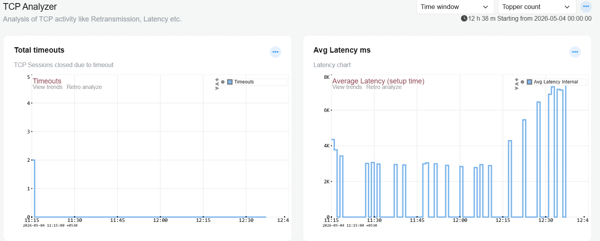
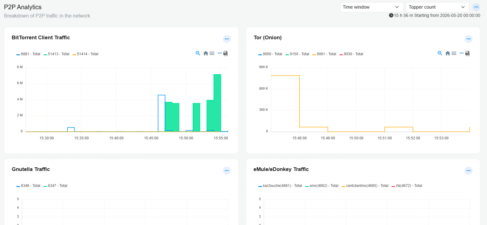
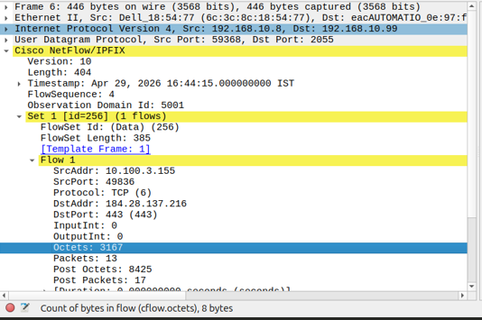
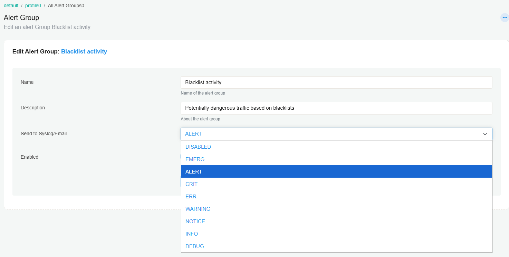

# Trisul NBAD

Trisul NBAD is Trisul Apps based Network Behavior Anomaly Detection solution developed to provide visibility into network traffic, application behavior, security events, and operational anomalies.

The solution combines flow analytics, Layer 7 visibility, behavioral monitoring, traffic investigation, and alerting capabilities through a collection of [**Trisul Apps**](https://github.com/trisulnsm/apps) and dashboards.

## Installation

The NBAD functionality in Trisul is provided through Trisul Apps and consists primarily of two application groups
- NBAD Dashboards
- Meta NBAD

:::info navigation
:point_right: Go to Web Admin &rarr; Manage &rarr; Apps
:::

After installation:

:point_right: Verify all required applications are enabled. Applications such as NFGEN, TCP Analyzer, DDoS Monitor, and Stable Keys can also be verified from the Apps section.

## NBAD Dashboards

The NBAD Dashboards application provides the core visualization and monitoring dashboards used for network behavior analysis and traffic visibility.

This application includes dashboards such as:

- Layer 7 Metrics
- HTTP Traffic Analytics
- IPv4 / IPv6 Monitoring
- Tunnel Monitoring
- Real-Time Alerts
- Traffic Visibility Dashboards

These dashboards provide visibility into application traffic, protocol activity, tunnels, alerts, and network behavior patterns.

## Traffic Monitoring


### Layer 7 Metrics

:::info navigation
:point_right: Go to NBAD &rarr; Layer7 Metrics
:::

The Layer 7 Metrics dashboard provides visibility into application-layer protocols and encrypted traffic metadata.

The dashboard includes:
- [Top Applications](/docs/next/ug/ui/dashboards#current-apps)
- SNI visibility
- [TLS Root CAs and TLS Intermediate CAs](/docs/next/ug/cg/ssl#tls-certificate-authorities)



#### SNI

Displays Server Name Indication (SNI) values extracted from TLS handshakes.

SNI identifies the hostname requested by a client during encrypted HTTPS communication.

| Field | Description |
|---|---|
| SNI Hostname | Requested hostname extracted from the TLS handshake |
| Percentage | Percentage contribution of the hostname in observed traffic |
| Traffic Volume | Bandwidth associated with the hostname |
| Expand Menu | Opens additional drilldown and flow analysis options |


---

### HTTP Traffic

:::info navigation
:point_right: Go to NBAD &rarr; HTTP Traffic
:::

The dashboard includes:
- HTTP Hosts
- HTTP Content Types
- HTTP Methods
- HTTP Status Codes

The HTTP Traffic dashboard provides visibility into HTTP traffic behavior, content distribution, request methods, host activity, and HTTP response status analysis.



#### Content Types Toppers

Displays the top HTTP content types observed in the monitored traffic.

| Field | Description |
|---|---|
| Content Type | MIME/content type identified in HTTP responses |
| Percentage | Percentage contribution of the content type in observed traffic |
| Traffic Volume | Total bandwidth consumed by the content type |
| Expand Menu | Opens additional drilldown and traffic investigation options |
| More | Displays additional content types beyond the current visible list |

Examples:
- video/mp2t
- image/jpeg
- text/html
- application/x-shockwave-flash
- text/javascript

#### Host Toppers

Displays the top HTTP hosts observed in traffic.

| Field | Description |
|---|---|
| Host | HTTP hostname or domain identified in traffic |
| Percentage | Percentage contribution of host traffic |
| Traffic Volume | Total bandwidth associated with the host |
| Expand Menu | Opens additional drilldown and investigation options |
| More | Displays additional hosts beyond the visible list |


#### Method Toppers

Displays the top HTTP request methods observed in traffic.

| Field | Description |
|---|---|
| HTTP Method | HTTP request method identified in traffic |
| Percentage | Percentage contribution of the request method |
| Request Count | Number of requests associated with the method |
| Expand Menu | Opens additional analysis and drilldown options |

Common HTTP Methods

| Method | Description |
|---|---|
| GET | Retrieves resources or web content |
| POST | Sends data to applications or servers |
| OPTIONS | Queries supported communication methods |


#### Status Code Toppers

Displays the top HTTP response status codes observed in traffic.

| Field | Description |
|---|---|
| Status Code | HTTP response status returned by servers |
| Percentage | Percentage contribution of the status code |
| Response Count | Number of responses associated with the status code |
| Expand Menu | Opens additional traffic analysis and drilldown options |

### Common Status Codes

| Status Code | Description |
|---|---|
| OK | Successful HTTP request |
| Found | Redirect response |
| No Content | Successful request with no response body |

---

### IPv4 / IPv6 Dashboard

:::info navigation
:point_right: Go to NBAD &rarr; IPv4/IPv6 Dashboard
:::

The IPv4 / IPv6 dashboard provides visibility into IPv4 and IPv6 host activity, traffic distribution, and bandwidth usage across the network.

The dashboard includes:
- Top IPv4 Hosts
- Top IPv6 Hosts
- Current Top Applications
- Current Applications by Connections
- Internal Hosts
- External Hosts


#### IPv4 Retro Toppers

Displays the top IPv4 hosts and entities observed in network traffic over the selected time interval.

| Field | Description |
|---|---|
| IPv4 Host | IPv4 address or hostname identified in monitored traffic |
| Percentage | Percentage contribution of the host traffic |
| Traffic Volume | Total bandwidth consumed by the host |
| Metric Tabs | Displays Total, Max, Min, Average, and Percentile traffic metrics |
| Expand Menu | Opens additional drilldown and traffic investigation options |
| More | Displays additional IPv4 hosts beyond the visible list |


#### IPv6 Retro Toppers

Displays the top IPv6 hosts and entities observed in network traffic.

| Field | Description |
|---|---|
| IPv6 Host | IPv6 address or hostname identified in monitored traffic |
| Percentage | Percentage contribution of the host traffic |
| Traffic Volume | Total bandwidth consumed by the host |
| Metric Tabs | Displays Total, Max, Min, Average, and Percentile traffic metrics |
| Expand Menu | Opens additional drilldown and investigation options |
| More | Displays additional IPv6 hosts beyond the visible list |


#### Metric Tabs

The dashboard provides multiple traffic analysis views using metric tabs.

| Metric | Description |
|---|---|
| Total | Total traffic volume observed during the selected interval |
| Max | Maximum observed traffic value |
| Min | Minimum observed traffic value |
| Average | Average traffic value during the selected interval |
| %tile | Percentile-based traffic analysis view |


#### Expand Menu Options

Each host entry contains a three-line action menu for additional analysis and drilldown workflows.

| Option | Description |
|---|---|
| Traffic Chart | Displays bandwidth and traffic trends for the selected host |
| Long Term Traffic report | Generates historical traffic reports for the selected host |
| View Edge Graph | Displays communication relationships and connection graphs |
| Download PCAP | Downloads packet capture data related to the selected traffic |
| Query flows by tag | Searches flows associated with tags linked to the selected host |
| Aggregate flows by tag | Aggregates and summarizes tagged flows |
| Statistics | Displays statistical information related to the selected host traffic |


### Tunnels

:::info navigation
:point_right: Go to NBAD &rarr; Tunnels
:::

The Tunnels dashboard provides visibility into tunneled and encapsulated network traffic such as GRE, MPLS, and IPsec communications.

The dashboard includes:
- GRE Traffic
- MPLS Traffic
- GRE Flows
- IPsec ESP/AH Traffic
- Application-level IPsec visibility



Supported tunnel visibility includes:
- GRE
- MPLS
- IPseck.

#### GRE Traffic

Displays GRE (Generic Routing Encapsulation) tunnel traffic activity over the selected time interval.

| Field | Description |
|---|---|
| GRE(47) | GRE tunnel protocol traffic identified in monitored traffic |
| Traffic Graph | Displays GRE traffic volume over time |
| Time Axis | Displays the selected monitoring interval |
| Traffic Scale | Displays bandwidth or traffic volume scale |
| Widget Toolbar | Provides graph interaction and visualization options |
| Expand Menu | Opens additional drilldown and investigation options |

#### Toolbar Options

| Option | Description |
|---|---|
| Zoom | Zooms into specific traffic intervals |
| Home | Resets graph view to default |
| Menu | Opens additional graph options |
| Export PDF | Exports graph data as PDF |

#### MPLS Traffic

Displays MPLS tunnel traffic observed in monitored traffic.

| Field | Description |
|---|---|
| MPLS-in-IP(137) | MPLS encapsulated traffic identified in monitored traffic |
| Traffic Graph | Displays MPLS traffic volume over time |
| Time Axis | Displays the selected monitoring interval |
| Traffic Scale | Displays traffic volume scale |
| Expand Menu | Opens additional drilldown and investigation options |

#### GRE Flows

Displays individual GRE tunnel flows observed in the selected time interval.

| Field | Description |
|---|---|
| PROTO | Tunnel protocol associated with the flow |
| IP | Source or destination IP address associated with the tunnel flow |
| PORT | Tunnel interface or logical port identifier |
| TRACKER METRIC VOL BYTES | Total traffic volume transferred for the flow |
| START TIME UTC | Timestamp when the flow was first observed |
| DURATION | Duration of the observed flow |
| PROBE | Probe or monitoring instance observing the traffic |
| TAGS | Tags or classifications associated with the flow |
| Action Menu | Opens additional drilldown and investigation options |
| Download Icon | Downloads packet capture or associated flow data |


#### Expand Menu Options

Each tunnel flow contains an action menu for additional analysis workflows.

| Option | Description |
|---|---|
| Traffic Chart | Displays bandwidth trends for the selected tunnel flow |
| Long Term Traffic report | Generates historical traffic reports for the selected tunnel flow |
| View Edge Graph | Displays communication relationships and tunnel connectivity |
| Download PCAP | Downloads packet capture data associated with the tunnel flow |
| Query flows by tag | Searches flows associated with tags linked to the tunnel flow |
| Aggregate flows by tag | Aggregates and summarizes tagged tunnel flows |
| Statistics | Displays statistical information related to the selected tunnel traffic |

#### Common Tunnel Protocols

| Protocol | Description |
|---|---|
| GRE | Generic Routing Encapsulation tunnel protocol |
| MPLS | Multi-Protocol Label Switching encapsulated traffic |
| IPsec | Encrypted VPN and secure tunnel communication |


### Maps


---
## Detection and Anomaly Analysis

### DDoS Metrics

:::info navigation
:point_right: Go to NBAD &rarr; DDoS Mterics
:::

The [DDoS Metrics dashboard](/docs/next/ug/alerts/ddos) provides visibility into volumetric traffic patterns and common DDoS attack indicators.

The dashboard includes:
- NTP Ingress vs Egress
- DNS Ingress vs Egress
- SSDP Traffic
- ICMP Ingress vs Egress
- Total Ingress vs Egress
- DDoS Flow Monitor
- TCP vs UDP Traffic
- Ingress vs Egress Ratio




### TCP Analyzer

:::info navigation
:point_right: Go to NBAD &rarr; TCP Analyzer
:::

The TCP Analyzer dashboard provides analysis of TCP session quality and connection performance.

The dashboard includes:
- Total Timeouts
- Average Latency
- Retransmitted Packets
- Retransmission Percentage
- Poor Quality Flows
- Setup Latency
- Flows Timed Out
- High Retransmission Rate Flows



---

### Common Flood - DNS/TCPSYN
:::info navigation
:point_right: Go to NBAD &rarr; DNS/TCPSYN
::: 

The Common Flood dashboard provides monitoring for common DNS and TCP SYN flood indicators.

The dashboard includes:
- Unique Hosts
- DNS Traffic
- Unique DNS Hosts
- DNS Connections
- Total Bandwidth Seen
- TCP SYN Activity

### P2P 

The P2P Analytics dashboard provides visibility into Peer-to-Peer (P2P) traffic activity observed in the network.

The dashboard helps identify decentralized communication protocols, file-sharing applications, anonymization traffic, and potentially unauthorized P2P activity.



- BitTorrent Client Traffic displays BitTorrent-related traffic activity observed in the monitored network.
- Tor (Onion) displays Tor network traffic activity identified in monitored traffic. Tor traffic may indicate anonymized or privacy-focused communication.
- Gnutella Traffic displays Gnutella P2P protocol traffic observed in the network.
- eMule/eDonkey Traffic displays eMule and eDonkey peer-to-peer traffic activity observed in monitored traffic.

#### Expand Menu Options

Each traffic widget contains additional drilldown and analysis workflows.

| Option | Description |
|---|---|
| Traffic Chart | Displays bandwidth and traffic trends for the selected traffic type |
| Long Term Traffic report | Generates historical traffic reports |
| View Edge Graph | Displays communication relationships and peer connections |
| Download PCAP | Downloads packet capture data associated with the selected traffic |
| Query flows by tag | Searches flows associated with related tags |
| Aggregate flows by tag | Aggregates and summarizes tagged flows |
| Statistics | Displays statistical information related to the selected traffic |

---

## NetFlow Generator (NFGEN)

:::info navigation
:point_right: Go to WebAdmin &rarr; Apps
::: 

The NFGEN (NetFlow Generator) application enables Trisul to generate and export NetFlow/IPFIX records from monitored traffic.

The generated records can be exported to external NetFlow collectors, SIEM platforms, traffic analyzers, and monitoring systems using IPFIX-compliant flow exports.

### Configure NetFlow Receiver

Login as the trisul `user` from the CLI and edit the NFGEN configuration file to specify the NetFlow/IPFIX receiver IP address and related export parameters.

Example configuration parameters may include:
- Receiver IP Address
- Receiver Port
- Export Protocol
- Sampling Configuration
- Export Format


### Verify IPFIX Export Using Wireshark

Use Wireshark on the receiver system to verify that IPFIX records are being exported successfully from Trisul.

The exported packets should appear as:
```text
Cisco NetFlow/IPFIX
```




# IPFIX Packet Fields

The following fields may be visible in Wireshark while inspecting exported IPFIX records.

| Field | Description |
|---|---|
| Version | NetFlow/IPFIX protocol version |
| Length | Total length of the exported IPFIX packet |
| Export Time | Timestamp associated with the exported flow record |
| Observation Domain ID | Identifier associated with the exporting device or exporter instance |
| Set ID | IPFIX template or data set identifier |
| FlowSet ID | Identifier for the flow template or exported flow data |
| SrcAddr | Source IP address of the observed flow |
| DstAddr | Destination IP address of the observed flow |
| SrcPort | Source port associated with the flow |
| DstPort | Destination port associated with the flow |
| Protocol | Layer 4 protocol associated with the flow |
| InputInt | Input interface associated with the observed traffic |
| OutputInt | Output interface associated with the observed traffic |
| Octets | Total number of bytes transferred |
| Packets | Total number of packets transferred |
| Post Octets | Post-policy or post-processing byte count |
| Post Packets | Post-policy or post-processing packet count |
| Duration | Duration of the observed network flow |


## Export Through Syslog to SIEM

Trisul NBAD supports forwarding alerts and security events to external SIEM platforms using Syslog integration.

This allows security teams to centrally monitor, correlate, and investigate alerts generated from Trisul NBAD dashboards, behavioral analytics, and detection workflows.

### Configure Syslog Export

:::info navigation
:point_right: Go to Context &rarr; Profile &rarr; All Alert Groups
:::

Select the required Alert Group and configure Syslog forwarding settings.

Example Alert Group:
- Blacklist activity



---

#### Alert Group Configuration Fields

| Field | Description |
|---|---|
| Name | Name of the alert group used for identifying the alert category |
| Description | Description of the alert group and associated detection behavior |
| Send to Syslog/Email | Selects the Syslog severity level used when forwarding alerts. |
| Enabled | Click on the radio button to enable |

Click **Update** to save the configurations.

---

#### Supported Syslog Severity Levels

| Severity | Description |
|---|---|
| EMERG | Emergency condition requiring immediate attention |
| ALERT | High-priority alert requiring immediate operational response |
| CRIT | Critical condition impacting services or security |
| ERR | Error condition indicating operational issues |
| WARNING | Warning condition indicating suspicious or abnormal behavior |
| NOTICE | Significant but normal operational event |
| INFO | Informational event |
| DEBUG | Debugging and troubleshooting information |
| DISABLED | Disables Syslog forwarding for the selected alert group |