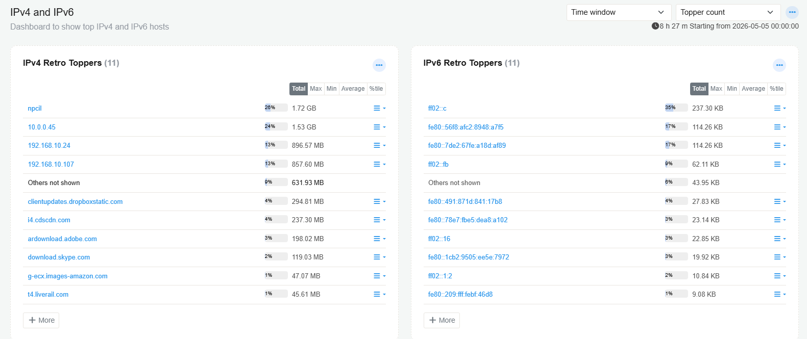

# Trisul NBAD

Trisul NBAD is Trisul Apps based Network Behavior Anomaly Detection solution developed to provide visibility into network traffic, application behavior, security events, and operational anomalies.

The solution combines flow analytics, Layer 7 visibility, behavioral monitoring, traffic investigation, and alerting capabilities through a collection of Trisul Apps and dashboards.

## Installation

The NBAD functionality in Trisul is provided through Trisul Apps and consists primarily of two application groups
- NBAD Dashboards
- Meta NBAD

:::info navigation
:point_right: Go to Web Admin &rarr; Manage &rarr; Apps
:::

After installation:

:point_right: Verify all required applications are enabled. Applications such as NFGEN, TCP Analyzer, DDoS Monitor, Stable Keys, and ShiftX can also be verified from the Apps section.

## NBAD Dashboards

The NBAD Dashboards application provides the core visualization and monitoring dashboards used for network behavior analysis and traffic visibility.

This application includes dashboards such as:

- Layer 7 Metrics
- HTTP Traffic Analytics
- IPv4 / IPv6 Monitoring
- Tunnel Monitoring
- Real-Time Alerts
- Traffic Visibility Dashboards

These dashboards provide visibility into application traffic, protocol activity, tunnels, alerts, and network behavior patterns.

### Layer 7 Metrics

:::info navigation
:point_right: Go to NBAD &rarr; Layer7 Metrics
:::

The Layer 7 Metrics dashboard provides visibility into application-layer protocols and encrypted traffic metadata.

The dashboard includes:
- Top Applications
- SNI visibility
- TLS Root CAs
- TLS Intermediate CAs

#### TLS Root CAs

Displays the top TLS Root Certificate Authorities observed in encrypted traffic sessions.

| Field | Description |
|---|---|
| TLS Root CA | Name of the Root Certificate Authority observed in TLS sessions |
| Percentage | Percentage contribution of traffic or sessions associated with the Root CA |
| Traffic / Count | Volume or number of sessions associated with the Root CA |
| Expand Menu | Opens additional drilldown and traffic investigation options |

#### TLS Inter CAs

Displays the top Intermediate Certificate Authorities observed in TLS traffic.

| Field | Description |
|---|---|
| TLS Inter CA | Name of the Intermediate Certificate Authority |
| Percentage | Percentage contribution of sessions or traffic |
| Traffic / Count | Traffic volume or session count associated with the Intermediate CA |
| Expand Menu | Opens additional analysis and drilldown options |

#### SNI

Displays Server Name Indication (SNI) values extracted from TLS handshakes.

SNI identifies the hostname requested by a client during encrypted HTTPS communication.

| Field | Description |
|---|---|
| SNI Hostname | Requested hostname extracted from the TLS handshake |
| Percentage | Percentage contribution of the hostname in observed traffic |
| Traffic Volume | Bandwidth associated with the hostname |
| Expand Menu | Opens additional drilldown and flow analysis options |

#### Applications

Displays the top Layer 7 applications and protocols identified from network traffic.

| Field | Description |
|---|---|
| Application | Detected Layer 7 application or protocol |
| Percentage | Percentage contribution of the application traffic |
| Traffic Volume | Total bandwidth consumed by the application |
| Expand Menu | Opens additional traffic analysis and drilldown options |

#### Commonly Observed Applications

The dashboard may display applications and protocols such as:

| Application | Description |
|---|---|
| HTTP | Standard web traffic protocol |
| HTTPS | Encrypted web traffic protocol |
| ICMP | Network diagnostic and control traffic |
| DNS / domain | Domain name resolution traffic |
| SMB / CIFS | File sharing traffic |
| SIP | Voice and signaling traffic |

#### Drilldown Menu Options

| Option | Description |
|---|---|
| Top users of app | Displays the top hosts, users, or IP addresses generating traffic for the selected application |
| Aggregate Flows | Aggregates and summarizes flows associated with the selected application |
| Retro analyze | Opens historical traffic analysis for the selected application over previous time intervals |
| Real Time Stabber : Traffic chart | Displays real-time bandwidth and traffic activity for the selected application |
| Real Time Stab : Flow activity | Displays real-time flow creation and flow activity metrics |
| Real Time Stab : Toppers | Displays top traffic contributors and top active entities related to the selected application |
| Set/Edit Label | Allows administrators to assign or modify labels associated with the selected application or entity |
| Traffic Chart | Displays traffic trends and bandwidth usage over time |
| Long Term Traffic report | Generates long-duration historical traffic reports for the selected application |
| View Edge Graph | Displays communication relationships and traffic interactions using graphical edge visualization |
| Download PCAP | Downloads packet capture data associated with the selected application traffic |
| Query flows by tag | Searches flows associated with specific tags or classifications |
| Aggregate flows by tag | Groups and summarizes tagged flows for analysis |
| Statistics | Displays statistical information related to the selected application traffic |

---

### HTTP Traffic

:::info navigation
:point_right: Go to NBAD &rarr; HTTP Traffic
:::

The HTTP Traffic dashboard provides visibility into HTTP application activity and web traffic behavior.

The dashboard includes:
- HTTP Hosts
- HTTP Content Types
- HTTP Methods
- HTTP Status Codes

The dashboard can be used to monitor:
- web application traffic
- request methods
- response behavior
- content distribution
- HTTP activity trends

HTTPS hostname visibility is supported through SNI extraction.

---

### IPv4 / IPv6 Dashboard

:::info navigation
:point_right: Go to NBAD &rarr; IPv4/IPv6 Dashboard
:::

The IPv4 / IPv6 Dashboard provides traffic visibility across IPv4 and IPv6 environments.

The dashboard includes:
- Top IPv4 Hosts
- Top IPv6 Hosts
- Current Top Applications
- Current Applications by Connections
- Internal Hosts
- External Hosts

This dashboard helps identify:
- host activity
- application usage
- internal versus external traffic
- IPv4 and IPv6 traffic distribution
- connection-heavy applications

---

### Tunnels

:::info navigation
:point_right: Go to NBAD &rarr; Tunnels
:::

The Tunnels dashboard provides visibility into tunneled and encapsulated traffic across the network.

The dashboard includes:
- GRE Traffic
- MPLS Traffic
- GRE Flows
- IPsec ESP/AH Traffic
- Application-level IPsec visibility

The dashboard helps monitor:
- encapsulated traffic
- tunnel protocol usage
- tunnel flow activity
- VPN and IPsec visibility
- MPLS traffic behavior

Supported tunnel visibility includes:
- GRE
- MPLS
- IPsec

---

## 4.5 DDoS Metrics

:::info navigation
:point_right: Go to NBAD &rarr; DDoS Mterics
:::

The DDoS Metrics dashboard provides visibility into volumetric traffic patterns and common DDoS attack indicators.

The dashboard includes:
- NTP Ingress vs Egress
- DNS Ingress vs Egress
- SSDP Traffic
- ICMP Ingress vs Egress
- Total Ingress vs Egress
- DDoS Flow Monitor
- TCP vs UDP Traffic
- Ingress vs Egress Ratio

The dashboard helps identify:
- traffic spikes
- reflection/amplification traffic
- abnormal ingress/egress ratios
- UDP flood activity
- DNS/NTP amplification behavior
- volumetric anomalies

This dashboard is intended for monitoring attack patterns and unusual traffic behavior across the network.

---

## 4.6 TCP Analyzer

:::info navigation
:point_right: Go to NBAD &rarr; TCP Analyzer
:::

The TCP Analyzer dashboard provides analysis of TCP session quality and connection performance.

The dashboard includes:
- Total Timeouts
- Average Latency
- Retransmitted Packets
- Retransmission Percentage
- Poor Quality Flows
- Setup Latency
- Flows Timed Out
- High Retransmission Rate Flows

The dashboard helps identify:
- latency issues
- retransmissions
- packet loss indicators
- poor TCP session quality
- connection timeout behavior
- degraded application performance

Metrics such as RTT, retransmission rate, and connection latency can be used for troubleshooting network and application performance issues.

---

## 4.7 Common Flood - DNS/TCPSYN
:::info navigation
:point_right: Go to NBAD &rarr; DNS/TCPSYN
::: 

The Common Flood dashboard provides monitoring for common DNS and TCP SYN flood indicators.

The dashboard includes:
- Unique Hosts
- DNS Traffic
- Unique DNS Hosts
- DNS Connections
- Total Bandwidth Seen
- TCP SYN Activity

The dashboard helps identify:
- DNS flood behavior
- TCP SYN flood activity
- abnormal DNS traffic spikes
- suspicious connection activity
- unusual bandwidth patterns

This dashboard is intended for identifying common volumetric and protocol-based flood activity.