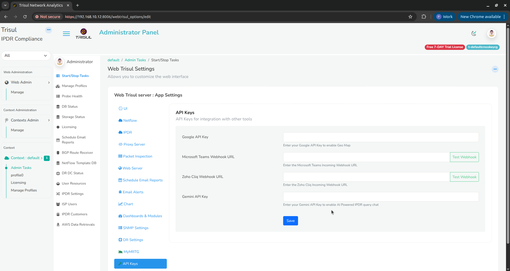
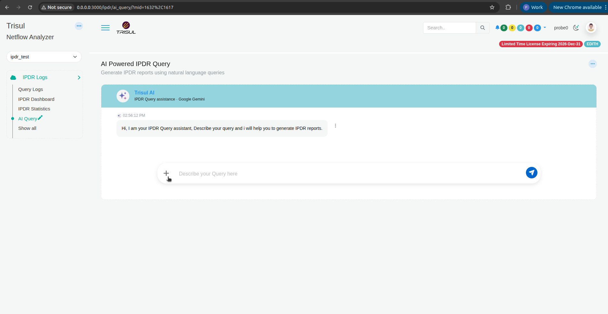
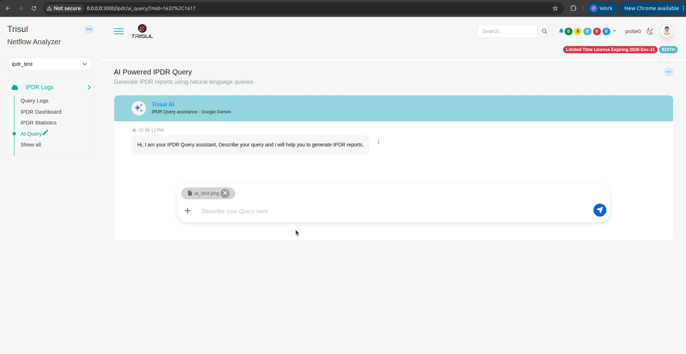
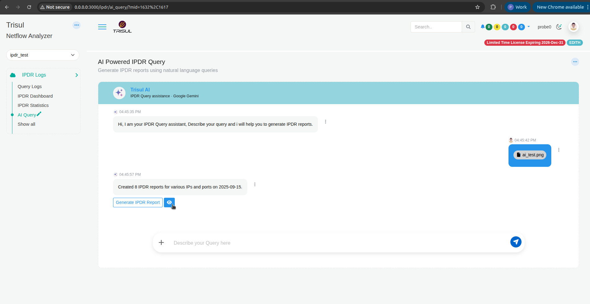
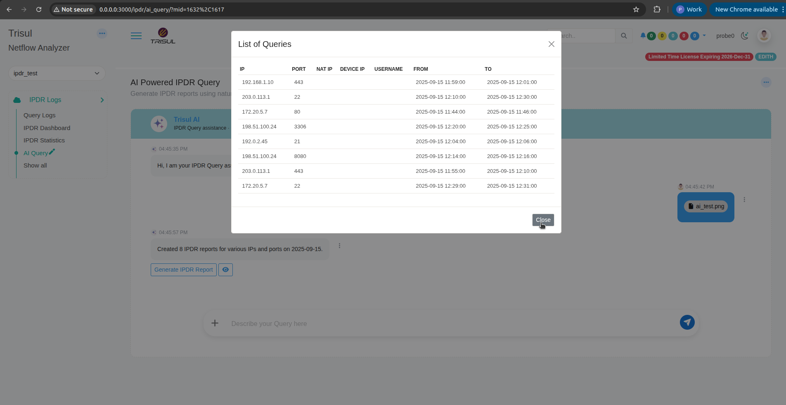
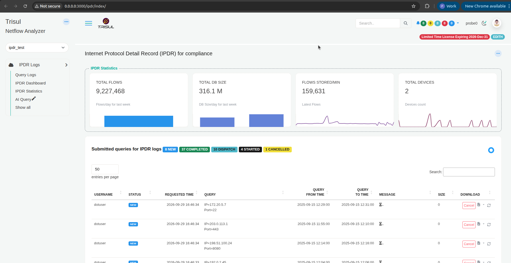

# Query IPDR logs with AI

**AI Query** turns a plain-language request, or an attached request document, into IPDR queries. You review the queries, then submit them. Trisul runs them through the normal IPDR query workflow, the same one as **Query Logs**.

**Applies to:** Trisul IPDR DoT Compliance.
**Who uses it:** compliance users who answer agency requests (for example `dotuser`).

:::note IPDR AI Query is not Trisul AI
This page covers the AI in the IPDR product. It is a separate feature from [Trisul AI](/docs/guide/trisulai/), the general network analytics assistant.

| | IPDR AI Query | Trisul AI |
| --- | --- | --- |
| Job | Fill in IPDR queries from a request | Answer questions about traffic, build reports and dashboards |
| Where | **IPDR Logs → AI Query** | **Trisul AI** page |
| LLM | Google Gemini | Gemini, OpenAI, Anthropic or a self-hosted OpenAI-compatible LLM, through the Trisul AI CLI |
| Setup | **Gemini API Key** in **API Keys** | AI endpoint in **Settings → Trisul AI** |
:::

## What the AI does and doesn't do

The AI only reads your request and fills in the query fields: IP, port, NAT IP, device IP, username, and the from and to times.

It doesn't:

- Search, read or see IPDR records.
- Run queries or build the report. The IPDR query engine does that, with the same validation and access control as a manual query.
- Make legal or compliance decisions, or skip any approval step.

:::caution Your request goes to Google Gemini
The text you type, and the file you attach, are sent to Google Gemini to extract the query fields. Check your organization's rules on sharing agency request contents with a third-party service before you use AI Query. TODO(verify: confirm whether attachments are processed locally before anything is sent to Gemini)
:::

## Before you begin: add a Gemini API key (admin)

An admin does this once.

1. Log in to WebTrisul as **Admin**.
2. Click the **⋯** menu at the top left, then click **Settings**.
3. On **Web Trisul Settings**, click **API Keys**.
4. In **Gemini API Key**, paste your Google Gemini API key.
5. Click **Save**.

TODO(verify: the IPDR AI blog says the key is tied to each user's identity and permissions. This screen has one key for the whole server. Which is correct?)

## Create queries from a request

1. Log in as a compliance user and select the IPDR context.
2. Click **IPDR Logs → AI Query**.

   The **AI Powered IPDR Query** page opens. The header reads **Trisul AI**, **IPDR Query assistance · Google Gemini**.

   

3. Give the AI the request, in one of two ways:
   - **Type it** in **Describe your Query here**. Include the identifier (IP, port, NAT IP or username), the exact time window with date and time, and the type of records you need. For example: `Get IPDR logs for IP 203.0.113.1 port 443 from 2025-09-15 11:55 to 12:10`. TODO(verify: confirm a typed example works as shown)
   - **Attach the request document.** Click **+**, then choose the file. The file appears above the input box. Click the **x** on it to remove it.

     

     TODO(verify: supported file types and maximum size. PNG is confirmed.)

4. Click the send button.

   The AI replies with a summary, for example **Created 8 IPDR reports for various IPs and ports on 2025-09-15.**, and two buttons: **Generate IPDR Report** and a view (eye) button.

   

## Check the queries before you submit

Always review what the AI extracted. A wrong digit in an IP, port or time produces a wrong report.

1. Click the view (eye) button.

   **List of Queries** shows one row per query, with **IP**, **PORT**, **NAT IP**, **DEVICE IP**, **USERNAME**, **FROM** and **TO**.

   

2. Compare every row with the original request: the identifiers, the date, and the start and end times.
3. Check the time zone. TODO(verify: are FROM and TO in server local time, and how does the AI handle a time zone stated in the request?)
4. Click **Close**.

If anything is wrong, tell the AI what to fix in a new message, then check the list again. TODO(verify: does the AI update the same query list after a correction?) To enter a query by hand instead, use **Query Logs**. See [Submit queries](/docs/prodguide/ipdr/submit-queries).

## Submit the queries

1. Click **Generate IPDR Report**.
2. Trisul submits one query per row. They appear under **Submitted queries for IPDR logs** on the IPDR page, with status **NEW**.

   

3. Track each query as its status moves through **NEW**, **STARTED**, **DISPATCH** and **COMPLETED**. When a query is **COMPLETED**, download its report from the **DOWNLOAD** column. For what each status means, see [Submit queries](/docs/prodguide/ipdr/submit-queries). TODO(verify: confirm the status order)

To stop a query before it runs, click **Cancel** in its row.

## Related

- [Submit queries](/docs/prodguide/ipdr/submit-queries): the manual query form.
- [Format of the output report](/docs/prodguide/ipdr/ipdrexportfields).
- [The dotuser ID](/docs/prodguide/ipdr/specialuser).
