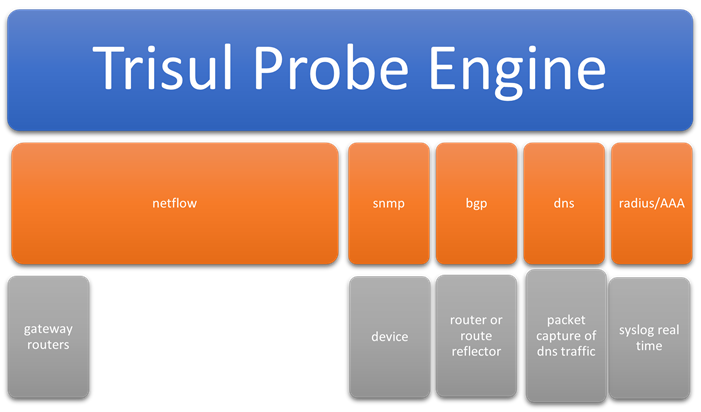

# Trisul ISP Analytics Guide

Trisul ISP Analytics adds peering, prefix, AS path and country analytics to flow-based monitoring. It combines NetFlow from your gateway routers with the BGP routes that Trisul collects as a passive I-BGP peer.

Trisul ISP Analytics adds the following:

1. Peering Analytics
2. Prefixes IPv4 and IPv6
3. AS analytics
4. Mapping ASN, Prefixes, Geo location to gateway routers and
   interfaces
5. Private Peering analytics with content providers
6. Route analytics
7. Custom metering of downstream customers usage patterns

### Network integration diagram

The following diagram is an overview of integration points (some are
optional) for a NetFlow-based Trisul ISP Analytics deployment.

  
Network Integration Diagram

Trisul ISP Analytics ingests the following data sources. Only NetFlow is required.

| Data source |Notes|
| --- | -- |
| NetFlow    | Required. All versions of NetFlow, JFlow, IPFIX, sFlow and NetStream are supported. Follow ISP NetFlow best practices, such as sampling and ingress policies. |
| SNMP       | Optional: for SNMP interface traffic. Useful to add on dashboards along with NetFlow interface traffic. |
| BGP        | Optional: if customer requires Route Analytics and Peer vs Origin AS |
| DNS        | Optional: needed for the OTT Analytics app, to identify content such as Amazon, Netflix, YouTube, WhatsApp and Instagram. |
| Radius/AAA | Optional: to map IP addresses to subscriber IDs dynamically. Needs real-time syslog from the AAA side. |

## Features of Trisul ISP Analytics {#features-of-trisul-isp}

In addition to the NetFlow monitoring features, Trisul ISP Analytics provides the following.

| Feature           | Description |
| ----------------- | --------- |
| AS Analytics      | Autonomous system traffic monitoring. AS to AS traffic matrix, AS drilldown. Flexible AS monitoring at global level, per router and per interface. Peer AS monitoring. Use case: an ISP can track AS traffic flows at minute level. |
| Prefix Analytics  | Prefixes are important for traffic engineering purposes. Like AS analytics, Prefix analytics is also available at global level, per router, and per interface |
| Routing           | Trisul includes a built-in BGP route receiver that can peer with dozens of gateways. AS Path analytics shows the busiest paths and segments for upstream and downstream customers, globally (the busiest route in the ISP network), per router and per interface. Peer AS and Origin AS are tracked separately. |
| Country           | Main use case is to see traffic egressing country on optimal traffic route east or west coast depending on final destination. Per Country in/out traffic is provided again at global level, per router, and per interface granularity.|
| Drilldowns        | The above mentioned AS,Prefix,Country analytics can also be done in a drilldown method. Rather than starting with a router/interface you can start with a AS Number and see where the traffic is coming from for that AS |
| Device Monitoring | Use the [Routers and Interfaces](/docs/guide/ug/netflow/routers_and_interfaces) tool to track any router and interface and drill down to usage. |

## BGP and NetFlow

The Trisul ISP feature is enabled in the starter configuration by mixing
NetFlow and BGP.

- To configure BGP, see [Configuring BGP](/docs/prodguide/isp/bgp).
- To install the apps and dashboards for ISP analytics, see [ISP Apps and Dashboards](/docs/prodguide/isp/isapps#install-trisul-apps).

## Pages in this guide

import DocCardList from '@theme/DocCardList';

<DocCardList />
