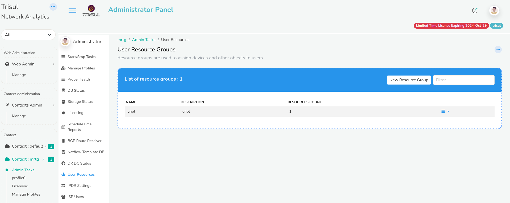
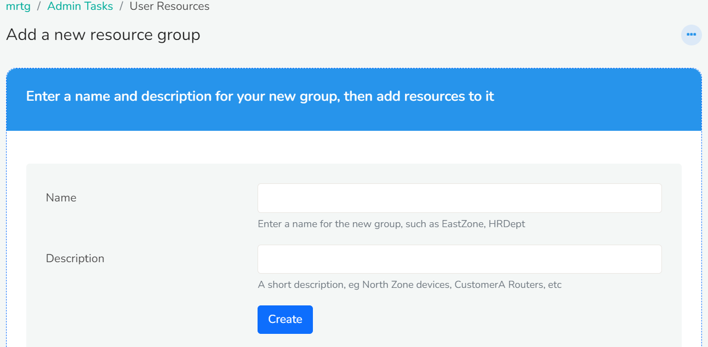
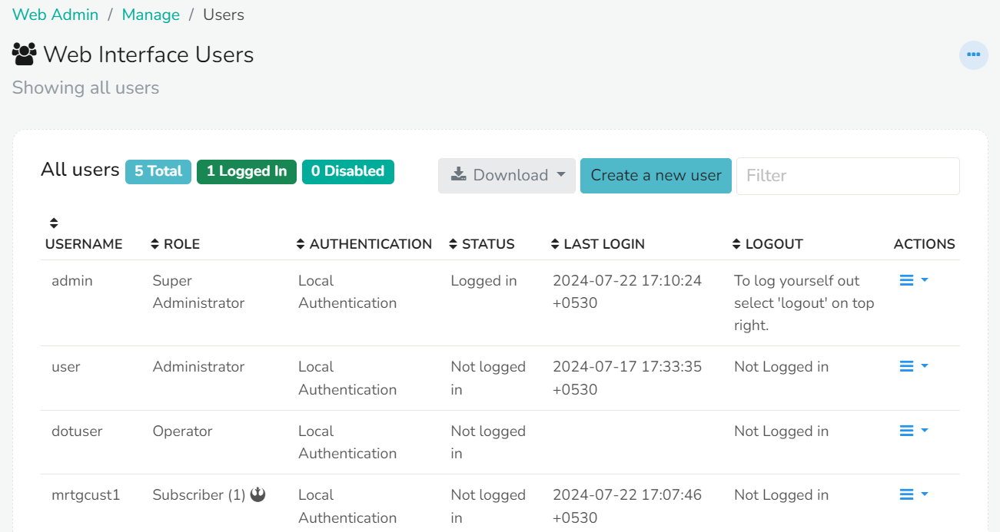
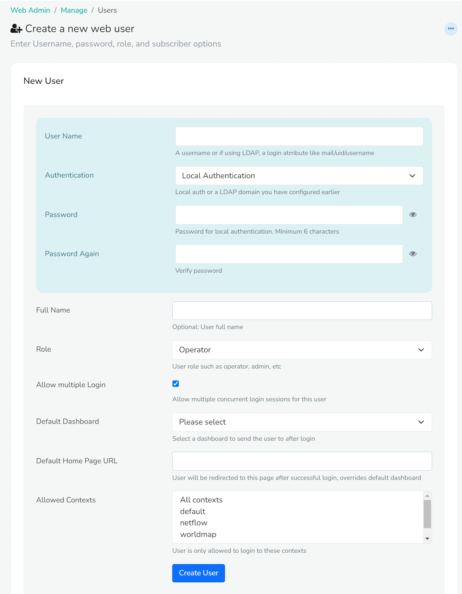
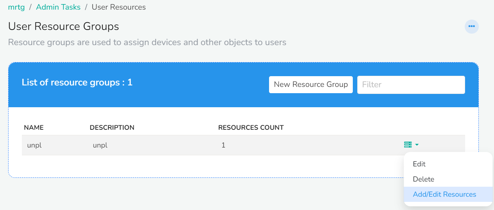
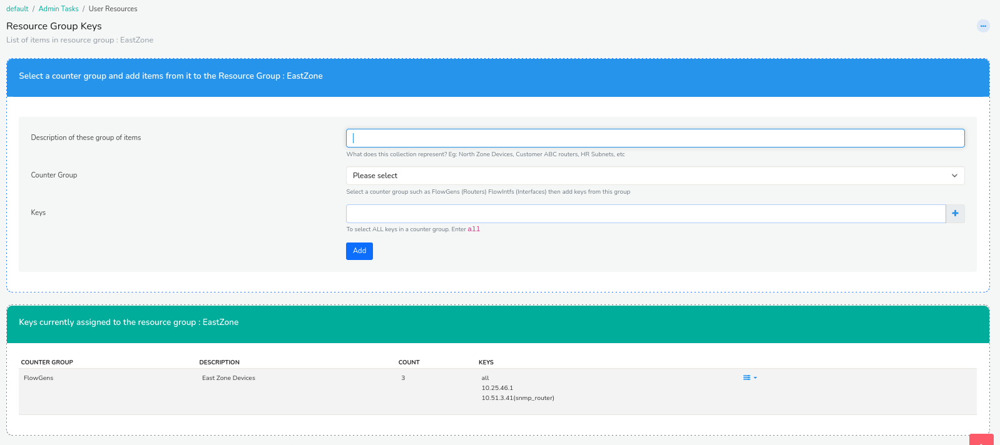

# Resource Groups for Subscribers

Resource groups assign devices, interfaces and other objects to users. A subscriber user sees only the resources in the groups assigned to them, in the [Traffic Grapher](/docs/prodguide/isp/rtg).

## Create a resource group

:::info Navigation
Log in as admin and go to **Context:MRTG → Admin Tasks → User resources**.
:::

<!-- TODO(verify): is "MRTG" a context the admin must create for subscribers? The Admin Guide uses Context: default (F-06-104) -->

On the **User Resource Group** module, click **New Resource Group**.

In **Add a new resource group**, enter a name for the group and a short description. Then click **Create**. The new group appears in the list of resource groups.

## Create a subscriber user {#how-to-create-a-subscriber-user}

To create a subscriber user,

:::note Navigation
Log in as admin and go to **Web Admin → Manage → Users**.
:::

Click *Create a new user* on the *Web interface users* module

You will see the *New User* window with the following fields.

| Fields                | Description                                                                      |
| --------------------- | -------------------------------------------------------------------------------- |
| User Name             | Enter the username for the subscriber                                            |
| Authentication        | Select Local authentication                                                      |
| Password              | Enter the password for the subscriber                                            |
| Full Name             | Enter the full name of the subscriber                                            |
| Role                  | Select user role as Subscriber                                                   |
| Allow Multiple Login  | Check this if you want to allow multiple concurrent login sessions for this user |
| Default Dashboard     |                                                                                  |
| Default Home Page URL | Enter the URL: /mrtg/index                                                       |
| Allowed Contexts      | Select the contexts from the list of contexts for the subscriber                 |

Click **Create User**. The new user appears in the list of users. For every field on this form, see [Users](/docs/guide/ag/webadmin/manageusers).

## Add resources to the group {#how-to-assign-resource-groups-to-user}

To add resources (keys) to a resource group:

:::note Navigation
Log in as admin and go to **Context:MRTG → Admin Tasks → User resources**.
:::

You can see the newly added resource groups under the list of resource groups window.
Click on the dropdown option button on the right against the resource group you would like to assign to. Click *Add/Edit Resources*.
The Resource group keys window appears with the following fields.

| Fields                              | Description                    |
| ----------------------------------- | ------------------------------ |
| Description of these group of items | Enter a short description on what this collection represents                                                              |
| Counter Group                       | Select SNMP-Interface from the list of counter groups                                                                     |
| Keys                                | Click on the Plus icon to add the keys and click Select after adding the desirable keys to that particular resource group |

:::note
If you cannot find SNMP-Interface from the list of counter groups. Install *SNMP-Poller* from [Trisul Apps](/docs/guide/ag/webadmin/apps) before this step and try again.
:::

Fill in the fields and click **Add**. The keys assigned to the group appear at the bottom of the same window.

## Assign the group to the user

Assign the resource group to the subscriber user, as described in [Assigning Resource Groups to Users](/docs/guide/ag/admintasks/userresources#assigning-resource-groups-to-users) in the Admin Guide.

<!-- TODO(verify): where the group is assigned to a user in the current UI for subscriber users (F-06-115) -->

## Next steps

Log in as the subscriber user to check what they see in the [Traffic Grapher](/docs/prodguide/isp/rtg).
