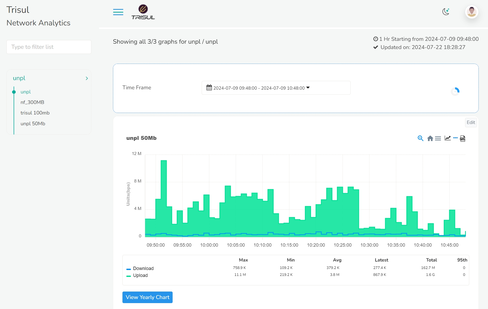
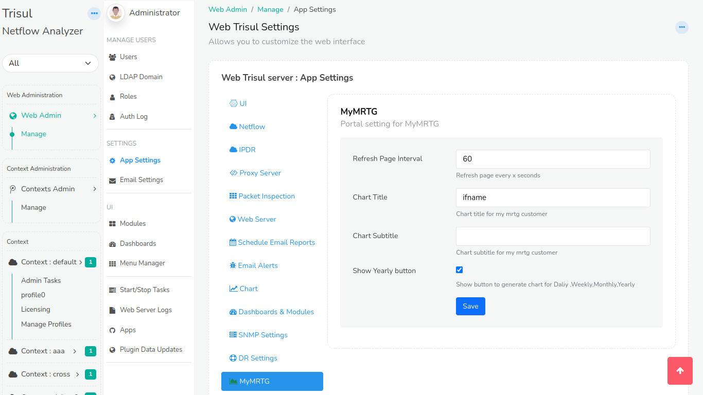
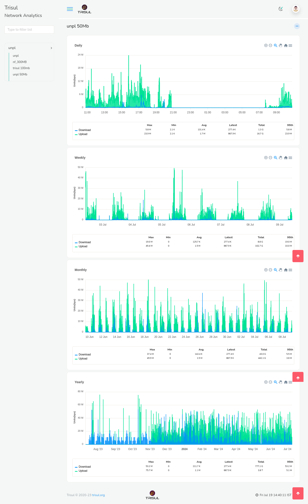

# Traffic Grapher

The Traffic Grapher shows a subscriber user the bandwidth of the resources assigned to them, similar to MRTG.

:::note Prerequisites
The subscriber user and their resource groups must exist. See [Resource Groups for Subscribers](/docs/prodguide/isp/resourcegroups).
:::

## Monitoring Bandwidth

You can view bandwidth as a chart and download it as a report. Log in as the subscriber user. The subscriber home page opens.

Once you have logged in, on the left you can see the resource groups and the keys assigned to that particular user. On the right side of the window, you can see the *time frame* module and bandwidth consumption chart module. The blue lines on the graph represents download data and green represents upload data. By default the time frame is set to last 15 mins so the chart on the screen is the bandwidth consumption for the last 15 mins. 

:::note
To hide the **View Yearly Chart** button, clear **Show Yearly Button** in [App Settings → MyMRTG](/docs/guide/ag/webadmin/web_options#mymrtg).
:::

  

*Figure: Show Yearly Button checkbox in App Settings → MyMRTG*

You can select the desired time range from the *time frame* module to view the bandwidth consumption for that particular time window.

For a longer time window, Click and drag on the spikes to zoom in and find more detailed time of the zoomed in section.

The top-right corner of the chart has four icons. From the right: PDF, Live SNMP, Menu and Home.

#### PDF

Click on the PDF icon to download the selected data in PDF format.

#### Live SNMP

Click on the Live SNMP icon to view the Live bandwidth consumption which is updated every 10 seconds.

#### Menu

Click on the Menu icon to download the data in other desirable formats including SVG, PNG, and CSV.

#### Home

Click on the Home icon to reset from the zoom selection if you have panned in for detailed view.

#### View Yearly Chart

Click on the *View Yearly Chart* button on the left bottom of the bandwidth consumption chart module and the following window will open up for the selected key.

This will give you a granular view of daily,weekly,monthly and yearly charts which can be monitored in a more detailed time frame.

Repeat these steps for any key in your resource groups.
