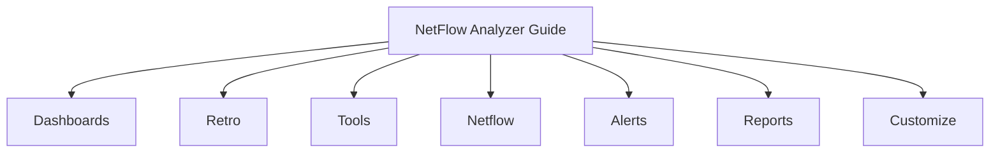

# Trisul NetFlow Analyzer Guide

Welcome to the **Trisul NetFlow Analyzer Guide**.

**Trisul NetFlow Analyzer** is designed for monitoring and analyzing network traffic using [flow](https://docs.trisul.org/docs/guide/learntrisul/terminology#flow) data collected from routers, switches, and other network devices. It supports **NetFlow v5/v9, IPFIX, sFlow, and NetStream**.

With NetFlow Analyzer, you can use flow data to:

* See how much traffic is flowing through your network
* Identify the hosts, applications, and interfaces generating traffic
* Investigate traffic patterns over time
* Monitor network capacity and utilization
* Track unusual or suspicious traffic
* Generate traffic and usage reports
* Investigate historical traffic without having to capture packets again

## Before you begin

If you have not installed Trisul yet, start with the installation guide.

During installation, select **NetFlow Analyzer** as the **Product Mode**. This configures Trisul for collecting and analyzing flow data from your network devices.

**[Install Trisul and select NetFlow Analyzer mode](/docs/guide/starthere/quickstart)**

Once Trisul is installed and you have logged in to the Web UI, return to this guide to learn how to use the NetFlow Analyzer interface.

The screens and menus described in this guide are available when Trisul is configured in NetFlow Analyzer mode. If you selected a different Product Mode during installation, your Web UI may have a different menu structure.

## What you will find in this guide

The NetFlow Analyzer Web UI is organized into seven main menu categories. Each category helps you perform a different type of network monitoring or analysis.

:::tip New here?
Start with **Dashboards** for a live view of your network, then check **Alerts** to see what has already been flagged. Use **Retro** once you need to look further back in time. The other menus below are for deeper investigation once you know what you are looking for.
:::

import DocCardList from '@theme/DocCardList';

<DocCardList />
