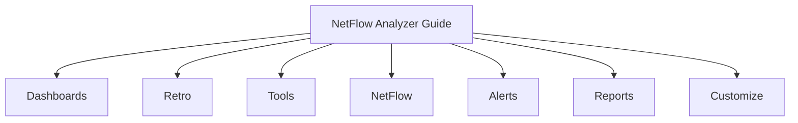

# Trisul NetFlow Analyzer Guide

Welcome to the **Trisul NetFlow Analyzer Guide**.

**Trisul NetFlow Analyzer** is designed for monitoring and analyzing network traffic using [flow](/docs/guide/learntrisul/terminology#flow) data collected from routers, switches, and other network devices. It supports **NetFlow v5/v9, IPFIX, sFlow, and NetStream**.

With NetFlow Analyzer, you can use flow data to:

* See how much traffic is flowing through your network
* Identify the hosts, applications, and interfaces generating traffic
* Investigate traffic patterns over time
* Monitor network capacity and utilization
* Track unusual or suspicious traffic
* Generate traffic and usage reports
* Investigate historical traffic without having to capture packets again

## Before you begin

1. Install Trisul. Follow the [Quickstart](/docs/guide/starthere/quickstart).
2. Configure your routers and switches to export flow records to Trisul. See [Configure NetFlow](/docs/guide/starthere/setuptrisul/network/input_netflow).
3. Log in to the Web UI and select **NetFlow Analyzer** as the product mode. You choose the mode on first login, not during installation. See [Selecting the Product Mode](/docs/guide/starthere/setuptrisul/install/selectmode).
4. Confirm that flow data is arriving. Go to **NetFlow &rarr; NetFlow Sources** and check that your flow exporters are sending data. See [NetFlow Sources](/docs/prodguide/nf/Netflow/netflow-sources). If no data arrives, see the [NetFlow troubleshooting guide](/docs/Troubleshooting/netflownotreceiving).

When data is arriving, use the rest of this guide to learn the NetFlow Analyzer menus.

The screens and menus described in this guide are available when Trisul is configured in NetFlow Analyzer mode. If you selected a different Product Mode during installation, your Web UI may have a different menu structure.

## What you will find in this guide

The NetFlow Analyzer Web UI is organized into seven main menu categories. Each category helps you perform a different type of network monitoring or analysis.

```mermaid
graph TD
    A[NetFlow Analyzer Guide] --> B[Dashboards]
    A --> C[Retro]
    A --> D[Tools]
    A --> E[NetFlow]
    A --> F[Alerts]
    A --> G[Reports]
    A --> H[Customize]

```

:::tip New here?
Start with **Dashboards** for a live view of your network, then check **Alerts** to see what has already been flagged. Use **Retro** once you need to look further back in time. The other menus below are for deeper investigation once you know what you are looking for.
:::

import DocCardList from '@theme/DocCardList';

<DocCardList />
